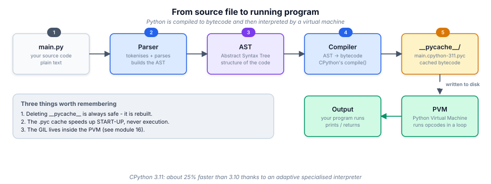

# 1. How Python runs

> "Python is an interpreted language" is the sentence everyone repeats and
> almost nobody can defend. By the end of this module you can.

## 1.1 Definition

**Plain version.** Python is a programming language plus a program (the
*interpreter*) that runs code written in that language, line of intent at a
time, without you compiling anything yourself.

**Precise version.** *Python* is a language specification. *CPython* is the
reference implementation: a C program that **compiles** your source text into
**bytecode** (a low-level instruction list for a virtual machine), caches it in
`__pycache__/*.pyc`, and then **interprets** that bytecode on the **Python
Virtual Machine (PVM)**. Other implementations exist (PyPy, which JIT-compiles
bytecode to machine code; MicroPython for microcontrollers), which is exactly
why "the interpreter" and "the language" must be kept apart.

Three consequences you should carry everywhere:

- Python is **compiled *and* interpreted**. The compile step is automatic and
  per-module; you simply never invoke it.
- The `.pyc` cache makes the *second* run of a module start faster. It never
  makes the code itself run faster.
- Everything later in this course about the **GIL**, **speed**, and
  **concurrency** is a property of the *PVM implementation*, not of the
  language.

## 1.2 Syntax

The smallest program that proves the pipeline:

```python
# hello.py
print("Hello, industry.")
```

```bash
$ python hello.py
Hello, industry.
```

And the same pipeline made visible:

```python
# compile source -> bytecode yourself, then disassemble it
import dis
code = compile("x = 1 + 2", "<demo>", "exec")
print(code.co_consts)          # (3, None)  <- 1+2 was folded at compile time!
dis.dis(code)
```

```text
  1           0 RESUME                   0
              2 LOAD_CONST               0 (3)
              4 STORE_NAME               0 (x)
              6 LOAD_CONST               1 (None)
              8 RETURN_VALUE
```

Notice `LOAD_CONST 0 (3)`: the constant expression `1 + 2` was evaluated by
the **compiler**, not at runtime. That is constant folding, and it is your
first proof that a real compile step exists.

## 1.3 First examples

**Example 1 — run a file.**

```python
# area.py
radius = 5
area = 3.14159 * radius ** 2
print(f"A circle of radius {radius} has area {area:.2f}")
```

```bash
$ python area.py
A circle of radius 5 has area 78.54
```

**Example 2 — the REPL (interactive interpreter).**

```bash
$ python
>>> 6 * 7
42
>>> import math
>>> math.sqrt(144)
12.0
>>> _                      # underscore = last result
12.0
>>> exit()
```

**Example 3 — see the cache appear.**

```bash
$ ls
hello.py
$ python hello.py
Hello, industry.
$ ls
__pycache__  hello.py
$ ls __pycache__
hello.cpython-311.pyc      # compiled bytecode, keyed to the Python version
```

Delete `__pycache__` freely; Python rebuilds it. Committing it to Git is a
review-blocking mistake.

## 1.4 The picture




## 1.5 Going deeper

### What bytecode actually is

Bytecode is a sequence of one-byte-plus-argument instructions for a
**stack machine**: operands are pushed on a value stack, operators pop them
and push results. `dis` shows it; `code.co_code` is the raw bytes.

```python
import dis
def f(a, b):
    return a * b + 1

dis.dis(f)
```

```text
  3           0 RESUME                   0
              2 LOAD_FAST                0 (a)
              4 LOAD_FAST                1 (b)
              6 BINARY_OP                5 (*)
             10 LOAD_CONST               1 (1)
             12 BINARY_OP                1 (+)
             16 RETURN_VALUE
```

`LOAD_FAST` (a local variable) is an array index; `LOAD_NAME`/`LOAD_GLOBAL`
are dictionary lookups. This single fact explains a whole class of
performance advice in module 17: **locals are faster than globals.**

### The evaluation loop and adaptive specialisation (3.11+)

CPython 3.11 replaced the old `switch`-based loop with a "computed goto"
loop and added **specialising adaptive interpretation**: hot bytecode
instructions rewrite themselves into type-specific variants
(`BINARY_OP` → `BINARY_OP_ADD_INT`), avoiding dispatch and boxing overhead.
This is why 3.11 was ~25 % faster than 3.10 with no code changes — and why
"Python is slow" needs a date attached to it.

### Startup vs steady state

The interpreter must, before your first line runs: initialise the runtime,
build `sys.path`, and import `site`, `os`, `io`, `encodings`… For a CLI tool
this can dominate runtime. Two industry responses:

- keep the import graph small at the top level (import heavy modules lazily);
- for real deployment, freeze the app (PyInstaller, Nuitka) or run it under a
  process manager that stays warm (a web server, not a script).

### Implementations, and why they matter to you

| Implementation | Executes bytecode by | Notable property |
|----------------|----------------------|------------------|
| CPython | interpreting in C | the reference; the GIL; C-extension ecosystem |
| PyPy | JIT-compiling hot loops | often 4–10× faster on long-running pure-Python code |
| MicroPython | interpreting, tiny runtime | runs on microcontrollers with KBs of RAM |
| GraalPy | JIT on the GraalVM | strong Java/Python interop |

Library authors must therefore avoid CPython-specific accidents (relying on
refcounting for resource cleanup, C-extension-only APIs) — which is why
context managers (`with`) exist and why module 10 insists on them.

## 1.6 Industry level

### The environment is part of the language

In industry, "it works on my machine" is a bug report about *your*
environment, not a defence. The professional baseline:

```bash
# 1. isolate: one virtualenv per project
python -m venv .venv
source .venv/bin/activate            # Windows: .venv\Scripts\activate

# 2. install the project itself in editable mode, with dev extras
pip install -e ".[dev]"

# 3. pin what you ship and what you develop with, separately
pip freeze > requirements.lock       # or use uv / poetry / pip-tools

# 4. never mix: .venv/ goes in .gitignore, requirements go in Git
```

### Version discipline

Read the `requires-python` field of every package you depend on. Teams pin a
minimum (e.g. `>=3.11`) to use modern syntax (`match`, `X | None`, faster
interpreter) and test against the newest released Python in CI so upgrades are
never a surprise. Running a five-year-old interpreter in 2026 is a security
incident waiting for a CVE.

### Toolchain defaults in a modern repo

| Tool | Job | Typical invocation |
|--------|-----|--------------------|
| `ruff` | lint + format (Rust, instant) | `ruff check --fix . && ruff format .` |
| `mypy` / `pyright` | static type checking | `mypy src/` (module 14) |
| `pytest` | tests | `pytest -q --cov` (module 15) |
| `pre-commit` | run the above before each commit | `pre-commit run --all-files` |
| GitHub Actions | run all of it on every push | `.github/workflows/ci.yml` (module 18) |

::: industry "What a reviewer looks for in a first pull request"
A `.gitignore` containing `.venv/` and `__pycache__/`; a `pyproject.toml`
declaring dependencies; tests that run with a single command; and no
machine-specific paths. Code quality is reviewed *after* that baseline exists,
because without it nobody can reproduce your run.
:::

## 1.7 Comparison tables

**`python file.py` vs `python -m module` vs REPL vs script shebang:**

| Form | Command | When to use |
|------|---------|-------------|
| File | `python app.py` | ad-hoc runs, learning |
| Module | `python -m pytest`, `python -m myapp` | packages & tools: puts **cwd** on `sys.path`, runs the installed entry point |
| REPL | `python` | exploring, debugging, measuring |
| Shebang | `./app.py` with `#!/usr/bin/env python3` | Unix scripts, cron jobs |
| Frozen | `./dist/app` (PyInstaller) | shipping to machines without Python |

**Compile-time vs run-time work:**

| Happens at compile time | Happens at run time |
|-------------------------|---------------------|
| syntax errors (`SyntaxError`) | name errors (`NameError`) |
| constant folding (`1+2` → `3`) | function calls, loops |
| building the code object | importing modules the first time |
| docstring & `__debug__` handling | attribute lookups, dispatch |

## 1.8 Mistakes & gotchas

::: gotcha "Running `python script.py` from the wrong directory"
Relative paths in code are relative to the **current working directory**, not
to the script's folder. Use `pathlib.Path(__file__).parent` for files that
ship with your code (module 10).
:::

::: gotcha "Two Pythons on one machine"
`python` vs `python3` vs a Conda env vs the system interpreter is the single
most common cause of "ModuleNotFoundError but I installed it!". Always check
`which python` and `python -c "import sys; print(sys.executable)"` inside the
active environment.
:::

::: gotcha "Installing with `sudo pip`"
It writes into the OS-managed interpreter and can break OS tooling. Modern
distros block it (PEP 668, "externally-managed-environment") precisely because
of this. Use a virtualenv, always.
:::

::: warn "Bytecode is not a security boundary"
`.pyc` files decompile trivially (`uncompyle6`, `pycdc`). Never ship secrets
or "protection" as bytecode.
:::

## 1.9 Interview questions

1. **Is Python compiled or interpreted?** — Both: source is compiled to
   bytecode per module (cached in `__pycache__`), then interpreted by the PVM.
2. **What does deleting `__pycache__` do?** — Nothing functional; the cache
   is rebuilt. It speeds up start-up only.
3. **What is a `.pyc` file?** — Marshalled code objects (bytecode + metadata)
   for one module, tagged with the interpreter version and source mtime/hash.
4. **Why does `1 + 2` not appear in `dis` output?** — Constant folding at
   compile time.
5. **Name two implementations other than CPython and one difference each.** —
   PyPy (JIT, much faster long-running pure Python), MicroPython (fits KBs of
   RAM, subset of the stdlib).
6. **What is the difference between `python app.py` and `python -m app`?** —
   `-m` searches `sys.path` and runs the module as `__main__` with the cwd on
   the path; it is the correct way to run package entry points.

## 1.10 Practice exercises

[[exercise tier="Beginner" id="ex-01-a" file="exercises/01_environment/test_tasks.py"]]
Create the file described by `tasks.first_program()`'s docstring and make the
three assertions in the test pack pass: report your interpreter version, the
absolute path of the running interpreter, and whether a virtualenv is active.
[[/exercise]]

[[exercise tier="Intermediate" id="ex-01-b" file="exercises/01_environment/test_tasks.py"]]
Implement `tasks.inspect_bytecode(source)` returning the tuple of constants
and the list of opcode names for a source string, and
`tasks.is_constant_folded(source)` deciding whether an arithmetic expression
was folded at compile time.
[[/exercise]]

[[exercise tier="Industry" id="ex-01-c" file="exercises/01_environment/test_tasks.py"]]
Implement `tasks.make_project_skeleton(root)` which lays out a
`src`-layout project (package dir, `__init__.py`, `py.typed`, `tests/`,
`pyproject.toml`, `.gitignore` with `.venv/` and `__pycache__/`) and
`tasks.validate_project(root)` that returns a list of the problems it finds
(empty list = healthy). This is the skeleton every later module assumes.
[[/exercise]]

[[solution]]
```python
# See exercises/01_environment/solution.py for the full reference.
import compileall, dis, io, os, sys, contextlib

def inspect_bytecode(source: str):
    code = compile(source, "<exercise>", "exec")
    names = []
    with contextlib.redirect_stdout(io.StringIO()):
        for instr in dis.get_instructions(code):
            names.append(instr.opname)
    return tuple(code.co_consts), names

def is_constant_folded(source: str) -> bool:
    consts, ops = inspect_bytecode(source)
    # folded: no arithmetic opcode survives, only LOAD_CONST-style work
    return not any(op.startswith(("BINARY_OP", "BINARY_ADD")) for op in ops)
```
[[/solution]]

## 1.11 Cheatsheet

| Concept | Command / fact |
|---------|----------------|
| Run a file | `python file.py` |
| Run a module | `python -m pkg.mod` |
| REPL | `python`, exit with `exit()` or Ctrl-D |
| Where am I running from? | `python -c "import sys; print(sys.executable)"` |
| Make a virtualenv | `python -m venv .venv` then `source .venv/bin/activate` |
| Install editable + dev deps | `pip install -e ".[dev]"` |
| See bytecode | `python -m dis file.py` or `dis.dis(fn)` |
| See the cache | `ls __pycache__` |
| Version in code | `sys.version_info` (a named tuple — compare with `(3, 11)`) |
| Compile check only | `python -m py_compile file.py` |
