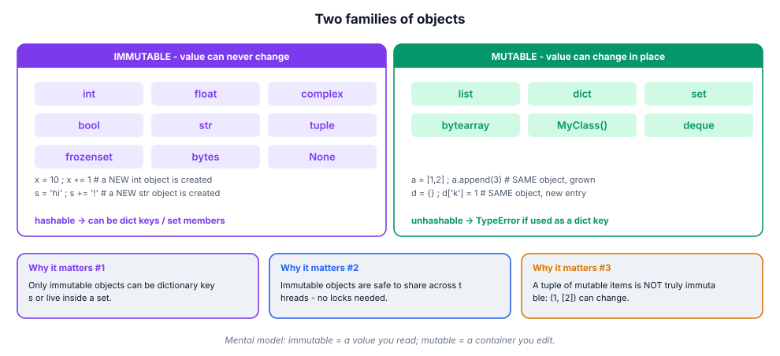
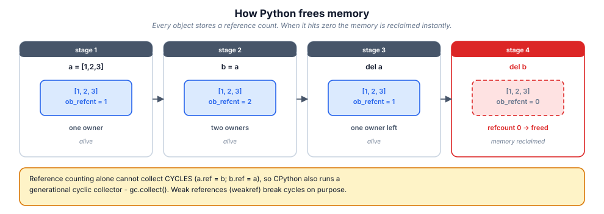

# 2. Variables, types & the memory model

> In C you own boxes. In Python you own name tags. Every confusing bug you
> will ever have with "the list changed by itself" is this module.

## 2.1 Definition

**Plain version.** A variable in Python is a *name* attached to an *object*
that lives in memory. Assignment sticks the name on an object; it never copies
the object and never reserves a typed box.

**Precise version.** An assignment statement `name = expression` evaluates the
expression to an object, then **binds** `name` to that object in the current
namespace (a mapping of names → objects). The object carries its own type
(`type(obj)`), value and identity (`id(obj)`). Python is therefore
**dynamically typed** (types belong to objects, not names) and **strongly
typed** (conversions must be explicit; `1 + "1"` is an error, not a coercion).

Everything — numbers, strings, functions, classes, modules — is an object, and
every object has at least: a **reference count**, a **pointer to its type**,
and its **value**.

## 2.2 Syntax

```python
# binding -------------------------------------------------------------
count = 10                    # bind name 'count' to an int object
price, qty = 9.99, 3          # tuple unpacking: two bindings at once
a = b = []                    # CHAINED: both names -> the SAME list
x, y = y, x                   # swap without a temp variable

# rebinding & mutating ------------------------------------------------
count = count + 1             # new int object; name moves to it
count += 1                    # same thing for ints (immutable)
a.append(4)                   # NO rebinding: the SAME list grows

# augmented & annotated ----------------------------------------------
total: int = 0                # annotation: a hint for tools, not a constraint
del count                     # unbind the name (object may then be freed)

# inspecting ----------------------------------------------------------
type(price)                   # <class 'float'>
id(a)                         # memory address / identity of the object
isinstance(price, float)      # True (respects inheritance)
```

## 2.3 First examples

**Example 1 — rebinding vs mutating.**

```python
a = [1, 2, 3]
b = a            # b points at the SAME list
b.append(4)
print(a)         # [1, 2, 3, 4]   <- a changed! one object, two names
print(a is b)    # True
```

**Example 2 — types travel with objects.**

```python
v = 10           # v -> int
v = "ten"        # v -> str   (the int is discarded, name rebound)
v = [1, 2]       # v -> list
print(type(v))   # <class 'list'>
```

**Example 3 — identity vs equality.**

```python
p = [1, 2]; q = [1, 2]
print(p == q)    # True  : same *value*
print(p is q)    # False : two distinct objects

r = p
print(r is p)    # True  : same object
```

## 2.4 The picture

![Mutating a shared object vs rebinding to a new one: b = a then b.append(4) changes both names; b = b + [4] leaves a untouched.](figures/memory-model.svg)





## 2.5 Going deeper

### 2.5.1 What an object looks like in memory

Every CPython object starts with the same header:

```text
+----------------+----------------+-------------------+
| ob_refcnt      | ob_type  ----->| the type object   |
| (reference ct) |                | (int, list, ...)  |
+----------------+----------------+-------------------+
| ... the value payload (type-specific) ...          |
+----------------------------------------------------+
```

`sys.getsizeof` reports the header + payload, **not** what the object points
at:

```python
import sys
sys.getsizeof([])            # 56   (header + empty pointer array)
sys.getsizeof([1, 2, 3])     # 88   (56 + 3 * 8-byte pointers on 64-bit)
sys.getsizeof([[], [], []])  # 88   (!) the inner lists are NOT counted
```

That last line is the whole story: a list stores **pointers**, so its size
ignores the pointees (see module 06 for the layout diagram).

### 2.5.2 Immutability, hashability, and the dict-key contract

An object is **hashable** if it has a stable `hash()` and equality that agrees
with it. Only immutable built-ins are hashable, which is why they — and only
they — can be dictionary keys or set members:

```python
d = {}
d[(1, 2)] = "ok"      # tuple: immutable -> hashable -> fine
d[[1, 2]] = "boom"    # TypeError: unhashable type: 'list'
```

The subtle trap: *a tuple is only as immutable as its contents*.

```python
t = (1, [2, 3])
t[1].append(4)        # legal! the tuple didn't change, its list did
hash(t)               # TypeError now - it was never safely hashable
```

### 2.5.3 `==` vs `is`, and the caches that fool everyone

- `==` calls `__eq__` → compares **values**.
- `is` compares **identity** (same object) → pointer equality.

CPython keeps two optimisations that make `is` *look* like value equality:

```python
# in the REPL, each line is a separate compile unit:
>>> a = 256; b = 256
>>> a is b
True            # small-int cache: -5..256 are pre-created singletons
>>> c = 257; d = 257
>>> c is d
False           # outside the cache: two objects
```

…but inside one script the compiler shares constants, so the same lines can
print `True`. And short string literals are **interned**:

```python
>>> s1 = "hi"; s2 = "hi"
>>> s1 is s2
True
>>> s3 = "hi there"; s4 = "hi there"     # space breaks the identifier rule
>>> s3 is s4
False
```

**Rule:** `is` is for `None` (and singletons you created). For values use `==`.
Linters flag `x == None` and `x is not None`-style mistakes for this reason.

### 2.5.4 Copying: shallow vs deep

```python
import copy
orig = [[1, 2], [3]]
shallow = list(orig)          # or orig[:] or orig.copy()
deep = copy.deepcopy(orig)

shallow[0].append(99)
print(orig)                   # [[1, 2, 99], [3]]  <- shallow shares innards
deep[1].append(7)
print(orig)                   # unchanged: deepcopy duplicated everything
```

Shallow copy duplicates the *pointer array*; deep copy walks the object graph
(and memoises it, so shared sub-objects stay shared, and cycles don't loop
forever).

### 2.5.5 Memory reclamation: refcounting + generations

Primary mechanism: **reference counting** (see figure). When `ob_refcnt` hits
0 the memory is freed *immediately* — deterministic, unlike Java's GC.
Weakness: **cycles** (`a.next = b; b.prev = a`) never reach 0, so a
**generational cyclic collector** periodically scans container objects
(generations 0→1→2, young ones collected most often). You can inspect and
force it:

```python
import gc, sys
sys.getrefcount(orig)         # counts +1 for the argument itself
gc.get_stats()                # per-generation collection counts
gc.collect()                  # force a full collection (rarely needed)
```

Practical consequence: do **not** rely on refcounting for correctness (other
implementations lack it). That is precisely what `with` statements and
`contextlib.closing` are for (module 10).

### 2.5.6 `__slots__`: trading flexibility for memory

Instances keep attributes in a per-object `__dict__` (~100+ bytes each). For
millions of small objects that hurts:

```python
class Point:
    __slots__ = ("x", "y")     # no __dict__; fixed attribute set
```

Saves memory and speeds attribute access, but blocks dynamic attributes and
complicates multiple inheritance. Use it for data-heavy value types, not for
ordinary application classes.

## 2.6 Industry level

### Immutable by default, mutable by necessity

Professional codebases bias hard toward immutability:

```python
from dataclasses import dataclass

@dataclass(frozen=True, slots=True)
class Money:
    amount: int            # minor units, never float for money
    currency: str

    def add(self, other: "Money") -> "Money":
        if self.currency != other.currency:
            raise ValueError("currency mismatch")
        return Money(self.amount + other.amount, self.currency)
```

Why teams do this: frozen value objects are hashable (usable as dict keys and
in sets), safe to share across threads without locks, impossible to corrupt
from a distant call site, and compare by value for free.

### Identity types vs value types

Domain modelling splits objects into **entities** (identity matters: two
`User` rows with the same fields are still different users — compare by `id`)
and **value objects** (only the value matters: `Money`, `DateRange`,
`EmailAddress` — compare by `==`, make them frozen). Mixing the two up is a
classic source of "why did my cache hit the wrong user?" bugs.

### Sentinel design

`None` is the universal "absent" singleton, and `is None` is the idiomatic
test. But when `None` is a *valid* value, use a unique sentinel:

```python
_MISSING = object()

def fetch(key, default=_MISSING):
    if key not in store:
        if default is _MISSING:
            raise KeyError(key)
        return default
    return store[key]
```

### Naming conventions teams enforce

| Convention | Meaning | Example |
|------------|---------|---------|
| `snake_case` | variables, functions | `user_count` |
| `UPPER_SNAKE` | module-level constants | `MAX_RETRIES = 3` |
| `_leading` | "private by convention" | `_cache` |
| `trailing_` | avoids keyword clash | `class_`, `id_` |
| `__dunder__` | language protocol — never invent your own | `__init__` |

Constants are a *convention*, not enforcement: `MAX_RETRIES = 4` elsewhere still
works. Linters (`ruff` rule N81x) catch style drift in CI.

## 2.7 Comparison tables

**The built-in types at a glance:**

| Type | Literal | Mutable | Hashable | Typical use | `getsizeof` (empty) |
|------|---------|---------|----------|-------------|---------------------|
| `int` | `42` | – | + | counts, ids | 28 |
| `float` | `4.2` | – | + | measurements | 24 |
| `bool` | `True` | – | + | flags | 28 |
| `str` | `"hi"` | – | + | text | 49 |
| `bytes` | `b"hi"` | – | + | binary blobs | 33 |
| `tuple` | `(1, 2)` | – | if contents | records, keys | 40 |
| `list` | `[1, 2]` | + | – | ordered working set | 56 |
| `dict` | `{"a": 1}` | + | – | mappings, indexes | 64 |
| `set` | `{1, 2}` | + | – | membership, dedupe | 200 |
| `frozenset` | `frozenset()` | – | + | immutable membership | 200 |
| `None` | `None` | – | + | absence | 16 |

**`==` vs `is`:**

| Expression | Result | Why |
|------------|--------|-----|
| `[1] == [1]` | `True` | value equality via `__eq__` |
| `[1] is [1]` | `False` | two objects |
| `None is None` | `True` | one singleton forever |
| `256 is 256` | `True` | small-int cache |
| `257 is 257` (REPL) | `False` | outside the cache |
| `"a" * 2 is "aa"` | implementation detail | interning — never rely on it |

**Copy strategies:**

| Operation | Copies | Shares | Cost |
|-----------|--------|--------|------|
| `b = a` | nothing | everything | free |
| `b = a[:]` / `list(a)` / `a.copy()` | outer container | inner objects | O(n) pointers |
| `copy.copy(a)` | outer container | inner objects | O(n) |
| `copy.deepcopy(a)` | whole graph | nothing (memo keeps true sharing) | O(size of graph) |

## 2.8 Mistakes & gotchas

::: gotcha "The mutable default argument"
`def add(item, bag=[])` creates ONE list shared by every call. Use
`bag=None` then `bag = bag or []` (or `if bag is None:`). See module 07 for
why.
:::

::: gotcha "`del x` does not delete the object"
It unbinds the name. The object dies only when its last reference goes.
`del a[0]` removes an item from a list; `del a` removes the name `a`.
:::

::: gotcha "Float equality"
`0.1 + 0.2 == 0.3` is `False`. Compare with `math.isclose(a, b)` or use
`decimal.Decimal` / integer minor units for money.
:::

::: gotcha "Chained assignment with mutables"
`a = b = []` gives both names the SAME list. Fine for immutables
(`a = b = 0`), a landmine for containers.
:::

::: warn "Don't compare types with `type(x) == SomeType`"
It ignores inheritance. `isinstance(x, SomeType)` is the correct,
subclass-respecting test — and `isinstance(x, (A, B))` accepts a tuple.
:::

## 2.9 Interview questions

1. **Are Python variables passed by value or by reference?** — Neither: *by
   object reference* (call-by-sharing). Rebinding a parameter doesn't affect
   the caller; mutating a shared mutable does.
2. **What does `id()` return and when can it change meaning?** — the object's
   identity (its address in CPython). After an object dies, its address can be
   reused, so comparing ids of dead objects is meaningless.
3. **Why can a tuple be a dict key but a list cannot?** — hashability requires
   an immutable value; lists mutate and would break the hash table.
4. **Is `(1, [2])` hashable?** — No: hashing it raises `TypeError` because an
   element is unhashable.
5. **Explain shallow vs deep copy.** — Outer container vs entire object graph;
   `deepcopy` memoises to preserve sharing and survive cycles.
6. **How is memory freed?** — refcounting for the common case, plus a
   generational cycle collector; `weakref` avoids adding a reference.
7. **What is `__slots__` for?** — replacing per-instance `__dict__` with a
   fixed descriptor layout: less memory, faster access, no dynamic attributes.

## 2.10 Practice exercises

[[exercise tier="Beginner" id="ex-02-a" file="exercises/02_memory/test_tasks.py"]]
Implement `alias_report(a, b)` (returns `{"same_object": bool,
"equal": bool, "refcount_a": int}`), `swap(a, b)` returning `(b, a)` without a
temporary variable, and `safe_append(item, bag=None)` that never shares a
default list between calls.
[[/exercise]]

[[exercise tier="Intermediate" id="ex-02-b" file="exercises/02_memory/test_tasks.py"]]
Implement `copy_matrix(m)` producing a shallow-but-row-independent copy of a
2-D list (mutating one row of the copy must not touch the original),
`deep_equal(a, b)` comparing nested lists/dicts by value without using `==`
on the containers directly, and `find_shared(original, copies)` returning the
indexes of copies that share *any* inner object with the original.
[[/exercise]]

[[exercise tier="Industry" id="ex-02-c" file="exercises/02_memory/test_tasks.py"]]
Build `MemoryLedger`: a tiny object registry using `weakref` so it never keeps
objects alive. Methods: `track(obj) -> str` (token), `alive(token) -> bool`,
`count() -> int`. Then implement `freeze(mapping)` returning a hashable,
deeply-immutable view of a nested dict/list structure suitable for use as a
dict key.
[[/exercise]]

[[solution]]
```python
# Key ideas (full reference: exercises/02_memory/solution.py)
import copy, weakref

def copy_matrix(m):
    return [row[:] for row in m]          # each row copied, matrix new

def safe_append(item, bag=None):
    if bag is None:
        bag = []
    bag.append(item)
    return bag

class MemoryLedger:
    def __init__(self):
        self._refs = {}
        self._n = 0
    def track(self, obj):
        self._n += 1
        token = f"obj-{self._n}"
        self._refs[token] = weakref.ref(obj)   # does NOT keep obj alive
        return token
    def alive(self, token):
        return self._refs.get(token)() is not None
    def count(self):
        return sum(self.alive(t) for t in self._refs)
```
[[/solution]]

## 2.11 Cheatsheet

| Question | Answer |
|----------|--------|
| Bind a name | `x = value` |
| Two names, one object | `a = b = obj` (careful with mutables) |
| Swap | `a, b = b, a` |
| Type of object | `type(x)`, prefer `isinstance(x, T)` |
| Identity | `x is y`, `id(x)` |
| Value equality | `x == y` |
| Size in bytes | `sys.getsizeof(x)` (top level only) |
| Refcount | `sys.getrefcount(x)` (includes the arg) |
| Copy | `x[:]` shallow · `copy.deepcopy(x)` full |
| Absent | `None`, test with `is None` |
| Make immutable | `tuple(...)`, `frozenset(...)`, `bytes(...)`, `@dataclass(frozen=True)` |
| Force collection | `gc.collect()` (almost never needed) |
