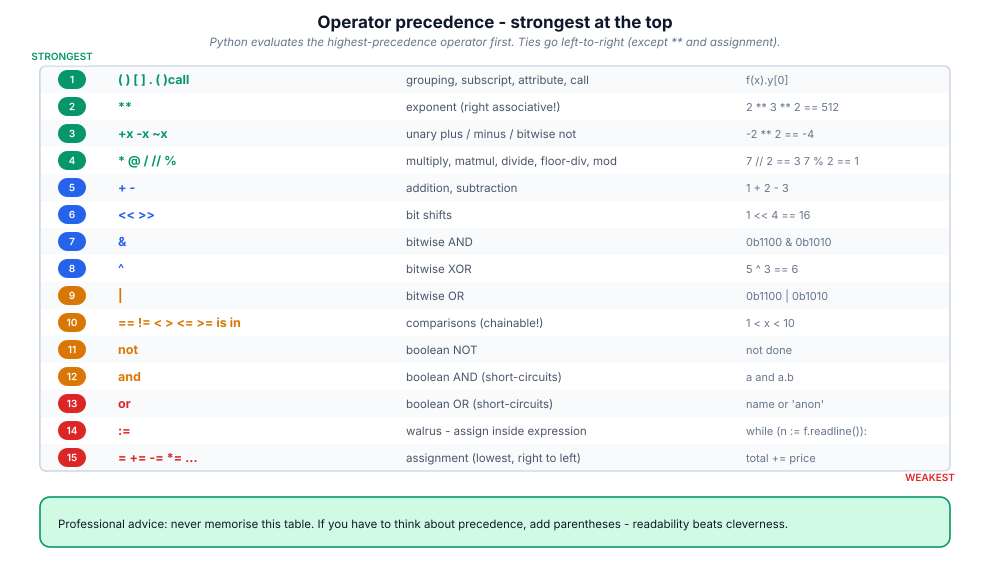

# 3. Operators & expressions

> An operator is not a symbol; it is a function call in disguise. Once you see
> the dispatch table, "magic" methods stop being magic.

## 3.1 Definition

**Plain version.** Operators are the built-in symbols (`+`, `and`, `in`, …)
that combine values into expressions.

**Precise version.** Every operator compiles to bytecode that calls a
**special (dunder) method** on the left operand — `a + b` becomes
`a.__add__(b)`, falling back to `b.__radd__(a)` if that returns
`NotImplemented`. Comparison, membership and identity operators are handled by
the VM directly or via `__eq__`/`__lt__`/`__contains__`/`__bool__`. So
*defining an operator for your own type* means defining the right dunder, and
*reading someone else's type* means checking which dunders it implements.

## 3.2 Syntax

```python
# arithmetic
7 + 2      7 - 2      7 * 2      7 / 2      # 9 5 14 3.5   (/ is always float)
7 // 2     7 % 2      7 ** 2                 # 3 1 49       (floor, modulo, power)
divmod(7, 2)                                # (3, 1)

# comparison (chainable!)
1 < x < 10            # x evaluated ONCE; same as 1 < x and x < 10 but faster
a == b   a != b   a >= b

# logical (short-circuit, return an OPERAND not a bool)
a and b               # a if a is falsy else b
a or b                # a if a is truthy else b
not a                 # the only one guaranteed to return a bool

# identity / membership
a is b    a is not b            # same object?
x in s    x not in s            # s.__contains__(x)

# bitwise
n & m     n | m     n ^ m     ~n      n << k    n >> k

# assignment forms
x = 1     x += 1    x -= 1    x *= 1   x //= 2   x %= 3   x **= 2   x |= flag

# conditional expression (the "ternary")
label = "adult" if age >= 18 else "minor"

# walrus (3.8+): assign INSIDE an expression
while (line := fh.readline()):
    ...
```

## 3.3 First examples

**Example 1 — floor division and modulo, including negatives.**

```python
print(7 // 2, 7 % 2)      # 3 1
print(-7 // 2, -7 % 2)    # -4 1   floor rounds DOWN; sign follows the DIVISOR
print(7 / 2)              # 3.5
```

**Example 2 — short-circuiting protects you.**

```python
user = None
print(user and user.name)     # None  (never touches .name -> no crash)
config = {}
print(config.get("theme") or "light")   # 'light'
```

**Example 3 — membership and chaining.**

```python
scores = [88, 92, 75]
print(92 in scores)             # True
print(all(60 <= s <= 100 for s in scores))   # True, chained comparisons
```

## 3.4 The picture



## 3.5 Going deeper

### 3.5.1 The dispatch table

| Operator | Method on left operand | Reflected fallback |
|----------|------------------------|--------------------|
| `+ - * / // % **` | `__add__ __sub__ __mul__ __truediv__ __floordiv__ __mod__ __pow__` | `__radd__ …` |
| `@` | `__matmul__` | `__rmatmul__` |
| `+= -= …` | `__iadd__ __isub__ …` (falls back to `__add__`) | — |
| `-x  +x  ~x` | `__neg__ __pos__ __invert__` | — |
| `== !=` | `__eq__ __ne__` | swapped automatically |
| `< <= > >=` | `__lt__ __le__ __gt__ __ge__` | swapped (`<` ↔ `>`) |
| `len(x)` / truthiness | `__len__` / `__bool__` | — |
| `x in s` | `s.__contains__(x)` | falls back to iteration |
| `abs(x)` `int(x)` `str(x)` | `__abs__ __int__ __str__` | — |

`NotImplemented` (not `None`!) is the signal "I don't know how; ask the other
side". Returning a wrong type or raising from `__eq__` breaks `==` everywhere,
including inside `sorted`, `in`, and `dict` lookups.

### 3.5.2 Truthiness: what counts as false

Exactly these are falsy: `False`, `None`, `0` (any numeric zero), `""`, `b""`,
`()`, `[]`, `{}`, `set()`, `range(0)`, and any object whose `__bool__` returns
`False` or whose `__len__` returns `0`. Everything else is truthy — including
`"0"`, `"False"`, `[0]` and `float('nan')`.

```python
bool("0"), bool([0]), bool(float("nan"))     # (True, True, True)
```

Custom classes are truthy by default; define `__bool__` (or `__len__`) to give
them honest emptiness semantics — e.g. a `ResultSet` should be falsy when it
holds no rows.

### 3.5.3 `and` / `or` return operands, not booleans

This is a feature (cheap defaults, None-guards) and a trap (surprising return
types):

```python
0 or "fallback"        # 'fallback'
"" or 0 or [] or "x"   # 'x'        first truthy wins, else the LAST value
3 and 4                # 4
None and 1             # None
```

The modern, explicit alternative for defaults is `value if value is not None
else default`, or `dict.get(k, default)`. Reserve `or` for genuinely
"first truthy" logic.

### 3.5.4 Bitwise operators as real engineering tools

```python
READ, WRITE, EXEC = 1 << 0, 1 << 1, 1 << 2     # 1, 2, 4
perms = READ | WRITE                            # combine: 3
perms & WRITE                                   # test: 2 (truthy)
perms ^ READ                                    # toggle READ off: 2
perms & ~WRITE                                  # clear WRITE: 1
bin(perms), perms.bit_length()                  # '0b11', 2
```

In production code prefer `enum.IntFlag` over raw ints — same bitwise power,
readable names, `repr` support:

```python
from enum import IntFlag, auto
class Perm(IntFlag):
    READ = auto(); WRITE = auto(); EXEC = auto()
p = Perm.READ | Perm.WRITE
Perm.WRITE in p            # True
```

Shifts are also the fastest powers of two (`n << k == n * 2**k`), and `&`/`|`
implement set algebra on bitmasks — the representation behind file
permissions, feature flags and packed protocols.

### 3.5.5 The walrus, honestly

PEP 572 exists for one shape of problem: *use a computed value in a condition
and then again in the body*.

```python
import re
if (m := re.match(r"(\d+)-(\d+)", text)):      # bind AND test
    lo, hi = int(m.group(1)), int(m.group(2))

results = [y for x in data if (y := slow(x)) is not None]   # compute once
```

It shines in `while` read-loops and comprehension filters. It hurts readability
when nested or used where a plain assignment would do. Style guides (and
reviewers) accept it in those two shapes and reject it elsewhere.

### 3.5.6 Augmented assignment: in-place when possible

`x += y` tries `__iadd__`; lists implement it (mutate in place and return
self), ints don't (rebind to a new object). This difference produces the most
famous Python gotcha:

```python
t = (1, [2])
try:
    t[1] += [3]
except TypeError as e:
    print(e)          # 'tuple' object does not support item assignment
print(t)              # (1, [2, 3])  <- the list WAS mutated, THEN it raised
```

The bytecode does `BINARY_OP` then `STORE_SUBSCR`; the store fails, but the
in-place mutation already happened. Lesson: never mutate through an immutable
container.

## 3.6 Industry level

### Exact arithmetic where it matters

Binary floats cannot represent most decimals. Money and scientific code pay
for this in production incidents:

```python
0.1 + 0.2                     # 0.30000000000000004
from decimal import Decimal
Decimal("0.1") + Decimal("0.2")      # Decimal('0.3')
```

Rules teams enforce: money → `Decimal` or integer minor units; compare floats
→ `math.isclose`; accumulate floats → `math.fsum`; scientific → `numpy` with
explicit dtypes.

### The `operator` module for functional code

When you need "the operator as a value" (sort keys, reductions, pipelines),
`operator` beats lambdas in speed and clarity:

```python
import operator, functools
rows.sort(key=operator.itemgetter("age", "name"))
total = functools.reduce(operator.add, amounts, 0)     # == sum(amounts)
names = list(map(operator.attrgetter("full_name"), users))
```

### Comparison discipline

Implement `__eq__` plus `__lt__` and decorate with
`functools.total_ordering` to get the rest; always return `NotImplemented`
for unknown types; make equality consistent with `__hash__` (equal objects,
equal hashes) or explicitly set `__hash__ = None` for unhashable mutables —
which is exactly what `list` does.

### Readability over golf

`x = a if c else b` beats nested ternaries; chained comparisons beat
`and`-joined ones; `in` beats `== or == or ==`. Reviewers reject clever
one-liners that need a comment — the comment is proof the expression failed.

## 3.7 Comparison tables

**Truthiness quick reference:**

| Value | Truthy? | Note |
|-------|---------|------|
| `0`, `0.0`, `0j`, `Decimal("0")` | falsy | numeric zero |
| `""`, `b""`, `()`, `[]`, `{}`, `set()` | falsy | empty containers |
| `None`, `False` | falsy | |
| `"0"`, `"False"`, `" "` | **truthy** | non-empty strings |
| `[0]`, `{"a": None}` | **truthy** | non-empty containers |
| `float("nan")` | **truthy** | nan is not zero |
| custom object | truthy | unless `__bool__`/`__len__` says otherwise |

**Floor division / modulo by sign:**

| Expression | Result | Rule |
|------------|--------|------|
| `7 // 2` | `3` | floor toward −∞ |
| `-7 // 2` | `-4` | floor, not truncate |
| `7 // -2` | `-4` | floor |
| `7 % 3` | `1` | sign of divisor |
| `-7 % 3` | `2` | sign of divisor (+) |
| `7 % -3` | `-2` | sign of divisor (−) |

**Operator → "what actually runs":**

| You write | Python runs |
|-----------|-------------|
| `a + b` | `type(a).__add__(a, b)` else `type(b).__radd__(b, a)` |
| `a += b` | `a = type(a).__iadd__(a, b)` if present else `a = a + b` |
| `a == b` | `__eq__`, default = identity |
| `a < b` | `__lt__` |
| `x in s` | `type(s).__contains__(s, x)` else iterate & `==` |
| `bool(a)` | `__bool__` else `__len__ != 0` else `True` |
| `if a:` | same as `bool(a)` |

## 3.8 Mistakes & gotchas

::: gotcha "`not a == b`"
Parses as `not (a == b)` — usually what you meant — but `not a == b` reads
badly; write `a != b`. And never write `x == False`; write `not x` or
`x is False` only when you truly need identity.
:::

::: gotcha "Float equality"
Never `==` two floats computed differently. `math.isclose(a, b, rel_tol=1e-9)`.
:::

::: gotcha "`//` with negatives surprises C/Java programmers"
Python floors; C truncates. `-7 // 2` is `-4`, not `-3`. Ported code breaks
here.
:::

::: gotcha "Chained assignment of mutables"
`a = b = []` shares one list. Use separate statements for containers.
:::

::: gotcha "`and`/`or` return operands"
`len(x) and "yes"` yields `0` for empty `x`, not `False`. If callers expect a
bool, wrap in `bool(...)`.
:::

::: warn "Augmented assignment through a tuple"
`t[1] += [3]` mutates AND raises. Use `t[1] = t[1] + [3]`… which also raises
(tuple immutable) — the correct move is to not store mutable state in tuples.
:::

## 3.9 Interview questions

1. **What does `a + b` compile to?** — `BINARY_OP` calling `__add__` with
   `__radd__` fallback on `NotImplemented`.
2. **Difference between `/` and `//`?** — true division (always float) vs
   floor division (rounds toward −∞, type follows operands).
3. **What does `and` return?** — the first falsy operand, else the last
   operand. Short-circuits.
4. **Why is `1 < x < 10` better than `x > 1 and x < 10`?** — one evaluation of
   `x`, single expression, compiles to an efficient chain.
5. **What is the walrus operator for?** — binding a name inside an expression
   where a statement isn't allowed (`while`, `if`, comprehensions).
6. **Is `==` the same as `is`?** — No: value vs identity. `is` is for `None`
   and singletons.
7. **How would you make your class support `+` and `+=` differently?** —
   `__add__` returning a new instance; `__iadd__` mutating and returning
   `self`.

## 3.10 Practice exercises

[[exercise tier="Beginner" id="ex-03-a" file="exercises/03_operators/test_tasks.py"]]
Implement `describe_division(a, b)` returning `{"true": …, "floor": …,
"mod": …, "divmod": (…)}`; `grade(score)` mapping a score to `"A"…"F"` using
chained comparisons; and `bit_summary(n)` returning `{"binary": "0b…",
"bit_length": …, "is_even": …, "halved": …}` using shifts and masks.
[[/exercise]]

[[exercise tier="Intermediate" id="ex-03-b" file="exercises/03_operators/test_tasks.py"]]
Implement `first_truthy(*values)` (exact `or` semantics: last value if all
falsy), `clip(value, lo, hi)` without `if` statements (use `min`/`max`),
`apply_op(name, a, b)` dispatching `+ - * / // % **` through the `operator`
module with a whitelist that raises `ValueError` for anything else, and
`encode_permissions(names)` / `has_permission(flags, name)` using bit masks.
[[/exercise]]

[[exercise tier="Industry" id="ex-03-c" file="exercises/03_operators/test_tasks.py"]]
Implement a `Money` value class (integer minor units + currency) supporting
`+`, `-`, `==`, `<`, `abs()`, `str()` ("€12.34"), unary `-`, and raising
`ValueError` on currency mismatch; support reflected addition with `int`
(zero-amount semantics) and refuse float operands with a clear `TypeError`.
Then implement `sort_transactions(txns)` ordering by currency then amount using
`operator.attrgetter`.
[[/exercise]]

[[solution]]
```python
# Core of the reference answer (full: exercises/03_operators/solution.py)
import operator

_OPS = {"+": operator.add, "-": operator.sub, "*": operator.mul,
        "/": operator.truediv, "//": operator.floordiv,
        "%": operator.mod, "**": operator.pow}

def apply_op(name, a, b):
    try:
        fn = _OPS[name]
    except KeyError:
        raise ValueError(f"unsupported operator: {name!r}") from None
    return fn(a, b)

class Money:
    __slots__ = ("minor", "currency")
    def __init__(self, minor: int, currency: str):
        if isinstance(minor, float):
            raise TypeError("Money amounts must be integer minor units")
        self.minor, self.currency = int(minor), currency
    def _check(self, other):
        if not isinstance(other, Money):
            return NotImplemented
        if self.currency != other.currency:
            raise ValueError(f"currency mismatch: {self.currency} vs {other.currency}")
        return other
    def __add__(self, other):
        if isinstance(other, int):           # reflected-friendly zero semantics
            other = Money(0, self.currency)
        o = self._check(other)
        if o is NotImplemented:
            return NotImplemented
        return Money(self.minor + o.minor, self.currency)
    __radd__ = __add__
    def __eq__(self, other):
        o = self._check(other)
        return o is not NotImplemented and self.minor == o.minor
```
[[/solution]]

## 3.11 Cheatsheet

| Need | Use |
|------|-----|
| Integer quotient / remainder | `a // b`, `a % b`, or `divmod(a, b)` |
| Power, modular power | `a ** b`, `pow(a, b, m)` |
| Range test | `lo <= x < hi` |
| Default value | `x or default` (truthy) / `x if x is not None else default` |
| Guard attribute access | `obj and obj.attr` / `getattr(obj, "attr", None)` |
| Membership | `x in coll`, `x not in coll` |
| Identity | `x is None`, `x is not None` |
| Bit flags | `enum.IntFlag` with `auto()`; raw: `1 << k`, `a \| b`, `a & b`, `a ^ b`, `~b & a` |
| Compare floats | `math.isclose(a, b)` |
| Money | `decimal.Decimal` or integer minor units |
| Sort by fields | `key=operator.itemgetter("a", "b")` |
| Assign in expression | `(n := expr)` |
| Ternary | `a if cond else b` |
