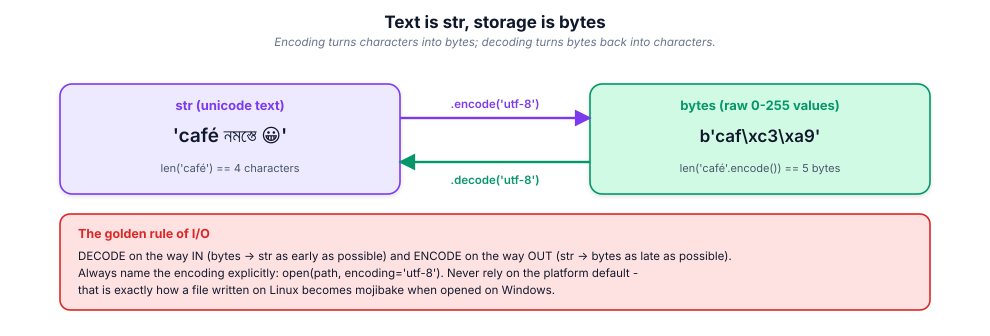

# 4. Strings & text

> Text is the interface between your program and the world, and the world is
> not ASCII. This module makes mojibake and quadratic string code impossible
> for you to write by accident.

## 4.1 Definition

**Plain version.** A string (`str`) is text: `"hello"`, `"नमस्ते"`, `"🚀"`.

**Precise version.** `str` is an **immutable sequence of Unicode code
points**. Immutable: every "change" builds a new object. Sequence: indexing,
slicing, iteration, `len`, `in` all work. Unicode: `len("café") == 4`
characters even though UTF-8 stores it in 5 **bytes** — because `str` is not
bytes. The bridge between the two is **encoding** (`str → bytes`) and
**decoding** (`bytes → str`).

## 4.2 Syntax

```python
# literals -------------------------------------------------------------
s = 'single'  t = "double"            # identical; pick one style, keep it
raw = r"C:\new\path"                  # no escape processing
tri = """multi
line"""                               # triple quotes keep newlines
b = b"raw bytes"                      # bytes literal, NOT str
f = f"value={42:>6.2f}"               # formatted literal (see 4.5)

# the core operations ---------------------------------------------------
s[0]          s[-1]        s[1:4]     s[::2]      s[::-1]
len(s)        "ub" in s    s + t      s * 3
s.upper()     s.lower()    s.strip()  s.split()   s.split(",")
s.replace(a, b)           s.startswith(p)        s.endswith(p)
s.find(sub)   s.index(sub) s.count(sub)           s.partition(sep)
",".join(parts)           s.format(...)          f"{x!r:>10}"
```

## 4.3 First examples

**Example 1 — slicing and immutability.**

```python
name = "PyCon India"
print(name[:5], name[6:], name[::-1])     # PyCon  India  aidnI noCyP
# name[0] = "p"                            # TypeError: 'str' does not support item assignment
print("p" + name[1:])                     # build a NEW string instead
```

**Example 2 — splitting and joining (the workhorses).**

```python
line = "  ada,lovelace,36  "
parts = [p.strip() for p in line.split(",")]
print(parts)                              # ['ada', 'lovelace', '36']
print(" | ".join(parts))                  # ada | lovelace | 36
```

**Example 3 — encode / decode.**

```python
text = "café 🚀"
data = text.encode("utf-8")
print(len(text), len(data))               # 7 code points, 11 bytes
print(data.decode("utf-8") == text)       # True
```

## 4.4 The picture

![Indexing and slicing: positive and negative indices over a string, with s[2:6] highlighted - the stop index is exclusive.](figures/string-slicing.svg)



## 4.5 Going deeper

### 4.5.1 Code points, graphemes, and why `len` lies to your eyes

```python
import unicodedata
s = "é"            # e + combining acute (2 code points!)
print(len(s))                      # 2
print(unicodedata.normalize("NFC", s) == "é")   # True after composing
```

A *grapheme cluster* (what a human calls "a character") can be several code
points (combining marks), and a code point can be several bytes. Hence three
different "lengths": `len(str)` code points, `len(str.encode())` bytes, and
display width (which emoji and CJK widen). Normalise user input with
`unicodedata.normalize("NFC", …)` before comparing or storing.

### 4.5.2 Case: `lower()` is not enough

```python
"STRASSE".lower() == "strasse"          # True
"straße".lower() == "STRASSE".lower()   # False (!)
"straße".casefold() == "STRASSE".casefold()   # True  (ß -> ss)
```

`casefold()` implements Unicode caseless matching — use it for
case-insensitive comparison of anything a human typed. Turkish `İ` and Greek
final sigma are further reasons `lower()` is wrong for matching.

### 4.5.3 The method families, organised

| Family | Methods | Notes |
|--------|---------|-------|
| case | `upper lower title capitalize swapcase casefold` | `title()` capitalises every word (odd for "mcDonald") |
| trimming | `strip lstrip rstrip removeprefix removesuffix` | `strip("abc")` removes a **set** of chars, not a substring |
| splitting | `split rsplit splitlines partition rpartition` | `split()` with no arg collapses all whitespace |
| searching | `find rfind index rindex count startswith endswith` | `find` → `-1`; `index` → `ValueError` |
| testing | `isalnum isalpha isdigit isnumeric isdecimal isspace isupper islower` | `isdigit` accepts superscripts; `isdecimal` is strictest |
| transforming | `replace translate expandtabs zfill center ljust rjust` | `str.maketrans` + `translate` = fast char maps |
| assembling | `join format %`-style, f-strings | `join` is the fast path |

`partition` is criminally underused: it always returns exactly three parts,
so `head, sep, tail = s.partition("=")` never raises and tells you whether the
separator existed (`sep == ""`).

### 4.5.4 f-strings and the format mini-language

```python
n, price, kind = 1234567.891, 42, "widget"
f"{n:,.2f}"          # '1,234,567.89'   grouping + precision
f"{kind:>12}"        # right-aligned in width 12
f"{kind:<12}|"       # left-aligned
f"{kind:^12}"        # centred
f"{42:b} {42:x} {42:o}"     # '101010 2a 52'
f"{0.5:%}"           # '50.000000%'
f"{price=}"          # 'price=42'   (debugging: shows name and value)
f"{price!r:>8}"      # conversion (!r repr, !s str, !a ascii) then spec
f"{{literal braces}}"      # escape braces by doubling
```

Everything after `:` is the same **format specification mini-language** that
`str.format()` and `format(value, spec)` accept — meaning you can apply a
spec read from configuration at runtime: `format(value, spec_from_file)`.
f-strings are evaluated at runtime (they call `__format__`), are fast (compiled
to concatenations), and since 3.12 may nest quotes and reuse the same quote
type.

### 4.5.5 Performance: the quadratic trap

Strings are immutable, so `s += part` in a loop copies the whole string every
iteration → O(n²):

```python
# slow: quadratic
out = ""
for chunk in chunks:
    out += chunk

# fast: linear
out = "".join(chunks)

# also fast, and clearer when building conditionally
parts = []
for row in rows:
    parts.append(render(row))
out = "\n".join(parts)
```

For very large streaming output, write to a file or `io.StringIO` instead of
accumulating at all. Benchmark with `timeit` (module 17); the join version is
routinely 10–100× faster on 10⁵ pieces.

### 4.5.6 Regular expressions, the 20 % you will use daily

```python
import re
LOG = re.compile(r"(?P<ip>\d+\.\d+\.\d+\.\d+) - - \[(?P<when>[^\]]+)\] "
                 r'"(?P<verb>GET|POST) (?P<path>\S+)" (?P<status>\d{3})')

m = LOG.search(line)
if m:
    m.group("status")        # named groups: readable, refactor-safe
    m.groupdict()            # {'ip': ..., 'when': ..., ...}

LOG.findall(text)            # all matches
LOG.sub("@@@", text)         # replace matches
re.split(r"[,\s]+", text)    # split on a pattern
```

Compile once, reuse forever (`re.compile`), prefer named groups, and reach for
plain string methods first — `s.startswith("GET ")` beats a regex every time
it can express the rule.

### 4.5.7 Encodings and error policies

```python
raw = b"caf\xe9"                     # latin-1 bytes
raw.decode("utf-8")                  # UnicodeDecodeError
raw.decode("utf-8", errors="replace")     # 'caf\ufffd'
raw.decode("utf-8", errors="ignore")      # 'caf'
raw.decode("utf-8", errors="backslashreplace")  # 'caf\\xe9'
raw.decode("latin-1")                # 'café'  (the right answer here)
```

Decide the policy **deliberately**: `strict` for data you must not corrupt,
`replace` for user-visible best-effort text, never `ignore` on data you store
(silently losing bytes is how records stop matching).

## 4.6 Industry level

### Text at the boundaries

Production services agree on UTF-8 everywhere: HTTP bodies, JSON, database
columns, log files. The code then follows one rule — decode once at the edge,
keep `str` internally, encode once at the edge:

```python
payload = request.body.decode("utf-8")      # edge in
...
response = json.dumps(obj, ensure_ascii=False).encode("utf-8")   # edge out
```

`ensure_ascii=False` keeps UTF-8 human-readable in payloads instead of
`\uXXXX` noise; the transport is UTF-8 anyway.

### Normalisation and matching of human input

Usernames, emails and search queries must be normalised before comparison:

```python
def canon(s: str) -> str:
    return unicodedata.normalize("NFC", s).casefold().strip()
```

Without this, "José" typed on two keyboards becomes two different users.

### Never use `str` for binary, never `bytes` for text

IDs from databases, tokens and hashes are frequently `bytes`; converting them
to `str` with the wrong codec is a top-10 production bug. Use
`binascii.hexlify(...).decode("ascii")` or `base64.urlsafe_b64encode` when a
textual form is genuinely required.

### Logging: lazy formatting

```python
logger.info("processed %d rows in %.2fs", n, dt)     # good: formatted only if logged
logger.info(f"processed {n} rows in {dt:.2f}s")      # pays the cost always
```

At `DEBUG`-off in production, the `%` form costs nothing. Teams lint for this.

### Paths are not strings

```python
from pathlib import Path
p = Path("data") / "raw" / "sales.csv"     # OS-correct separators, no join bugs
p.read_text(encoding="utf-8")
```

`os.path` string glue is legacy; `pathlib` is the reviewed default (module 10).

## 4.7 Comparison tables

**`str` vs `bytes`:**

| | `str` | `bytes` |
|---|-------|---------|
| holds | Unicode code points | integers 0–255 |
| literal | `"café"` | `b"caf\xc3\xa9"` |
| `len("café")` | 4 | 5 (utf-8) |
| indexing gives | 1-char `str` | `int` |
| use for | text, names, messages | files, sockets, hashes, images |
| convert | `.encode(codec)` | `.decode(codec)` |

**Formatting choices:**

| Mechanism | When |
|-----------|------|
| f-string | interpolation known at write time (default choice) |
| `str.format` | template stored in data/config |
| `%` formatting | logging calls (lazy) |
| `string.Template` | user-editable templates (no code execution surface) |
| `"".join` / `write()` | assembling many pieces |

**Search methods:**

| Need | Method | Missing-case behaviour |
|------|--------|------------------------|
| position or −1 | `find` / `rfind` | `-1` |
| position or crash | `index` / `rindex` | `ValueError` |
| boolean | `in` | `False` |
| prefix/suffix | `startswith` / `endswith` (accept tuples!) | `False` |
| split at first sep | `partition` | `("", "", s)` |
| count | `count` | `0` |

## 4.8 Mistakes & gotchas

::: gotcha "`strip("ab")` is a character SET"
`"abcab".strip("ab")` → `'c'`. To remove a fixed prefix/suffix use
`removeprefix` / `removesuffix` (3.9+).
:::

::: gotcha "`split()` vs `split(" ")`"
Bare `split()` collapses runs of whitespace and drops empties;
`split(" ")` keeps empty fields. Parsing CSV by hand with `split(",")` is how
quoted-comma bugs ship — use the `csv` module (module 10).
:::

::: gotcha "`find` returns −1, which is truthy-ish in `if s.find(x):`"
`if s.find(x) != -1:` or better `if x in s:`. The −1-vs-0 confusion is a
classic off-by-truthiness bug.
:::

::: gotcha "Literal braces in f-strings"
`f"{"x"}"` is a syntax error pre-3.12 and `f"{ {1,2} }"` prints a set. To emit
`{` or `}` literally, double them: `f"{{}}"` → `'{}'`.
:::

::: gotcha "Concatenating in loops"
Quadratic time. Collect pieces and `"".join`. Reviewers reject `+=` in loops
over data of unknown size.
:::

::: warn "Default encoding is platform-dependent"
`open(path)` without `encoding=` uses the locale (cp1252 on some Windows!).
Always pass `encoding="utf-8"` — or run Python 3.15+ where UTF-8 mode becomes
default, but don't rely on it yet.
:::

## 4.9 Interview questions

1. **Are strings mutable?** — No; every modification returns a new object.
   Consequences: no item assignment, O(n) per "change", hashable, thread-safe.
2. **`str` vs `bytes`?** — code points vs raw bytes; bridged by
   encode/decode with a named codec.
3. **Why is `"".join(parts)` fast?** — one allocation and one copy, versus a
   copy of the growing string per `+=`.
4. **`find` vs `index`?** — −1 vs `ValueError`.
5. **What does `casefold` do that `lower` doesn't?** — full Unicode caseless
   mapping (ß→ss), correct for case-insensitive matching.
6. **What is an f-string at runtime?** — an expression calling
   `__format__`/conversions; compiled, not parsed at runtime; cannot be
   built from untrusted templates (use `string.Template` for that).
7. **How do you compare usernames safely?** — NFC-normalise, casefold, strip.

## 4.10 Practice exercises

[[exercise tier="Beginner" id="ex-04-a" file="exercises/04_strings/test_tasks.py"]]
Implement `stats(text)` returning `{"chars", "words", "lines", "reversed"}`,
`initials(full_name)` ("ada lovelace" → "A.L."), and `caesar(text, shift)`
shifting only ASCII letters, wrapping around, preserving case and
non-letters.
[[/exercise]]

[[exercise tier="Intermediate" id="ex-04-b" file="exercises/04_strings/test_tasks.py"]]
Implement `slugify(text)` (NFC-normalise, strip accents, lowercase,
non-alnum → single `-`, trim `-`), `parse_query(qs)` parsing
`"a=1&b=2&b=3"` into `{"a": ["1"], "b": ["2", "3"]}` with URL-decoding, and
`mask_email(addr)` keeping first and last character of the local part
(`"jane.doe@corp.io"` → `"j******e@corp.io"`).
[[/exercise]]

[[exercise tier="Industry" id="ex-04-c" file="exercises/04_strings/test_tasks.py"]]
Implement `render_template(template, mapping)` supporting `{key}`,
`{key!r}`, `{key!s}` and `{key:spec}` (apply the format mini-language via
`format(value, spec)`), raising `KeyError` for unknown keys and `ValueError`
for a malformed placeholder; and `decode_stream(chunks)` that decodes an
iterable of byte chunks split at arbitrary boundaries using an incremental
decoder, yielding `str` pieces without ever losing or duplicating a
character.
[[/exercise]]

[[solution]]
```python
# The interesting half (full: exercises/04_strings/solution.py)
import codecs, re, unicodedata

PLACEHOLDER = re.compile(
    r"\{(?P<key>\w+)(?P<conv>![rs])?(?::(?P<spec>[^{}]*))?\}")
LBRACE, RBRACE = "\x00", "\x01"      # sentinels for escaped braces

def render_template(template: str, mapping: dict) -> str:
    work = template.replace("{{", LBRACE).replace("}}", RBRACE)  # protect first!
    if re.search(r"[{}]", PLACEHOLDER.sub("", work)):
        raise ValueError("malformed placeholder")

    def sub(m: re.Match) -> str:
        key = m.group("key")
        if key not in mapping:
            raise KeyError(key)
        value = mapping[key]
        text = (repr(value) if m.group("conv") == "!r"
                else str(value) if m.group("conv") == "!s"
                else value)
        spec = m.group("spec")
        if spec:
            return format(text, spec)        # raw value: numeric specs work
        return text if isinstance(text, str) else format(text)

    return PLACEHOLDER.sub(sub, work).replace(LBRACE, "{").replace(RBRACE, "}")

def decode_stream(chunks):
    dec = codecs.getincrementaldecoder("utf-8")()
    for i, chunk in enumerate(chunks):
        piece = dec.decode(chunk, final=(i == len(chunks) - 1))
        if piece:
            yield piece
```
[[/solution]]

## 4.11 Cheatsheet

| Need | Use |
|------|-----|
| Reverse | `s[::-1]` |
| Split lines / words | `s.splitlines()`, `s.split()` |
| Trim | `s.strip()`, `removeprefix`, `removesuffix` |
| Test membership | `sub in s` |
| Replace first n | `s.replace(a, b, n)` |
| Char map | `s.translate(str.maketrans({...}))` |
| Align/pad | `s.center(w)`, `ljust`, `rjust`, `zfill` |
| Numbers | `f"{n:,}"`, `f"{n:.2f}"`, `f"{n:%}"`, `f"{n:x}"` |
| Debug print | `f"{expr=}"` |
| Caseless compare | `a.casefold() == b.casefold()` |
| Normalise | `unicodedata.normalize("NFC", s)` |
| Fast build | `"".join(iterable)` |
| Streaming text | `io.StringIO`, or write to file |
| Regex | `re.compile(...)` once, named groups, `.search/.findall/.sub` |
| Safe templates from users | `string.Template` |
