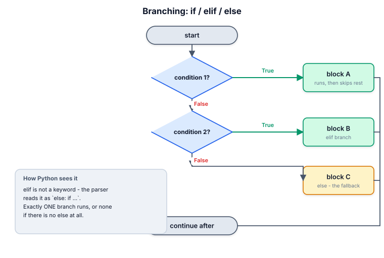
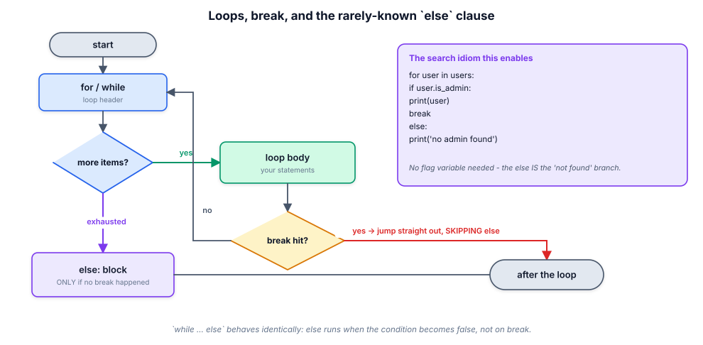
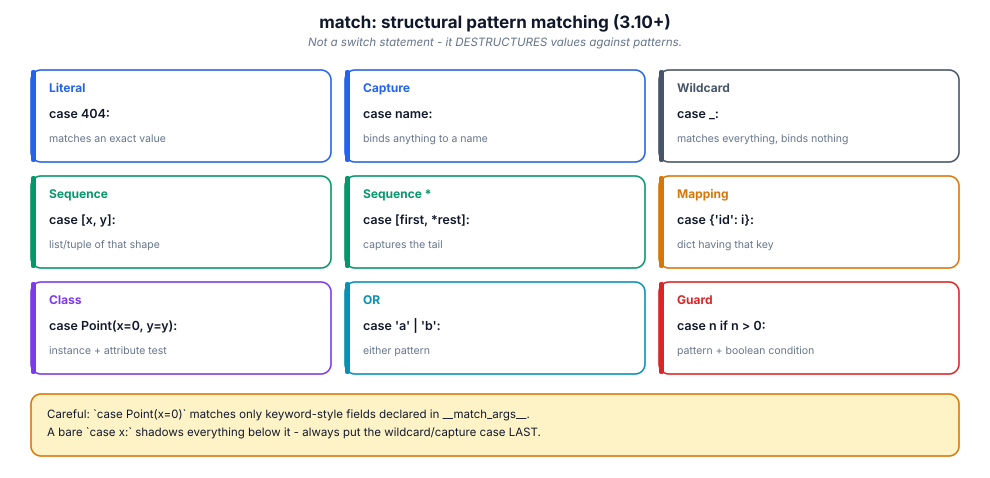

# 5. Control flow

> Good control flow is invisible: the reader never has to hold state in their
> head. This module is about writing branches and loops that read top to
> bottom like prose.

## 5.1 Definition

**Plain version.** Control flow is how a program chooses which statements run
and how often.

**Precise version.** Python offers *selection* (`if/elif/else`, conditional
expressions, `match`), *iteration* (`for`, `while`, plus the comprehensions of
module 12), and *interruption* (`break`, `continue`, `return`, `raise`).
Blocks are delimited by **indentation** (4 spaces, enforced by the parser),
there is **no block scope** (a loop variable survives the loop), and every
construct is an expression or a suite of statements — never both at once.

## 5.2 Syntax

```python
# selection -------------------------------------------------------------
if score >= 90:
    grade = "A"
elif score >= 80:            # elif = "else: if", only ONE branch runs
    grade = "B"
else:
    grade = "C"

label = "pass" if score >= 40 else "fail"      # conditional expression

# iteration ---------------------------------------------------------------
for item in collection:      # any iterable; item is rebound each pass
    ...
for i, item in enumerate(collection, start=1):   # index + value
    ...
for key, value in mapping.items():
    ...
for a, b in zip(seq1, seq2, strict=True):      # strict: length mismatch -> ValueError
    ...
while condition:
    ...

# interruption -------------------------------------------------------------
break        # leave the loop NOW (skips the else clause!)
continue     # skip to the next iteration
pass         # do nothing (placeholder to keep syntax valid)

# the loop else ------------------------------------------------------------
for x in items:
    if wanted(x):
        break
else:
    ...          # runs ONLY if the loop finished without break
```

## 5.3 First examples

**Example 1 — guard clauses instead of nesting.**

```python
def process(user):
    if user is None:
        return None                 # bail out early
    if not user.is_active:
        return None
    return user.profile             # the happy path stays at the left margin
```

**Example 2 — `for…else` search.**

```python
users = [{"name": "ada", "admin": False}, {"name": "grace", "admin": True}]
for u in users:
    if u["admin"]:
        print("first admin:", u["name"]); break
else:
    print("no admin found")         # never printed here
```

**Example 3 — `match` on structure.**

```python
def describe(point):
    match point:
        case (0, 0):
            return "origin"
        case (x, 0):
            return f"on x-axis at {x}"
        case [x, y] if x == y:
            return "diagonal"
        case {"x": x, "y": y}:
            return f"dict point {x},{y}"
        case _:
            return "something else"
```

## 5.4 The picture







## 5.5 Going deeper

### 5.5.1 `for` is sugar over the iterator protocol

`for item in seq:` compiles to `it = iter(seq)` then repeated `next(it)` until
`StopIteration` (module 12 draws the whole protocol). Consequences you can
rely on:

- anything iterable works: lists, dicts (keys), files (lines), generators,
  ranges, custom objects;
- the loop consumes iterators **once** — a generator is empty the second time;
- modifying a list while iterating it is undefined-ish behaviour; iterate a
  copy (`for x in lst[:]`) or build a new list.

### 5.5.2 No block scope: loop variables leak

```python
for i in range(3):
    pass
print(i)          # 2  !  the name survives
```

Unlike C/Java, `i` lives on in the enclosing function scope. Harmless in tiny
scripts; a real bug source when a later loop reuses the name assuming it is
fresh. Comprehensions, in contrast, **do** have their own scope (their loop
variable does not leak) — one more reason to prefer them.

### 5.5.3 The exact semantics of `else`

- runs when the loop condition becomes false (`while`) or the iterable is
  exhausted (`for`);
- does **not** run if `break` executed;
- **does** run if the body always `continue`s (continue is not an exit);
- runs even for a loop that never executed its body (empty iterable) — which
  is usually what you want ("not found" includes "nothing to search").

`break` inside `try…finally` still runs `finally` before leaving (module 11).

### 5.5.4 `match` is pattern matching, not a switch

Key differences from C-style `switch`:

- patterns **destructure**: `case [first, *rest]` binds names;
- a bare name is a **capture**, not a comparison. To compare against an
  existing value use a dotted name (`case Color.RED:`) or a guard
  (`case x if x == target:`);
- `_` is a wildcard that binds nothing;
- sequence patterns never match `str`/`bytes` (deliberate: prevents
  character-by-character surprises);
- class patterns use `__match_args__` for positional fields:
  `case Point(x=0, y=y):`;
- the first matching case wins; put irrefutable captures (`case x:`) last or
  they swallow everything;
- guards (`if …`) run after the pattern matches.

Under the hood, `match` compiles to efficient opcode-level checks
(`MATCH_SEQUENCE`, `MATCH_MAPPING`, `MATCH_CLASS`) — faster than an equivalent
`if/elif` chain of `isinstance` tests.

### 5.5.5 Loop idioms that replace loops entirely

Most "loop then accumulate" code is a builtin:

```python
any(p(x) for x in items)          # exists?      short-circuits
all(p(x) for x in items)          # every one?   short-circuits
sum(x.score for x in items)       # total
max(items, key=lambda x: x.score) # winner by a criterion
sorted(items, key=attrgetter("name"))
next((x for x in items if p(x)), default)   # first match or default
```

These are C-speed, short-circuiting, and say *what* you want rather than *how*.
Reserve an explicit `for` for cases with real state or side effects.

### 5.5.6 `while` loops: one exit is enough

```python
while True:
    line = fh.readline()
    if not line:
        break
    handle(line)
```

is acceptable and common; but

```python
while (line := fh.readline()):
    handle(line)
```

is the walrus's raison d'être: one exit, no duplicated condition. Reviewers
object to `while True` bodies containing several `break`s in different
directions — that is a state machine pretending to be a loop; make it a
`match` on an explicit state instead.

## 5.6 Industry level

### Flatten the pyramid

Deep nesting is a readability tax paid by every future reader. Three tools:

1. **guard clauses** (return/raise early for the abnormal cases);
2. **extract functions** so each branch gets a name;
3. **dispatch tables** when branches are keyed by a value:

```python
HANDLERS = {
    "create": handle_create,
    "update": handle_update,
    "delete": handle_delete,
}

def dispatch(event):
    handler = HANDLERS.get(event.kind)
    if handler is None:
        raise UnsupportedEvent(event.kind)
    return handler(event)
```

A dict of callables is O(1), testable per-branch, and extensible without
touching the dispatcher — the Open/Closed principle in six lines. Use `match`
when the *shape* of the data differs per branch; use a dispatch table when
only the *key* differs.

### State machines deserve explicit states

```python
from enum import Enum, auto

class OrderState(Enum):
    DRAFT = auto(); SUBMITTED = auto(); PAID = auto()
    SHIPPED = auto(); DELIVERED = auto(); CANCELLED = auto()

TRANSITIONS = {
    OrderState.DRAFT:     {OrderState.SUBMITTED, OrderState.CANCELLED},
    OrderState.SUBMITTED: {OrderState.PAID, OrderState.CANCELLED},
    OrderState.PAID:      {OrderState.SHIPPED},
    OrderState.SHIPPED:   {OrderState.DELIVERED},
    OrderState.DELIVERED: set(),
    OrderState.CANCELLED: set(),
}

def advance(order, target: OrderState) -> None:
    allowed = TRANSITIONS[order.state]
    if target not in allowed:
        raise InvalidTransition(order.state, target)
    order.state = target
```

Illegal states become unrepresentable-by-accident: the table *is* the
business rule, and tests can iterate the whole table.

### Iteration hygiene teams lint for

| Anti-pattern | Reviewed replacement |
|--------------|----------------------|
| `for i in range(len(xs))` | `for x in xs` / `enumerate(xs)` |
| `for k in d: v = d[k]` | `for k, v in d.items()` |
| `zip(a, b)` on unequal data | `zip(a, b, strict=True)` |
| flag variable + post-loop `if flag` | `for…else` or `any(...)` |
| index bookkeeping with `while i < n` | iterate, or `itertools` (module 12) |
| nested 4-deep conditionals | guard clauses / extracted predicates |

## 5.7 Comparison tables

**Choosing the branch construct:**

| Situation | Use |
|-----------|-----|
| 2 outcomes on one boolean | `if/else` or conditional expression |
| several disjoint value ranges | `if/elif` chain |
| many branches keyed by one value | dict dispatch or `match` on literals |
| branches on data *shape* | `match` with destructuring |
| validation preconditions | guard clauses (early return/raise) |
| polymorphic behaviour per type | methods / `Protocol`, not type checks |

**Loop control keywords:**

| Keyword | Effect | Runs loop `else`? |
|---------|--------|-------------------|
| `break` | exit loop immediately | no |
| `continue` | next iteration now | yes (if loop later exhausts) |
| `pass` | nothing | yes |
| `return` | exit the function | `finally` yes, `else` never reached |
| `raise` | propagate exception | `finally` yes |

**`match` pattern cheat-table:** see the figure in §5.4; the nine kinds are
literal, capture, wildcard, sequence, star-sequence, mapping, class, OR,
guard.

## 5.8 Mistakes & gotchas

::: gotcha "`zip` silently truncates"
`zip([1,2,3], [4,5])` yields two pairs and hides the bug. Use
`strict=True` (3.10+) so length mismatches raise immediately.
:::

::: gotcha "Mutating the list you iterate"
`for x in lst: lst.remove(x)` skips elements. Iterate a copy or rebuild with a
comprehension.
:::

::: gotcha "`else` after `while True`"
`while True:` never exhausts, so its `else` only runs via… nothing — `break`
skips it. An `else` on `while True` is dead code; reviewers flag it.
:::

::: gotcha "A capture pattern that swallows everything"
`case x:` matches ANY subject and binds it. Always place it (and `_`) last,
and use dotted constants (`case Status.OK:`) when you meant comparison.
:::

::: gotcha "Comparing with `==` inside `if` against None/True"
Use `is None` / `is True`-style identity for singletons (module 02/03).
:::

::: warn "Recursion is not idiomatic iteration"
Python's recursion limit (~1000 frames) and lack of tail-call optimisation
mean deep recursion crashes. Convert to a loop or an explicit stack.
:::

## 5.9 Interview questions

1. **What does `for…else` do?** — the `else` suite runs when the loop ends
   without `break`; ideal for search-with-fallback.
2. **`break` vs `continue` vs `pass`?** — exit / skip to next / do nothing.
3. **Does the loop variable leak?** — yes, `for` has no block scope;
   comprehensions do.
4. **How is `match` different from `switch`?** — patterns destructure and bind;
   names capture rather than compare; guards; first match wins.
5. **Why `zip(..., strict=True)`?** — fail fast on length mismatch instead of
   silently dropping tail items.
6. **Replace a flag variable with what?** — `for…else`, `any/all`, or an early
   return.
7. **What runs first: `else` or `finally` when a loop breaks inside try?** —
   `finally` runs on the way out; the loop's `else` is skipped by `break`.

## 5.10 Practice exercises

[[exercise tier="Beginner" id="ex-05-a" file="exercises/05_control_flow/test_tasks.py"]]
Implement `fizzbuzz(n)` returning the list of labels for 1..n;
`classify(values)` mapping each number to `"negative" | "zero" | "small" |
"large"` (small < 10); and `sum_evens(matrix)` summing only even entries of a
2-D list using `continue`.
[[/exercise]]

[[exercise tier="Intermediate" id="ex-05-b" file="exercises/05_control_flow/test_tasks.py"]]
Implement `first_admin(users)` using `for…else` (returns the first admin dict
or `None`, without any flag variable), `run_length_encode(seq)` returning
`[(item, count), …]`, and `parse_sections(lines)` grouping lines under
`[header]` lines into a dict (lines before any header go under `""`).
[[/exercise]]

[[exercise tier="Industry" id="ex-05-c" file="exercises/05_control_flow/test_tasks.py"]]
Implement the `OrderState` machine from §5.6 with `advance(order, target)`
raising `InvalidTransition` for illegal moves, plus
`shortest_path(start, target)` computing a legal transition sequence (or
`None`) via breadth-first search over the table — proving the table is a real
graph, not decoration. Then implement `chunk_while(predicate, iterable)`
splitting an iterable into runs while the predicate holds between neighbours.
[[/exercise]]

[[solution]]
```python
# Reference core (full: exercises/05_control_flow/solution.py)
from collections import deque

def first_admin(users):
    for user in users:
        if user.get("admin"):
            return user
    else:
        return None          # loop exhausted: no admin

def shortest_path(start, target):
    if start is target:
        return [start]
    seen, queue = {start}, deque([(start, [start])])
    while queue:
        state, path = queue.popleft()
        for nxt in sorted(TRANSITIONS[state], key=lambda s: s.name):
            if nxt in seen:
                continue
            seen.add(nxt)
            new = path + [nxt]
            if nxt is target:
                return new
            queue.append((nxt, new))
    return None
```
[[/solution]]

## 5.11 Cheatsheet

| Need | Idiom |
|------|-------|
| Branch on boolean | `if cond:` |
| Multi-way value | `if/elif/else` or dict dispatch |
| Branch on shape | `match … case …` |
| Inline choice | `a if cond else b` |
| Index + value | `enumerate(xs, start=1)` |
| Parallel iterate | `zip(a, b, strict=True)` |
| Dict iterate | `d.items()` |
| Search with fallback | `for…else` or `next((…), default)` |
| Exists / all | `any(…)`, `all(…)` |
| Early bail | guard clause `if bad: return/raise` |
| Skip one pass | `continue` |
| Stop loop | `break` |
| Placeholder body | `pass` (or `...`) |
| Infinite read loop | `while (line := fh.readline()):` |
