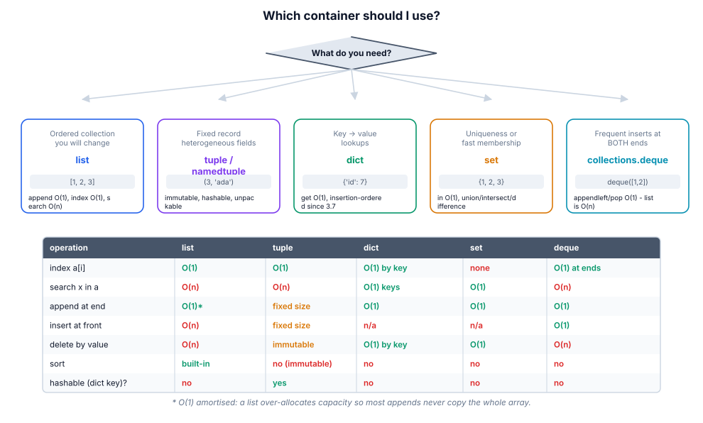
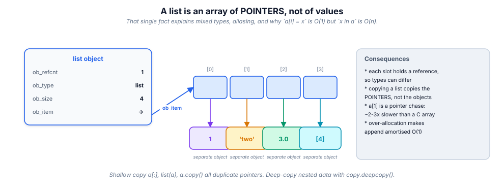
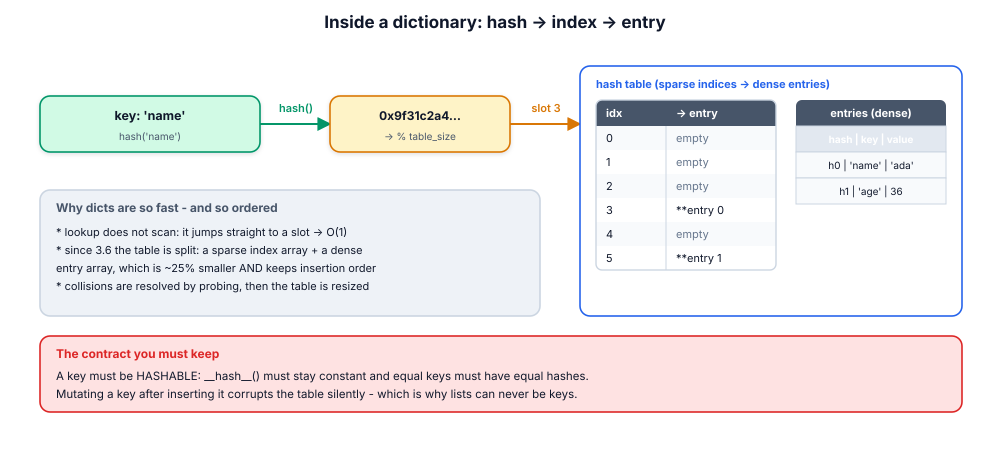

# 6. Data structures

> Choosing a container is a performance decision and a design decision at the
> same time. This module gives you the cost table, the memory layout, and the
> `collections` tools that make hand-rolled loops unnecessary.

## 6.1 Definition

**Plain version.** Containers hold several values: lists (ordered, editable),
tuples (ordered, fixed), dicts (key → value), sets (unique, unordered).

**Precise version.** Python's four core containers split into three
*protocols*: **sequences** (`list`, `tuple` — positional, indexable, ordered),
**mappings** (`dict` — key-addressed, insertion-ordered since 3.7), and
**sets** (`set`, `frozenset` — uniqueness and O(1) membership, no order).
Underneath: a list is a **resizable array of pointers**; a tuple is a **fixed
array of pointers**; a dict and a set are **hash tables** (dict's entries also
keep a dense insertion-order array). Those four sentences predict every
complexity number in this module.

## 6.2 Syntax

```python
# list ------------------------------------------------------------------
xs = [1, 2, 3]
xs.append(4)        xs.extend([5, 6])     xs.insert(0, 0)
xs.pop()            xs.remove(2)          xs.index(3)      3 in xs
xs.sort()           xs.reverse()          xs[1:3]          xs.copy()
sorted(xs, key=..., reverse=...)          # returns a NEW list

# tuple -------------------------------------------------------------------
pt = (3, 4)         single = (42,)        # the comma makes it a tuple!
x, y = pt           a, *rest = (1, 2, 3)  # unpacking / starred unpacking
pt.count(3)         pt.index(4)

# dict ----------------------------------------------------------------------
d = {"a": 1, "b": 2}
d["c"] = 3          d.get("z", 0)         d.setdefault("z", [])
d.keys()  d.values()  d.items()           # live views
d.pop("a")          d.update({"x": 9})    "a" in d          # key test
d | {"y": 1}        d1 | d2               # merge (3.9+)

# set --------------------------------------------------------------------------
s = {1, 2, 3}       empty = set()         # NOT {}  (that's a dict!)
s.add(4)            s.discard(4)          s | t   s & t   s - t   s ^ t
s <= t              s.issubset(t)         frozenset(s)
```

## 6.3 First examples

**Example 1 — the membership upgrade (O(n) → O(1)).**

```python
banned = ["spam", "scam", "phish"]            # list: 'in' scans
if user in banned: ...                        # O(n) per check

banned = set(banned)                          # build ONCE
if user in banned: ...                        # O(1) per check
```

**Example 2 — tuples as records, unpacking as API.**

```python
row = ("ada", 36, "engineer")
name, age, role = row
first, *middle, last = "grace brewster hopper".split()
print(first, middle, last)     # grace ['brewster'] hopper
```

**Example 3 — dict as an index.**

```python
by_id = {u["id"]: u for u in users}           # O(n) build
by_id[7]["name"]                              # O(1) forever after
```

## 6.4 The picture








## 6.5 Going deeper

### 6.5.1 list: over-allocation and amortised O(1) append

CPython grows a list by allocating **more** space than needed (roughly
`new = old + old//2 + 6`), so most appends write into already-owned memory.
Occasionally a realloc copies everything — but spread over the cheap appends,
the *amortised* cost stays O(1). `insert(0, x)` and `pop(0)` are O(n) because
every later pointer must shift; that is exactly what `collections.deque`
fixes with a doubly-linked block list (O(1) at both ends).

### 6.5.2 tuple: fixed, cacheable, hashable

Tuples allocate exactly their size, are immutable, and therefore hashable
when their contents are. CPython additionally caches small tuples internally,
so creating `(1, 2)` in hot code can be nearly free. Because they cannot
change, tuples are the right type for *records* and *function returns of
multiple values* — the immutability documents intent and enables use as dict
keys.

### 6.5.3 dict: the hash table, precisely

- `hash(key)` → an index; collisions resolved by **open addressing** (probe
  other slots), never by chaining;
- since 3.6 the table is **compact**: a sparse index array plus a dense entry
  array in insertion order → order is guaranteed (3.7+) *and* memory dropped;
- load factor ≤ 2/3: past it the table resizes (rehashes everything) — so
  pre-sizing with `dict.fromkeys`/known capacity avoids mid-loop resizes;
- keys must be **hashable and stable**: equal objects must hash equally.
  Mutating a key object corrupts lookups silently — hence lists/dicts/sets
  can never be keys;
- string hashing is **randomised per process** (`PYTHONHASHSEED`) as a
  DoS defence, which is why `set`/`dict` iteration order of strings can differ
  between runs while staying insertion-ordered for equal inputs.

### 6.5.4 set: a dict without values

Same machinery, membership and uniqueness only. Set algebra is C-speed:

```python
active & premium            # intersection
new_users - seen            # difference
a | b | c                   # union
a ^ b                       # symmetric difference
```

These replace nested membership loops and are the idiomatic way to express
"which of these are in that".

### 6.5.5 Sorting: stable, key-driven, and never a comparison function

`sorted`/`list.sort` use **Timsort** (O(n log n), exploits existing runs,
*stable* — equal keys keep input order). Stability is a feature you compose:

```python
rows.sort(key=lambda r: r["name"])       # then
rows.sort(key=lambda r: r["dept"])       # -> sorted by dept, then name
```

or in one pass with a tuple key: `key=lambda r: (r["dept"], r["name"])`.
Comparison functions (`cmp`) are gone; `functools.cmp_to_key` bridges legacy.

### 6.5.6 The `collections` module: the professional toolkit

| Tool | Solves | One-liner |
|------|--------|-----------|
| `deque` | queues/stacks with O(1) both ends | `dq.appendleft(x)`, `dq.popleft()` |
| `Counter` | counting & top-k | `Counter(words).most_common(3)` |
| `defaultdict` | grouping without key-existence checks | `defaultdict(list)` |
| `OrderedDict` | explicit move-to-end / legacy order needs | mostly replaced by dict |
| `namedtuple` | lightweight immutable records | `Point = namedtuple("Point", "x y")` |
| `ChainMap` | layered lookups (scopes, configs) | `ChainMap(local, global)` |

Grouping, the most common real-world loop, collapses to:

```python
from collections import defaultdict
groups = defaultdict(list)
for row in rows:
    groups[row["dept"]].append(row)
```

…and counting to `Counter(words)`. Both are faster and shorter than the
`if key not in d: d[key] = []` ritual.

### 6.5.7 Beyond the builtins

- `array.array` / `bytes` / `bytearray`: homogeneous numeric/byte data,
  ~10× less memory than a list of ints;
- `bisect` for sorted-list insertion/binary search (O(log n) lookups without a
  third-party tree);
- `heapq` for priority queues (O(log n) push/pop, O(1) peek);
- `dataclasses` for records with behaviour (module 09);
- NumPy arrays / pandas for numeric columns at scale (module 17).

## 6.6 Industry level

### Choose by operation profile, not by habit

The review question is always "what will you do with this most?". Read the
cost table in §6.4's figure; then:

- reading a config → `dict` (or a `dataclass`/`TypedDict` at the boundary);
- a work queue → `deque`;
- a record passing between functions → `tuple`/`namedtuple`/`dataclass`;
- dedupe/membership/difference → `set`;
- counts/top-k → `Counter`;
- an index for repeated lookups → build a `dict` once (space for time).

### Precompute indexes; never scan in a loop

```python
# O(n*m): rescans orders for every customer
for c in customers:
    c_orders = [o for o in orders if o.customer_id == c.id]

# O(n+m): one pass to index, one pass to consume
orders_by_customer = defaultdict(list)
for o in orders:
    orders_by_customer[o.customer_id].append(o)
```

This single transformation is the most frequent performance fix in Python
codebases.

### Immutability at the boundaries

Frozen sets for constant whitelists, tuples for coordinates, frozen
dataclasses for DTOs: immutable containers cannot be corrupted by a callee and
are safe across threads. When a container must not change, say so in the type.

### Views are live, and that bites

```python
d = {"a": 1}
keys = d.keys()
d["b"] = 2
"b" in keys            # True: the view tracks the dict
for k in d.keys():
    del d[k]           # RuntimeError: dictionary changed size during iteration
```

Iterate over `list(d)` when you intend to mutate during the loop.

## 6.7 Comparison tables

**list vs tuple:**

| | `list` | `tuple` |
|---|--------|---------|
| literal | `[1, 2]` | `(1, 2)` |
| mutable | yes | no |
| hashable | no | yes (if contents are) |
| methods | 11 (mutating) | 2 (`count`, `index`) |
| memory (3 ints) | smaller header, over-allocated | exact |
| use for | working collection | record, key, multi-return |
| as dict key | never | yes |

**dict flavours:**

| Flavour | Behaviour on missing key | Use when |
|---------|--------------------------|----------|
| `dict` | `KeyError` | default; explicit is good |
| `d.get(k, default)` | returns default (evaluated eagerly!) | cheap fallbacks |
| `defaultdict(list)` | creates & inserts via factory | grouping/accumulating |
| `Counter` | returns 0 | counting |
| `d.setdefault(k, v)` | inserts v, returns existing or v | one-time init per key |

**Set operations vs loops:**

| Intent | Set form | Loop form it replaces |
|--------|----------|-----------------------|
| common | `a & b` | `[x for x in a if x in b]` |
| only-in-a | `a - b` | filter with `not in` |
| either-not-both | `a ^ b` | two filters + concat |
| subset test | `a <= b` | `all(x in b for x in a)` |

## 6.8 Mistakes & gotchas

::: gotcha "`empty = {}` is a dict"
`set()` is the empty set. `{}` creates `{}` the dict — a classic silent bug
when you later call `.add`.
:::

::: gotcha "`(42)` is an int"
Parentheses group; the comma makes a tuple: `single = (42,)`.
:::

::: gotcha "`sort()` and `append()` return None"
They mutate in place. `xs = xs.sort()` destroys your list reference. Use
`sorted(xs)` when you need a value.
:::

::: gotcha "`in` on a list inside a loop"
O(n) per probe → O(n·m) overall. Build a `set` first whenever the collection
is not tiny.
:::

::: gotcha "Mutating a dict while iterating its view"
`RuntimeError: dictionary changed size during iteration`. Snapshot with
`list(d)` first.
:::

::: gotcha "A tuple containing a list is not hashable"
`hash((1, [2]))` raises. Immutability is only skin deep.
:::

::: warn "`defaultdict` in read-only code paths"
Accidentally *reading* a missing key inserts it. For lookups that must not
mutate, use a plain dict with `.get`.
:::

## 6.9 Interview questions

1. **Why is `x in set` fast but `x in list` slow?** — hash-table slot jump
   O(1) vs linear scan O(n).
2. **Why is dict insertion order guaranteed now but not in 3.5?** — the
   compact layout (3.6, implementation detail) became a language guarantee in
   3.7.
3. **What makes an object usable as a dict key?** — stable `__hash__` and
   `__eq__` agreement; i.e. effective immutability.
4. **list append complexity?** — O(1) amortised via over-allocation;
   `insert(0, …)` is O(n).
5. **tuple vs list for a function return?** — tuple: immutable, hashable,
   signals "record, don't edit".
6. **How would you count words and get the top 5?** —
   `Counter(words).most_common(5)`.
7. **What data structure for a FIFO queue?** — `deque`; a list's `pop(0)` is
   O(n).
8. **Is sorting stable and why care?** — Timsort is stable; enables
   multi-key sorting by successive sorts or tuple keys.

## 6.10 Practice exercises

[[exercise tier="Beginner" id="ex-06-a" file="exercises/06_data_structures/test_tasks.py"]]
Implement `frequency(words)` (dict of counts, insertion-ordered by first
appearance), `transpose(matrix)` (rows→columns, ragged input raises
`ValueError`), and `unique_preserve(seq)` (first occurrence order kept).
[[/exercise]]

[[exercise tier="Intermediate" id="ex-06-b" file="exercises/06_data_structures/test_tasks.py"]]
Implement `group_by(records, key)` (dict of lists via `defaultdict`),
`invert(mapping)` (value→list of keys, collisions collected, deterministic
order), `merge_counts(a, b)` (sum per key), and `top_k(words, k)` (count desc,
then alphabetical, using `Counter.most_common` or equivalent).
[[/exercise]]

[[exercise tier="Industry" id="ex-06-c" file="exercises/06_data_structures/test_tasks.py"]]
Implement `LRUCache(capacity)` with `get`/`put` in O(1) (dict ordering +
move-to-end; evict least-recently-used on overflow) and `InvertedIndex` with
`add(doc_id, text)` / `search(term)` / `search_all(terms)` (AND) /
`search_any(terms)` (OR) using set algebra. Finally `sliding_window_max(nums,
k)` in O(n) using a monotonic `deque`.
[[/exercise]]

[[solution]]
```python
# Reference core (full: exercises/06_data_structures/solution.py)
from collections import Counter, defaultdict, deque

class LRUCache:
    def __init__(self, capacity: int):
        self.cap = capacity
        self.data = {}                      # dict IS the LRU order (3.7+)
    def get(self, key, default=None):
        if key not in self.data:
            return default
        self.data[key] = self.data.pop(key) # move to end = most recent
        return self.data[key]
    def put(self, key, value):
        if key in self.data:
            self.data.pop(key)
        elif len(self.data) >= self.cap:
            self.data.pop(next(iter(self.data)))   # oldest = first key
        self.data[key] = value

def sliding_window_max(nums, k):
    dq, out = deque(), []          # dq holds indexes, values decreasing
    for i, n in enumerate(nums):
        while dq and nums[dq[-1]] <= n:
            dq.pop()
        dq.append(i)
        if dq[0] <= i - k:
            dq.popleft()
        if i >= k - 1:
            out.append(nums[dq[0]])
    return out
```
[[/solution]]

## 6.11 Cheatsheet

| Need | Use |
|------|-----|
| Ordered editable sequence | `list` |
| Fixed record / dict key | `tuple` |
| Key → value | `dict` |
| Uniqueness / membership / algebra | `set` |
| Queue / stack | `collections.deque` |
| Counting / top-k | `collections.Counter` |
| Grouping | `collections.defaultdict(list)` |
| Light immutable record | `namedtuple` / `dataclass(frozen=True)` |
| Sorted insert / binary search | `bisect` |
| Priority queue | `heapq` |
| Homogeneous numbers, low memory | `array.array` |
| Sort by several keys | `key=(a, b)` tuple, or successive stable sorts |
| First match or default | `next((x for x in xs if p(x)), default)` |
| Merge dicts | `a \| b` (3.9+) or `{**a, **b}` |
| Safe missing key | `d.get(k, default)` / `setdefault` / `defaultdict` |
