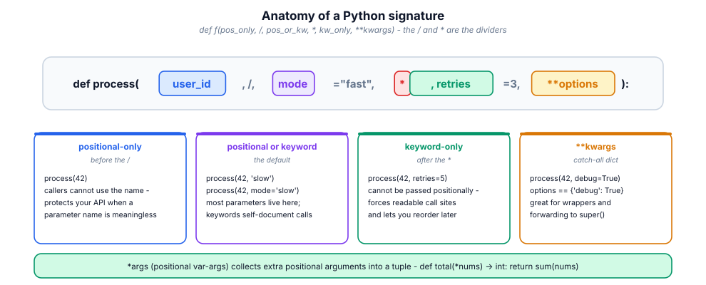
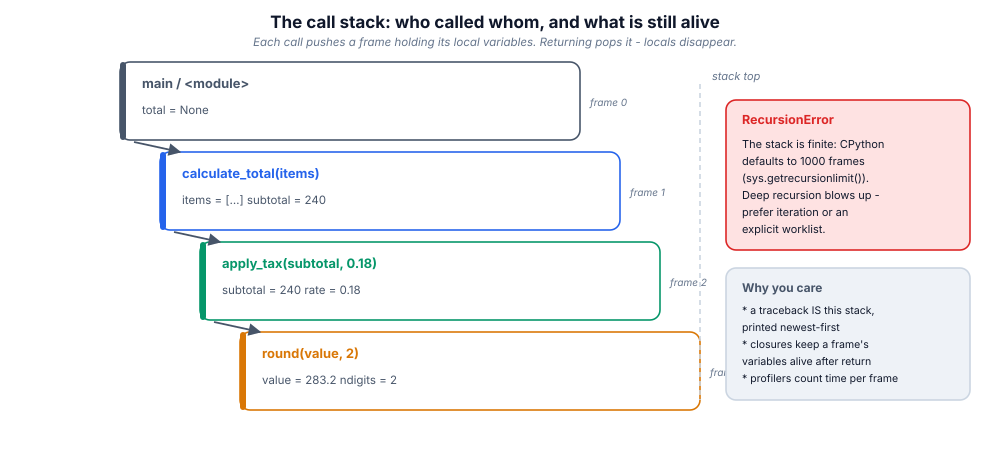
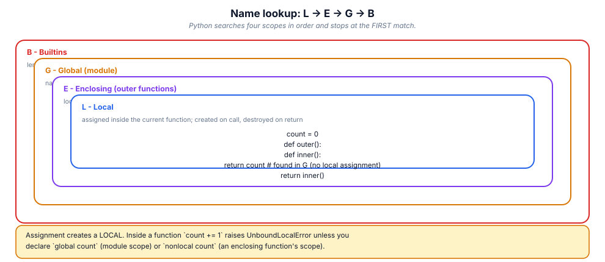
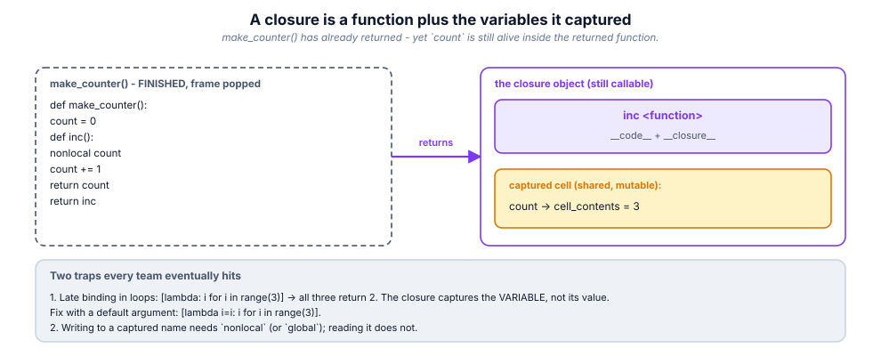

# 7. Functions

> A function is an object that happens to be callable. Accept that fully and
> half of Python's "magic" — decorators, callbacks, DI, `functools` — becomes
> ordinary code.

## 7.1 Definition

**Plain version.** A function is a named block of code you can call with
inputs and get an output from.

**Precise version.** `def` creates a **function object** at runtime and binds
it to a name. The object carries code (`__code__`), defaults
(`__defaults__`, `__kwdefaults__`), a reference to the module globals where it
was defined (`__globals__` — this is what makes closures-over-globals work),
metadata (`__name__`, `__doc__`, `__annotations__`) and, for closures,
captured cells (`__closure__`). Calling it pushes a **stack frame** holding
the parameters and locals; returning pops it. Functions are **first-class**:
they can be assigned, passed, returned, stored in dicts and put in lists.

## 7.2 Syntax

```python
def greet(name: str, greeting: str = "Hello", *, loud: bool = False) -> str:
    """Return a greeting for *name*.            <- docstring (first statement)

    One-line summary, blank line, then details.
    """
    message = f"{greeting}, {name}!"
    return message.upper() if loud else message

greet("Ada")                     # positional + default
greet("Ada", greeting="Hi")      # keyword
greet("Ada", loud=True)          # keyword-only (after the *)

# everything else -----------------------------------------------------------
total = lambda a, b: a + b              # anonymous, single expression only
def outer():
    count = 0
    def inner():
        nonlocal count                  # write to the ENCLOSING scope
        count += 1
        return count
    return inner                        # returning a function = closure
```

## 7.3 First examples

**Example 1 — defaults and keywords.**

```python
def connect(host, port=5432, *, timeout=5):
    return f"{host}:{port} t={timeout}"

print(connect("db"))                     # db:5432 t=5
print(connect("db", 5433, timeout=1))    # db:5433 t=1
# connect("db", 5433, 1)   TypeError: timeout is keyword-only
```

**Example 2 — `*args` / `**kwargs`.**

```python
def log(level, *messages, **fields):
    print(level, messages, fields)

log("INFO", "started", "pid", pid=42, host="h1")
# INFO ('started', 'pid') {'pid': 42, 'host': 'h1'}
```

**Example 3 — functions as values.**

```python
OPS = {"add": lambda a, b: a + b, "mul": lambda a, b: a * b}
def apply_all(fns, value):
    for fn in fns:
        value = fn(value)
    return value
print(apply_all([abs, lambda x: x * 2], -3))     # 6
```

## 7.4 The picture









## 7.5 Going deeper

### 7.5.1 How arguments actually bind

On call, Python matches in this order: positional parameters (left to right),
then keyword parameters by name; leftovers go to `*args` / `**kwargs`;
anything still missing takes its default; anything still missing →
`TypeError`. Duplicate supply (`f(1, a=1)`) is an error. This algorithm is why
keyword-only parameters let you **reorder or rename later without breaking
callers** — the signature becomes an API contract.

### 7.5.2 Defaults are evaluated ONCE, at `def` time

```python
import time
def stamp(when=time.time()):     # evaluated at import, not per call!
    return when
```

…and the infamous mutable version:

```python
def add(item, bag=[]):        # ONE list shared by ALL calls
    bag.append(item); return bag
add(1); add(2)                # [1, 2]  (!)
```

The professional pattern:

```python
def add(item, bag=None):
    if bag is None:
        bag = []
    bag.append(item); return bag
```

Inspect the stored defaults any time: `add.__defaults__`.

### 7.5.3 Scope: LEGB, and what assignment does

Reading a name searches **L**ocal → **E**nclosing → **G**lobal → **B**uiltin.
**Assigning** to a name anywhere in a function makes it *local for the whole
function*, which is the source of `UnboundLocalError`:

```python
count = 0
def bump():
    count += 1        # UnboundLocalError: 'count' is local (because assigned)
```

Fixes: `global count` (module scope), `nonlocal count` (enclosing function),
or — better — don't use shared mutable state: pass it in, return it out.

Comprehensions have their own scope; `for` loops do not (module 05).

### 7.5.4 Closures and cells

When an inner function reads or writes a name from an enclosing function, the
compiler puts that name in a **cell**: a tiny mutable box shared by both
frames. The outer frame can return and the cell survives, referenced by the
inner function's `__closure__`. This is the entire mechanism behind
decorators (module 13), callbacks that remember configuration, and private
state without classes:

```python
def make_counter():
    count = 0
    def inc():
        nonlocal count
        count += 1
        return count
    return inc

c = make_counter(); c(); c()     # 2  — state without a class
```

**Late-binding trap:** closures capture the *variable*, not its value:

```python
fns = [lambda: i for i in range(3)]
[f() for f in fns]               # [2, 2, 2]
fns = [lambda i=i: i for i in range(3)]    # bind NOW via a default
[f() for f in fns]               # [0, 1, 2]
```

### 7.5.5 Recursion: usable, bounded

CPython caps the stack (~1000 frames, `sys.setrecursionlimit` raises the cap
but risks a C-stack segfault). Recursion suits recursive *data* (trees, JSON);
for linear iteration prefer a loop or an explicit stack — no Tail-Call
Optimisation exists in CPython.

### 7.5.6 The `functools` toolkit

| Tool | Purpose |
|------|---------|
| `functools.wraps(fn)` | copy name/doc/signature onto a wrapper (decorators!) |
| `functools.lru_cache(maxsize=…)` | memoise a pure function; `.cache_info()` |
| `functools.partial(fn, …)` | freeze some arguments → new callable |
| `functools.reduce(fn, seq, init)` | fold a sequence to one value |
| `functools.cmp_to_key(fn)` | bridge legacy comparison functions to `key=` |
| `functools.singledispatch` | overload by the type of the first argument |
| `functools.cache` | `lru_cache(maxsize=None)` |

```python
from functools import lru_cache, partial

@lru_cache(maxsize=512)
def fib(n: int) -> int:
    return n if n < 2 else fib(n - 1) + fib(n - 2)

double = partial(operator.mul, 2)      # double(21) == 42
```

`lru_cache` requires hashable arguments and is *state*: watch memory in
servers, and never cache impure functions (the cache would freeze "now").

## 7.6 Industry level

### Signature design rules teams enforce

1. **Booleans are keyword-only.** `fetch(url, retries=3, *, verify=True)` —
   `fetch(url, 3, True)` is unreadable at the call site and unrefactorable
   later.
2. **`None` as the "absent" default**, never a sentinel mutable or a magic
   value.
3. **Positional-only (`/`) for parameters whose names are meaningless**
   (`len(obj)`, `min(a, b)`); it frees you to rename internals.
4. **Accept narrow, return useful**: take `Iterable`/`Sequence` (via type
   hints) rather than demanding `list`; return concrete types callers need.
5. **No flag-parameter explosions.** Three booleans = eight behaviours = eight
   untested paths. Split into functions or take an enum/strategy object.
6. **Inject collaborators**: `def report(db, clock=system_clock)` makes tests
   trivial (module 15) — that is dependency injection without a framework.

### Pure functions as the default

A pure function (same inputs → same output, no side effects) is testable,
cacheable, parallelisable and reason-able. Keep impurity at the edges (I/O,
clock, RNG) and pass it in:

```python
def next_retry(attempt: int, *, now: Callable[[], float], rand: random.Random):
    ...
```

### Docstrings are an API contract

```python
def transfer(account, amount: Decimal) -> Receipt:
    """Move *amount* from *account* to the settlement account.

    Raises:
        InsufficientFunds: when the balance would go negative.
    Returns:
        The persisted receipt; never None.
    """
```

Tools (`pydocstyle`, Sphinx, mkdocstrings) lint and render these; reviewers
read them before the body.

### Callables beyond `def`

Any object with `__call__` is a function as far as Python is concerned —
classes (constructors), instances with `__call__` (stateful strategies),
bound methods, `partial` objects, lambdas. Dispatch tables of callables
(module 05) are the idiomatic replacement for long `if/elif` chains.

## 7.7 Comparison tables

**Parameter kinds recap:**

| Kind | Syntax | Call site | Use for |
|------|--------|-----------|---------|
| positional-only | `a, /` | `f(1)` | C-like APIs, rename freedom |
| positional-or-keyword | `a` | `f(1)` / `f(a=1)` | most parameters |
| default | `a=1` | optional | stable optionals |
| keyword-only | `*, a` | `f(a=1)` | booleans, dangerous options |
| `*args` | `*rest` | extra positionals → tuple | forwarding, variadic |
| `**kwargs` | `**opts` | extra keywords → dict | wrappers, config |

**`lambda` vs `def`:**

| | `lambda` | `def` |
|---|----------|-------|
| body | one expression | statements |
| name | `<lambda>` in tracebacks (!) | real name |
| docstring | impossible | yes |
| annotations | impossible | yes |
| use | tiny inline key/callback | everything else |

**Scope keywords:**

| Statement | Effect |
|-----------|--------|
| (none) | assignment creates a LOCAL |
| `global x` | bind to the module-level name |
| `nonlocal x` | bind to the nearest enclosing function's name |
| reading only | searches LEGB, no binding |

## 7.8 Mistakes & gotchas

::: gotcha "Mutable default arguments"
`def f(x, bag=[])` shares one list forever. Use `None` + create inside.
:::

::: gotcha "Default computed once"
`def f(ts=datetime.now())` freezes import time. Use `ts=None` then compute.
:::

::: gotcha "Late-binding closures in loops"
All lambdas see the final `i`. Bind with a default: `lambda i=i: …`.
:::

::: gotcha "`UnboundLocalError` from a stray assignment"
Assigning anywhere in the function makes the name local everywhere in it.
:::

::: gotcha "Forgetting `return`"
The function returns `None`; callers then crash two frames later on
`None.something`. Annotate `-> None` when that is the intent.
:::

::: warn "`lambda` hurts debugging"
Tracebacks say `<lambda>`; profilers and coverage can't name it. If it needs
a comment, it needs a `def`.
:::

::: warn "Recursion for linear work"
`factorial` via recursion is fine to teach, wrong to ship at n=10⁵. Iterate.
:::

## 7.9 Interview questions

1. **Are arguments passed by value or reference?** — by object reference
   (call-by-sharing): rebinding a parameter is local; mutating a shared
   mutable is visible to the caller.
2. **Why is `def f(x=[])` dangerous?** — the default list is created once at
   `def` time and shared by all calls.
3. **`*args` vs `**kwargs`?** — extra positionals as a tuple vs extra keywords
   as a dict.
4. **What is a closure?** — a function plus the cells of enclosing-scope names
   it references, kept alive after the outer call returns.
5. **`global` vs `nonlocal`?** — module scope vs nearest enclosing function
   scope.
6. **What does `functools.wraps` do and why care?** — copies `__name__`,
   `__doc__`, `__dict__`, `__wrapped__`, signature metadata so tooling
   (help, pytest, FastAPI) sees the original function.
7. **How would you memoise?** — `@functools.lru_cache` on a pure function with
   hashable args; check `.cache_info()`.
8. **Why keyword-only booleans?** — call-site readability and signature
   evolution without breakage.

## 7.10 Practice exercises

[[exercise tier="Beginner" id="ex-07-a" file="exercises/07_functions/test_tasks.py"]]
Implement `repeat(fn, n, value)` (apply `fn` n times), `compose(f, g)`
(returning `x -> f(g(x))`), and `apply_all(fns, value)` (left to right).
[[/exercise]]

[[exercise tier="Intermediate" id="ex-07-b" file="exercises/07_functions/test_tasks.py"]]
Implement `retry(fn, attempts, exceptions=(Exception,))` (re-raise the last
error when exhausted), `memoize(fn)` returning a wrapped function exposing
`.cache` (dict) and `.hits`/`.misses` counters, and `pipeline(*stages)`
returning one callable that threads a value through all stages.
[[/exercise]]

[[exercise tier="Industry" id="ex-07-c" file="exercises/07_functions/test_tasks.py"]]
Implement `retry_with_backoff(fn, *, attempts=3, base_delay=0.1, sleep=…)`
with exponential delays (`base_delay * 2**attempt`) using an INJECTABLE sleep
so tests can assert the delay schedule without waiting; a `register(name)`
decorator filling a `REGISTRY` dict plus `dispatch(name, *a, **kw)` raising
`KeyError` for unknown names; and `TypeDispatcher` with
`.register(type)(fn)` and `__call__(value)` dispatching on `type(value)`
walking the MRO, raising `TypeError` when unhandled.
[[/exercise]]

[[solution]]
```python
# Reference core (full: exercises/07_functions/solution.py)
import functools

def retry_with_backoff(fn, *, attempts=3, base_delay=0.1, sleep=time.sleep):
    last = None
    for attempt in range(attempts):
        try:
            return fn()
        except Exception as exc:            # noqa: BLE001 - deliberate
            last = exc
            if attempt < attempts - 1:
                sleep(base_delay * 2 ** attempt)
    raise last

REGISTRY: dict[str, callable] = {}

def register(name):
    def deco(fn):
        REGISTRY[name] = fn
        @functools.wraps(fn)
        def wrapper(*a, **kw):
            return fn(*a, **kw)
        return wrapper
    return deco
```
[[/solution]]

## 7.11 Cheatsheet

| Need | Use |
|------|-----|
| Define | `def name(params) -> ret:` |
| One-expression anonymous | `lambda x: …` (sparingly) |
| Optional mutable | `x=None` then create inside |
| Keyword-only option | `def f(a, *, flag=False)` |
| Variadic | `*args`, `**kwargs` |
| Enclosing-scope write | `nonlocal` |
| Module-scope write | `global` (avoid; pass state instead) |
| Freeze arguments | `functools.partial(fn, …)` |
| Memoise pure fn | `@functools.lru_cache(maxsize=…)` |
| Keep metadata in wrappers | `@functools.wraps(fn)` |
| Dispatch by key | dict of callables |
| Dispatch by type | `functools.singledispatch` |
| Fold | `functools.reduce(fn, seq, init)` |
| Docs | docstring: summary line, blank line, Args/Returns/Raises |
