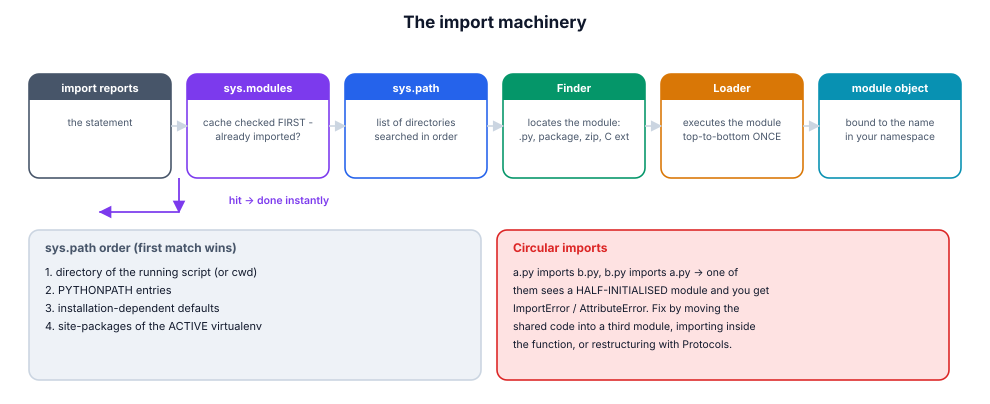
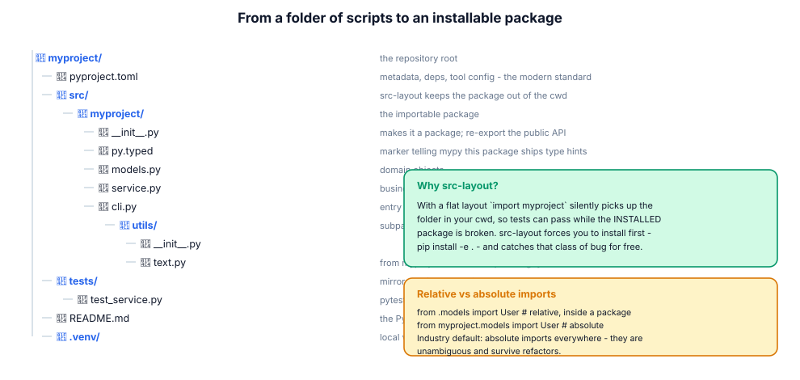

# 8. Modules, packages & the import system

> "ModuleNotFoundError" is not a mystery; it is the import machinery telling
> you exactly which step failed. Learn the steps and every import error
> becomes a two-minute fix.

## 8.1 Definition

**Plain version.** A *module* is a `.py` file you can import; a *package* is a
folder of modules.

**Precise version.** A module is any object that can be imported and used as a
namespace — usually a compiled `.py` file, but also C extensions and builtins.
A *regular package* is a directory containing `__init__.py` (itself a module,
executed on first import of the package); a *namespace package* (PEP 420) is a
directory **without** `__init__.py` that can be spread across several
locations on `sys.path`. Importing executes the module's top level **once**,
caches the resulting module object in `sys.modules`, and binds it (or selected
attributes) into your namespace.

## 8.2 Syntax

```python
import math                     # binds the MODULE object as 'math'
import numpy as np              # alias
from pathlib import Path        # binds the ATTRIBUTE Path
from collections import deque as dq
from mypkg import submod        # binds submod; mypkg.__init__ runs first
from mypkg.mod import func      # binds func

from . import sibling           # relative: same package
from ..utils import helper      # relative: parent package's utils

import mypkg.mod                # needed before mypkg.mod is an attribute?
mypkg.mod                       #   (see gotcha: attribute vs submodule)

__all__ = ["public_thing"]      # controls `from module import *`
if __name__ == "__main__":      # "am I the entry point?"
    main()
```

## 8.3 First examples

**Example 1 — a module is just a file.**

```python
# prices.py
VAT = 0.18

def with_vat(amount: float) -> float:
    return round(amount * (1 + VAT), 2)
```

```python
# app.py
import prices
print(prices.with_vat(100))        # 118.0
print(prices.VAT)                  # 0.18
```

**Example 2 — `__name__` tells the story.**

```bash
$ python prices.py        # __name__ == "__main__"
$ python -c "import prices"   # __name__ == "prices"
```

**Example 3 — where did that module come from?**

```python
import json, sys
print(json.__file__)          # .../json/__init__.py
print(json.__name__, json.__spec__.origin)
print(sys.modules["json"] is json)      # True: the cache
```

## 8.4 The picture





## 8.5 Going deeper

### 8.5.1 The four steps of `import x`

1. **`sys.modules` check** — already imported? return the cached object
   (this is why edits need a restart, and why `importlib.reload` exists).
2. **Find** — walk `sys.path` (a list of strings/paths): the script's
   directory (or cwd for `-m`/REPL), `PYTHONPATH`, stdlib, then the active
   environment's `site-packages`. Finders handle files, packages, zips, C
   extensions.
3. **Load** — execute the module top-to-bottom in a fresh namespace; the
   resulting module object is stored in `sys.modules` **before** its body
   finishes (which is what makes some circular imports half-work).
4. **Bind** — attach the name(s) in *your* namespace.

Every import error is a failure at step 2 (not found), step 3 (the module
crashed while executing — read the traceback, it is *your* code), or a name
error at step 4 (attribute missing, often a half-initialised circular import).

### 8.5.2 `sys.path[0]` and the two ways to run

- `python app.py` → `sys.path[0]` = the **script's directory**;
- `python -m pkg.mod` → `sys.path[0]` = **cwd**, and the module is imported
  properly with its package context (`__package__` set), so relative imports
  work;
- REPL/notebook → cwd.

This is why "works when I run the file, breaks when I run the tests" happens:
the tests import the *package*, your ad-hoc run imported a bare file. Rule:
run package code with `-m`, and keep imports absolute from the package root.

### 8.5.3 Packages: what `__init__.py` is for

It is executed on first import of the package, and its namespace **is** the
package object. Uses:

```python
# mypkg/__init__.py
from mypkg.models import User          # re-export the public API
from mypkg.service import OrderService

__all__ = ["User", "OrderService"]
__version__ = "1.4.0"
```

Callers then write `from mypkg import User`. Keep `__init__` thin: re-exports
and version, no logic, no heavy imports (import cost is paid by everyone).
An empty `__init__.py` is also fine and common.

### 8.5.4 Relative vs absolute imports

Relative imports (`from .models import User`) are resolved against
`__package__`; they only work **inside a package**, and break when the file is
run as a script (`ImportError: attempted relative import with no known parent
package`). Absolute imports (`from mypkg.models import User`) work everywhere
and survive file moves. Industry default: absolute everywhere; relative only
inside tightly-coupled subpackages.

### 8.5.5 Circular imports, diagnosed and cured

`a.py` imports `b.py` which imports `a.py`: whichever is imported second sees
the first *half-executed* (its `sys.modules` entry exists but its later names
don't) → `ImportError`/`AttributeError` at import time, often only under a
specific entry point. Cures, in order of preference:

1. **extract** the shared thing into a third module both import;
2. **invert** the dependency (dependency inversion: depend on a Protocol,
   module 09/14);
3. **import inside the function** that needs it (late binding);
4. never: `sys.path` hacks, `importlib.reload`, try/except around imports.

Detect quickly: `python -X importtime -c "import mypkg"` shows the import
graph timing; `pydeps`/`import-linter` enforce layering in CI.

### 8.5.6 Namespace packages and plugins

A directory **without** `__init__.py` on `sys.path` can still be a package,
and several such directories *merge* into one namespace. That is the mechanism
behind plugin ecosystems (`mypkg.plugins` contributed by separate
distributions) and modern tooling layouts. Discovery then uses
`importlib.metadata.entry_points()`:

```python
from importlib.metadata import entry_points
for ep in entry_points(group="mypkg.plugins"):
    plugin = ep.load()
```

### 8.5.7 Entry points: from `python -m` to a real command

```toml
[project.scripts]
mytool = "mypkg.cli:main"
```

After `pip install -e .`, the shell gets a `mytool` command that calls
`mypkg.cli.main()`. `main()` should return an int exit code and parse args
with `argparse`/`click`/`typer`. This is how every CLI you use is wired.

## 8.6 Industry level

### The src-layout, defended

```text
myproject/
    pyproject.toml
    src/mypkg/…
    tests/…
```

With a flat layout (`mypkg/` at the repo root), `pytest` and ad-hoc scripts can
import the *source folder* from cwd while the installed wheel is broken —
tests green, production red. The src-layout makes the package importable only
after installation (`pip install -e .`), so CI tests exactly what ships.

### The public API is a contract

Reviewers treat `__init__.py` re-exports as the supported surface; everything
else may change. `__all__` documents it and tames `import *`. Type checkers
honour it too (module 14). Deprecations go through wrappers with
`warnings.warn(..., DeprecationWarning)` for at least one release cycle.

### Import hygiene teams lint for

| Smell | Fix |
|-------|-----|
| import at function scope "for speed" | move to top unless genuinely circular or enormous |
| `from x import *` | explicit names (breaks static analysis) |
| module named `random.py`, `email.py`, `json.py` | never shadow stdlib; rename |
| side effects at import (network, DB) | move into functions/`main()` |
| `sys.path.append("..")` | install the package; fix `pyproject` |
| version hardcoded in several places | single source: `importlib.metadata.version` |

### Measuring import cost

Startup-sensitive CLIs audit imports: `python -X importtime -c "import app"`
prints a tree with self+cumulative times; heavy optional deps become lazy
(`importlib.import_module` inside the command) or optional extras
(`pip install mypkg[excel]`).

## 8.7 Comparison tables

**Import forms:**

| Form | Binds | Notes |
|------|-------|-------|
| `import a.b` | `a` | access as `a.b.x`; runs both `__init__`s |
| `import a.b as b` | `b` | preferred when you use `b` a lot |
| `from a.b import x` | `x` | the name, not the module |
| `from a import *` | `__all__` or public names | avoid; opaque |
| `from . import m` | `m` | only inside a package |
| `importlib.import_module("a.b")` | returned object | dynamic names, plugins |

**Module vs package vs namespace package:**

| | module | regular package | namespace package |
|---|--------|-----------------|-------------------|
| on disk | `m.py` | `p/__init__.py` | `p/` (no `__init__.py`) |
| `__file__` | yes | yes (`__init__`) | None |
| can span paths | no | no | **yes** (merged) |
| typical use | code file | library unit | plugin roots, monorepos |

**Flat vs src layout:**

| | flat (`mypkg/` at root) | src (`src/mypkg/`) |
|---|--------------------------|--------------------|
| importable pre-install | yes (cwd shadowing risk) | no |
| tests run installed code | not guaranteed | guaranteed |
| tooling config | slightly simpler | one extra line |
| industry default | legacy | **modern** |

## 8.8 Mistakes & gotchas

::: gotcha "Shadowing a stdlib module"
A local `random.py` or `types.py` hijacks the stdlib import and produces
bizarre errors *inside* library code. Name your modules specifically.
:::

::: gotcha "Submodule not an attribute until imported"
`import mypkg` does NOT give `mypkg.mod` unless `__init__` imported it.
Either `import mypkg.mod` or re-export in `__init__`.
:::

::: gotcha "Relative import run as a script"
`python mypkg/mod.py` → "attempted relative import with no known parent
package". Run `python -m mypkg.mod` instead.
:::

::: gotcha "Import side effects"
Code at module top level runs on *every* import, including from tests and
tooling. Keep top level to definitions and constants.
:::

::: gotcha "`from x import y` copies the reference, not a live link"
After `from conf import TIMEOUT`, rebinding `conf.TIMEOUT = 9` does not change
your local `TIMEOUT`. Import the module when the value may change.
:::

::: warn "`importlib.reload` is a debugging tool, not a design"
Reload re-executes top level; old class objects from the previous version stay
alive in existing instances (`isinstance` breaks). Restart the process.
:::

## 8.9 Interview questions

1. **What happens on `import x`?** — sys.modules cache → finders over
   sys.path → loader executes top level once → module object cached → names
   bound.
2. **`import a.b` vs `from a.b import c`?** — binds the package root vs binds
   the attribute; both execute the same modules.
3. **Why does `python -m pkg.mod` differ from `python pkg/mod.py`?** — package
   context (`__package__`), sys.path[0], and therefore relative imports.
4. **What is `__init__.py` for?** — marks a regular package, runs on first
   import, defines the package namespace/public API.
5. **How do you break a circular import?** — extract shared module, invert the
   dependency, or import inside the function.
6. **What is a namespace package?** — a package without `__init__.py` that can
   merge across sys.path entries; the plugin mechanism.
7. **How is a CLI command installed?** — `[project.scripts]` entry point
   mapping a command to `module:function`.

## 8.10 Practice exercises

[[exercise tier="Beginner" id="ex-08-a" file="exercises/08_modules/test_tasks.py"]]
Implement `load_module_from_file(path, name)` using `importlib.util`
(spec_from_file_location), returning the module object, and
`module_report(mod)` returning `{"name", "file", "has_main_guard"}` where
`has_main_guard` detects the `if __name__ == "__main__":` idiom in the source.
[[/exercise]]

[[exercise tier="Intermediate" id="ex-08-b" file="exercises/08_modules/test_tasks.py"]]
Implement `build_package(root, files: dict)` writing a package tree from a
`{"pkg/mod.py": "source", …}` mapping (creating `__init__.py` where missing),
then `import_from(root, "pkg.mod")` that inserts `root` at the front of
`sys.path`, imports, and **always restores `sys.path`** afterwards (context
manager or try/finally).
[[/exercise]]

[[exercise tier="Industry" id="ex-08-c" file="exercises/08_modules/test_tasks.py"]]
Implement `discover_plugins(directory)` mimicking entry-point discovery:
import every top-level `.py` in the directory (isolated names, failures
collected not raised), return `(registry, errors)` where registry maps
`plugin.PLUGIN_NAME -> plugin` for modules exposing a `PLUGIN_NAME` attribute.
Then implement `find_import_cycle(modules: dict[str, set[str]])` returning one
cyclic chain (list of names) or `None`, over a static dependency graph — the
check `import-linter` runs in CI.
[[/exercise]]

[[solution]]
```python
# Reference core (full: exercises/08_modules/solution.py)
import importlib.util, sys, contextlib

@contextlib.contextmanager
def _path_front(root):
    sys.path.insert(0, str(root))
    try:
        yield
    finally:
        sys.path.remove(str(root))          # always restore

def import_from(root, dotted):
    with _path_front(root):
        return importlib.import_module(dotted)

def find_import_cycle(modules):
    WHITE, GREY, BLACK = 0, 1, 2
    color, stack = {}, []
    def visit(node):
        color[node] = GREY; stack.append(node)
        for nxt in modules.get(node, ()):
            if color.get(nxt, WHITE) == GREY:
                return stack[stack.index(nxt):] + [nxt]
            if color.get(nxt, WHITE) == WHITE:
                found = visit(nxt)
                if found:
                    return found
        stack.pop(); color[node] = BLACK
        return None
    for node in modules:
        if color.get(node, WHITE) == WHITE:
            found = visit(node)
            if found:
                return found
    return None
```
[[/solution]]

## 8.11 Cheatsheet

| Need | Use |
|------|-----|
| Import module / attribute | `import m` / `from m import x` |
| Alias | `import numpy as np` |
| Run package code | `python -m pkg.mod` |
| Dynamic import | `importlib.import_module(name)` |
| Reload (debugging) | `importlib.reload(mod)` |
| Where is it from? | `mod.__file__`, `mod.__spec__.origin` |
| Already imported? | `"m" in sys.modules` |
| Search path | `sys.path` (list), `PYTHONPATH` env |
| Public API | `__init__.py` re-exports + `__all__` |
| Entry guard | `if __name__ == "__main__":` |
| CLI command | `[project.scripts]` in pyproject |
| Version at runtime | `importlib.metadata.version("pkg")` |
| Plugin discovery | `importlib.metadata.entry_points(group=…)` |
| Import timing | `python -X importtime -c "import pkg"` |
| Enforce layers | `import-linter` / `pydeps` in CI |
