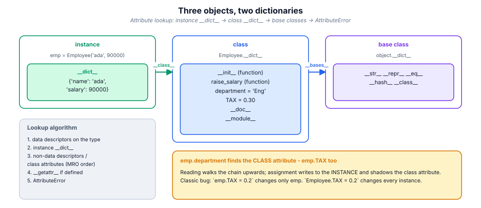
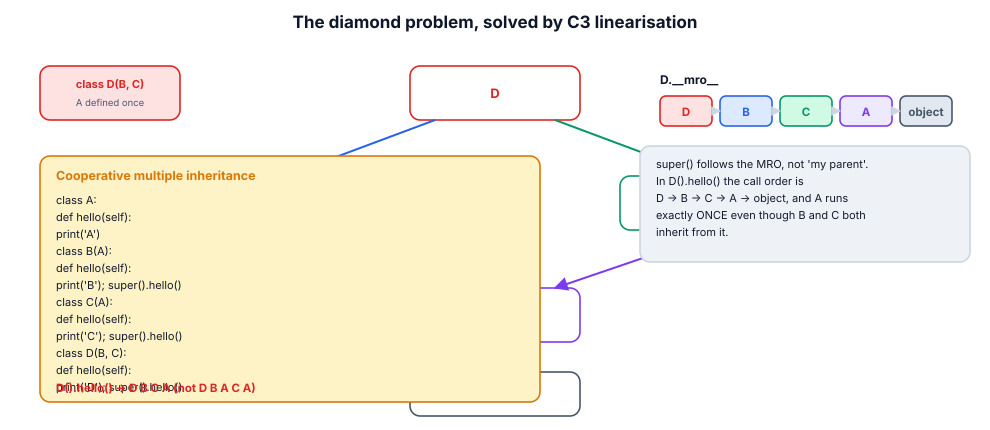
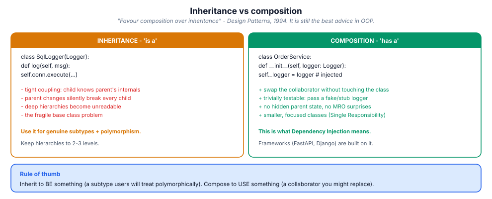

# 9. Object-oriented Python

> Python's OOP is not Java's OOP. It is a *protocol* system: an object is
> defined by the special methods it answers to, not by its ancestry. Master
> the protocols and "duck typing" becomes a design tool instead of a gamble.

## 9.1 Definition

**Plain version.** A class bundles data (attributes) and behaviour (methods);
objects are instances of classes.

**Precise version.** A class is an object (an instance of `type`) that acts as
a factory and a namespace. An instance holds per-object state in its
`__dict__`; behaviour and shared state live on the class and are found by the
**attribute lookup chain**: instance → class → base classes in **MRO** order →
`object`. Methods are functions that become **bound** when accessed through an
instance (the descriptor protocol), which is where `self` comes from: it is
simply the first argument, passed automatically.

## 9.2 Syntax

```python
class Account:
    """A bank account with an audit trail."""        # docstring

    BANK = "PyBank"            # class attribute: shared by all instances
    _interest = 0.04           # single underscore = "private by convention"

    def __init__(self, owner: str, balance: float = 0.0):
        self.owner = owner     # instance attribute (per object)
        self.balance = balance
        self._history: list = []

    def deposit(self, amount: float) -> None:        # instance method
        if amount <= 0:
            raise ValueError("amount must be positive")
        self.balance += amount
        self._history.append(("deposit", amount))

    @property
    def history(self) -> tuple:                      # computed attribute
        return tuple(self._history)

    @classmethod
    def from_dict(cls, data: dict) -> "Account":     # alternative constructor
        return cls(data["owner"], data.get("balance", 0.0))

    @staticmethod
    def is_valid_iban(value: str) -> bool:           # no self, no cls
        return len(value) == 22

    def __repr__(self) -> str:                       # for developers
        return f"Account({self.owner!r}, {self.balance!r})"

    def __str__(self) -> str:                        # for humans
        return f"{self.owner}: {self.balance:.2f}"


class Savings(Account):                              # inheritance
    def __init__(self, owner, balance=0.0, *, rate=0.02):
        super().__init__(owner, balance)             # cooperative call
        self.rate = rate
```

## 9.3 First examples

**Example 1 — state and behaviour together.**

```python
a = Account("ada", 100.0)
a.deposit(50)
print(a)                # ada: 150.00
print(repr(a))          # Account('ada', 150.0)
print(a.history)        # (('deposit', 50),)
```

**Example 2 — inheritance and `super()`.**

```python
s = Savings("grace", 1000, rate=0.05)
s.deposit(10)                     # inherited behaviour
print(s.rate, s.BANK)             # 0.05 PyBank
print(Savings.__mro__)            # (Savings, Account, object)
```

**Example 3 — protocols make it "just work".**

```python
class Deck:
    def __init__(self, cards): self._cards = list(cards)
    def __len__(self): return len(self._cards)
    def __getitem__(self, i): return self._cards[i]
    def __contains__(self, c): return c in self._cards

d = Deck(["A", "K", "Q"])
len(d), "K" in d, d[0], list(d)   # all work: len, in, index, iteration
import random; random.shuffle(d) # ...and shuffle, because of __getitem__/__setitem__
```

## 9.4 The picture







## 9.5 Going deeper

### 9.5.1 `self`, demystified

`obj.method(x)` is sugar for `type(obj).method(obj, x)`. Functions are
**descriptors**: accessing one through an instance calls its `__get__`, which
returns a *bound method* with `self` pre-filled. Therefore `self` is a
convention (you could name it anything — don't) and methods can be called
unbound: `Account.deposit(a, 50)` works.

### 9.5.2 The lookup algorithm, precisely

For `obj.attr`:

1. **data descriptors** on `type(obj)` (properties, slots) — they win over the
   instance dict;
2. `obj.__dict__["attr"]`;
3. **non-data descriptors / plain class attributes** walking the MRO;
4. `__getattr__` (note: only called when normal lookup *fails*);
5. `AttributeError`.

Assignment `obj.attr = v` always writes to `obj.__dict__` (unless a data
descriptor's `__set__` intercepts it — which is how `property` setters and
`__slots__` work). This explains the classic surprise: setting an instance
attribute *shadows* a class attribute for that object only.

### 9.5.3 Method kinds, and when each earns its place

| Kind | Decorator | Receives | Use for |
|------|-----------|----------|---------|
| instance | (none) | `self` | behaviour using/producing state |
| class | `@classmethod` | `cls` | alternative constructors, subclass-aware factories |
| static | `@staticmethod` | nothing | a function that belongs to the namespace (rare; prefer module function) |
| property | `@property` | `self` | computed/validated attribute, keeps `obj.x` syntax |

If a `@staticmethod` never touches the class, reviewers ask why it isn't a
module-level function (it usually should be).

### 9.5.4 The dunder protocols (the real OOP surface)

| Protocol | Methods | Unlocks |
|----------|---------|---------|
| representation | `__repr__`, `__str__`, `__format__` | `repr()`, `print()`, f-strings |
| comparison | `__eq__`, `__lt__` (+`@total_ordering`) | `==`, `sorted()`, `min/max` |
| hashing | `__hash__` (with `__eq__`) | dict keys, sets |
| collections | `__len__`, `__getitem__`, `__setitem__`, `__contains__`, `__iter__` | `len`, indexing, `in`, `for` |
| callables | `__call__` | `obj(...)` — strategies, decorators-as-classes |
| context | `__enter__`, `__exit__` | `with obj:` |
| arithmetic | `__add__`, `__mul__`, … | operators (module 03) |
| attribute | `__getattr__`, `__setattr__`, `__getattribute__` | proxies, lazy loading |
| lifecycle | `__new__`, `__init__`, `__del__`, `__init_subclass__` | construction & subclass hooks |

`__repr__` deserves special discipline: **unambiguous, ideally eval-able**
(`Account('ada', 150.0)`) — it is what appears in every traceback, log line
and debugger session. `__str__` is the human face.

The equality/hash contract: if you define `__eq__`, Python sets `__hash__ =
None` unless you define it too; equal objects must hash equally. Frozen
value objects get both for free from `@dataclass(frozen=True)`.

### 9.5.5 Inheritance: MRO, `super()`, mixins

The MRO is the C3 linearisation of the inheritance graph —
`Klass.__mro__` shows it. `super()` means *"next in the MRO"*, not "my parent",
which is what makes cooperative multiple inheritance work: every class in a
diamond calls `super().__init__(…)` and each runs exactly once. **Mixins** are
small single-purpose bases composed this way (`LoggingMixin`,
`SerializationMixin`); rules: name them `…Mixin`, never instantiate them
alone, keep `__init__` signatures compatible via `**kwargs`.

Prefer **composition** when the relationship is "uses", inheritance when it is
genuinely "is a" *and* callers will treat subclasses polymorphically (figure
§9.4).

### 9.5.6 Abstract base classes vs Protocols

```python
from abc import ABC, abstractmethod

class Repository(ABC):                      # nominal: must subclass
    @abstractmethod
    def get(self, id: str): ...

from typing import Protocol

class SupportsClose(Protocol):              # structural: duck typing, checked
    def close(self) -> None: ...
```

ABCs suit frameworks that own the hierarchy (instantiation of an incomplete
subclass raises `TypeError`); Protocols suit libraries accepting *any* object
with the right shape — checked duck typing without forcing inheritance
(module 14).

### 9.5.7 dataclasses: the record generator

```python
from dataclasses import dataclass, field

@dataclass(frozen=True, slots=True, order=True)
class Point:
    x: float
    y: float
    tags: list[str] = field(default_factory=list)
```

Generates `__init__`, `__repr__`, `__eq__` (+ordering, +`__hash__` when
frozen), from the annotations. Options that matter: `frozen` (immutable →
hashable → thread-safe), `slots` (memory), `kw_only` (signature stability),
`order`, `eq=False` (keep identity semantics), `default_factory` for
mutables. `dataclasses.asdict/replace/fields` complete the toolkit;
`replace` is the immutable "copy with changes".

### 9.5.8 Descriptors: the machinery behind property

An object with `__get__`/`__set__`/`__delete__` is a descriptor; with `__set__`
it is a *data* descriptor and outranks instance dicts. `property`,
`staticmethod`, `classmethod`, `__slots__` and Django/SQLAlchemy columns are
all descriptors. A validated-field framework in 15 lines:

```python
class Checked:
    def __set_name__(self, owner, name): self.name = "_" + name
    def __init__(self, check): self.check = check
    def __get__(self, obj, objtype=None): return getattr(obj, self.name)
    def __set__(self, obj, value):
        self.check(value)
        setattr(obj, self.name, value)

class User:
    name = Checked(lambda v: (_ for _ in ()).throw(ValueError("empty"))
                   if not v else None)
```

(You will build a cleaner version in this module's industry exercise.)

### 9.5.9 `__init_subclass__`: registration without metaclasses

```python
class Plugin:
    _registry: dict = {}
    def __init_subclass__(cls, *, name=None, **kw):
        super().__init_subclass__(**kw)
        Plugin._registry[name or cls.__name__] = cls
```

Every subclass registers itself at class-creation time — the lightweight
plugin mechanism that replaced most metaclass use. Reach for a metaclass
(`class Meta(type)`) only when you must control class *creation* itself;
prefer `__init_subclass__` or a class decorator first.

## 9.6 Industry level

### Modelling rules teams enforce

1. **Entities vs value objects** (module 02): entities compare by identity,
   value objects are frozen dataclasses compared by value.
2. **No god objects**: a class that needs an `and` in its name needs splitting
   (Single Responsibility).
3. **Inject collaborators** through `__init__` (module 07) — the constructor
   signature *is* the dependency graph.
4. **Properties for invariants, not for ceremony**: validate on write, but
   keep them O(1) and side-effect-free; heavy computation belongs in methods.
5. **`__repr__` in every model class** — production debugging lives and dies
   by it.
6. **Enums for state**, not strings: `OrderState.PAID` makes illegal values
   unrepresentable and `match` exhaustive (module 05).
7. **Prefer Protocol over ABC at library boundaries**; ABC inside your own
   framework where you own the hierarchy.

### The modern class toolbox, in order of preference

| Need | First choice |
|------|--------------|
| Plain record / DTO | `@dataclass(frozen=True, slots=True)` |
| Record with validation | `pydantic.BaseModel` (parses + validates at the edge) |
| Fixed alternative values | `enum.Enum` / `IntFlag` |
| Shared behaviour across unrelated classes | mixin or composition |
| Interface for your framework | `ABC` + `@abstractmethod` |
| Interface for others' objects | `typing.Protocol` |
| Per-field validation rules | descriptors or pydantic |
| Subclass registration | `__init_subclass__` |

### SOLID, translated

- **S**ingle responsibility: one reason to change per class.
- **O**pen/closed: extend via new subclasses/plugins, not by editing
  dispatch chains (`__init_subclass__`, entry points).
- **L**iskov: a subclass must honour the base contract (preconditions no
  stricter, postconditions no weaker) — violating it breaks every caller.
- **I**nterface segregation: small Protocols (`SupportsRead`, `SupportsClose`)
  over one fat ABC.
- **D**ependency inversion: depend on Protocols, inject implementations.

## 9.7 Comparison tables

**`__str__` vs `__repr__`:**

| | `__str__` | `__repr__` |
|---|-----------|------------|
| audience | end users | developers / logs / debugger |
| goal | readable | unambiguous, ideally eval-able |
| fallback | `__repr__` | `<obj at 0x…>` if missing |
| used by | `print`, `str()`, f-string `{}` | `repr()`, REPL, tracebacks, `{!r}` |

**ABC vs Protocol:**

| | ABC | Protocol |
|---|-----|----------|
| relationship | nominal (must inherit) | structural (shape matches) |
| enforcement | runtime (`TypeError` on instantiate) | static (mypy/pyright) |
| retrofitting existing classes | requires editing them | free |
| best for | frameworks you own | libraries accepting anything |

**Inheritance vs composition:** see figure §9.4; summary — inherit to *be*,
compose to *use*; composition wins for testability and change isolation.

## 9.8 Mistakes & gotchas

::: gotcha "Mutable class attributes are shared"
`class C: items = []` gives ONE list to all instances. Use
`field(default_factory=list)` / create in `__init__`.
:::

::: gotcha "Defining `__eq__` silently kills `__hash__`"
Your model stops working as a dict key. Define `__hash__` consistently or use
`@dataclass(frozen=True)`.
:::

::: gotcha "`__init__` returning a value"
`TypeError: __init__() should return None`. Construction customisation belongs
in `__new__` or a classmethod factory.
:::

::: gotcha "Forgetting `super().__init__()` in a subclass"
Base state silently missing; attribute errors appear far from the cause. In
multiple inheritance, forgetting it breaks the whole cooperative chain.
:::

::: gotcha "Property name collides with its backing field"
`self.x = …` inside a `@property def x` recurses forever. Store in `self._x`.
:::

::: warn "Deep hierarchies"
Beyond ~3 levels, MRO surprises and fragile-base-class bugs dominate. Flatten
with mixins/composition.
:::

::: warn "`isinstance` chains instead of polymorphism"
`if isinstance(x, A)… elif isinstance(x, B)…` defeats extensibility; give the
classes the method (or use `singledispatch`).
:::

## 9.9 Interview questions

1. **Where does `self` come from?** — bound-method creation via the descriptor
   protocol; it is the instance passed as first argument.
2. **Class vs instance attribute?** — shared on the type vs per-object in
   `__dict__`; assignment shadows, never edits the class copy.
3. **What is the MRO?** — C3 linearisation; `K.__mro__`; `super()` walks it.
4. **`__str__` vs `__repr__`?** — human vs developer; repr should be
   unambiguous.
5. **Why does defining `__eq__` remove hashing?** — the contract (equal ⇒
   same hash) can't be assumed; Python opts out safely.
6. **dataclass vs dict?** — named, typed, immutable-able, comparable,
   self-documenting fields vs stringly-typed bag.
7. **ABC vs Protocol?** — nominal/runtime vs structural/static.
8. **How do you make an object usable in `for`, `len`, `in`?** — implement
   `__iter__`/`__len__`/`__contains__` (or just `__iter__` and `__len__`).
9. **What is a descriptor?** — an object with `__get__`/`__set__`; the
   mechanism behind property, slots, methods.

## 9.10 Practice exercises

[[exercise tier="Beginner" id="ex-09-a" file="exercises/09_oop/test_tasks.py"]]
Implement `Temperature` storing Celsius internally with `.celsius` and
`.fahrenheit` properties (both settable, validated ≥ −273.15, raising
`ValueError`), plus `Stack` with `push/pop/peek/__len__` and a custom
`EmptyStack` error.
[[/exercise]]

[[exercise tier="Intermediate" id="ex-09-b" file="exercises/09_oop/test_tasks.py"]]
Implement `BankAccount` with `deposit/withdraw` (raising `Overdrawn` on
insufficient funds), an audit `.history`, `__repr__`, equality by account
number, and a `from_dict` classmethod; plus `SortedCollection` implementing
`__len__`, `__iter__`, `__contains__`, `__getitem__` (slices included) over an
always-sorted internal list.
[[/exercise]]

[[exercise tier="Industry" id="ex-09-c" file="exercises/09_oop/test_tasks.py"]]
Build (1) a plugin framework: base class `Plugin` whose
`__init_subclass__` registers subclasses by a `name` kwarg or class name,
rejecting duplicates, with `Plugin.get(name)` and an abstract `run()`;
(2) a descriptor `Validated` supporting type + predicate checks with clear
error messages, used to declare a `User` class whose invalid assignments raise
`ValueError` *at assignment time*; (3) `EventBus` with
`subscribe(event, handler)` / `emit(event, payload)` where handlers may be
functions **or any callable object**, errors in one handler not stopping the
others.
[[/exercise]]

[[solution]]
```python
# Reference core (full: exercises/09_oop/solution.py)
class Validated:
    """Descriptor: validates on every assignment."""
    def __init__(self, type_, predicate=None, message="invalid value"):
        self.type_, self.predicate, self.message = type_, predicate, message
    def __set_name__(self, owner, name):
        self.storage = f"_{owner.__name__}_{name}"
        self.public = name
    def __get__(self, obj, objtype=None):
        if obj is None:
            return self
        return getattr(obj, self.storage, None)
    def __set__(self, obj, value):
        if not isinstance(value, self.type_) or (
                self.predicate and not self.predicate(value)):
            raise ValueError(f"{self.public}: {self.message} (got {value!r})")
        setattr(obj, self.storage, value)

class Plugin:
    _registry: dict[str, type] = {}
    def __init_subclass__(cls, *, name=None, **kwargs):
        super().__init_subclass__(**kwargs)
        key = name or cls.__name__
        if key in Plugin._registry:
            raise ValueError(f"duplicate plugin name: {key}")
        Plugin._registry[key] = cls
```
[[/solution]]

## 9.11 Cheatsheet

| Need | Use |
|------|-----|
| New class | `class Name:` + `__init__(self, …)` |
| Shared constant | class attribute |
| Per-object state | `self.x = …` in `__init__` |
| Computed/validated attribute | `@property` (+ `.setter`) |
| Alternative constructor | `@classmethod def from_x(cls, …)` |
| Namespace-only helper | `@staticmethod` (or module function) |
| Debug text | `__repr__` |
| Human text | `__str__` |
| Value equality | `__eq__` (+ `__hash__` or frozen dataclass) |
| Ordering | `__lt__` + `@functools.total_ordering` |
| `len`/`in`/`for`/`[]` | `__len__` / `__contains__` / `__iter__` / `__getitem__` |
| `with` support | `__enter__` / `__exit__` |
| Record | `@dataclass(frozen=True, slots=True)` |
| Fixed choices | `enum.Enum` |
| Framework interface | `ABC` + `@abstractmethod` |
| Structural interface | `typing.Protocol` |
| Subclass hook/registry | `__init_subclass__` |
| Cooperative init in MI | `super().__init__(**kwargs)` everywhere |
