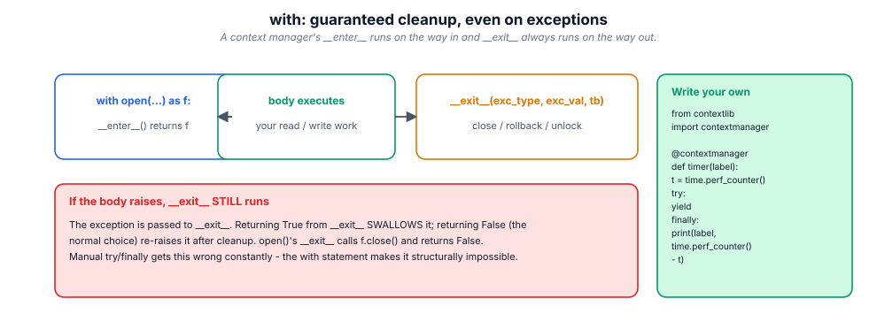

# 10. Files & I/O

> I/O is where programs meet reality: partial writes, wrong encodings, locked
> files, half-updated configs. The idioms in this module exist because each of
> those has taken down a production system.

## 10.1 Definition

**Plain version.** Opening a file gives you an object you can read from or
write to; `with` makes sure it gets closed.

**Precise version.** `open()` returns a **file object**: for text mode a
`TextIOWrapper` (decodes bytes ↔ str using a named codec, translates
newlines), layered over a **buffered binary stream** (`BufferedReader` /
`BufferedWriter`), layered over a raw OS descriptor. Binary mode skips the
text layer. The object is a **context manager**: `with` guarantees `close()`
runs even when the body raises, flushing buffers and releasing the descriptor.
Iteration over a text file yields **lines lazily** — the foundation of
streaming.

## 10.2 Syntax

```python
from pathlib import Path

# text ------------------------------------------------------------------
with open("data.txt", encoding="utf-8") as fh:      # READ (default mode 'r')
    text = fh.read()                                # whole file as str
with open("data.txt", encoding="utf-8") as fh:
    for line in fh:                                 # lazy, line by line
        ...
with open("out.txt", "w", encoding="utf-8") as fh:  # WRITE (truncates!)
    fh.write("hello\n")
with open("log.txt", "a", encoding="utf-8") as fh:  # APPEND
    fh.write("more\n")

# binary ------------------------------------------------------------------
with open("img.png", "rb") as fh:
    blob = fh.read()                                # bytes

# pathlib shortcuts ---------------------------------------------------------
p = Path("data.txt")
p.read_text(encoding="utf-8")      p.write_text(text, encoding="utf-8")
p.read_bytes()                     p.write_bytes(blob)
p.exists()  p.is_file()  p.is_dir()  p.mkdir(parents=True, exist_ok=True)
p.parent  p.name  p.stem  p.suffix  p.with_suffix(".json")
list(p.glob("*.csv"))              p.rglob("**/test_*.py")
```

## 10.3 First examples

**Example 1 — read, transform, write.**

```python
from pathlib import Path

src = Path("scores.txt")
lines = src.read_text(encoding="utf-8").splitlines()
clean = [ln.strip() for ln in lines if ln.strip()]
Path("scores.clean.txt").write_text("\n".join(clean) + "\n", encoding="utf-8")
```

**Example 2 — the mode matrix in action.**

```python
with open("m.txt", "w") as fh:  fh.write("one\ntwo\n")   # create/truncate
with open("m.txt", "a") as fh:  fh.write("three\n")      # append
with open("m.txt", "r+") as fh:
    fh.seek(0); fh.write("ONE")                          # overwrite in place
print(Path("m.txt").read_text())                         # ONE\n two\n three\n
```

**Example 3 — JSON round trip.**

```python
import json
data = {"users": [{"name": "ada", "active": True}]}
Path("users.json").write_text(json.dumps(data, indent=2), encoding="utf-8")
loaded = json.loads(Path("users.json").read_text(encoding="utf-8"))
assert loaded == data
```

## 10.4 The picture



## 10.5 Going deeper

### 10.5.1 The three layers, and what each can break

```text
str  <->  TextIOWrapper   (codec + newline translation + errors policy)
bytes <-> BufferedWriter/Reader   (8 KB buffer by default)
fd    <-> FileIO          (the OS descriptor)
```

- **Text layer failures**: `UnicodeDecodeError` (wrong codec), mojibake
  (right bytes, wrong codec), lost newlines (translation);
- **Buffer layer failures**: data not yet on disk when you expected it
  (`flush()`/`close` pushes buffers; `os.fsync(fd)` pushes to the device);
- **Descriptor failures**: too many open files (leaks), permission errors,
  locks on Windows.

Inspect them: `fh.buffer`, `fh.buffer.raw`, `fh.encoding`, `fh.newlines`.

### 10.5.2 The mode matrix

| Mode | Meaning | File must exist? | Truncates? | Cursor |
|------|---------|------------------|------------|--------|
| `r` | read text | yes | no | start |
| `w` | write text | no (creates) | **yes** | start |
| `x` | exclusive create | **must NOT** | — | start |
| `a` | append | no (creates) | no | end |
| `r+` | read+write | yes | no | start |
| `w+` | read+write | no | yes | start |
| add `b` | binary (`rb`, `wb`, …) | | | |
| add `t` | text (default) | | | |

`x` is the underrated one: "create this config, fail if it already exists" is
exactly `open(path, "x")`.

### 10.5.3 Newlines and the `newline=` argument

Reading: **universal newlines** by default — `\r\n`, `\r`, `\n` all become
`\n`. Writing: `\n` is translated to `os.linesep`… unless you pass
`newline=""` or `newline="\n"`. The `csv` module **requires** `newline=""`
(because it does its own quoting/line-end handling); getting this wrong
produces blank lines between rows on Windows.

### 10.5.4 Encodings and the BOM

`utf-8` is the default choice; `utf-8-sig` reads (and writes) the BOM that
Excel/Notepad love; `latin-1` never fails (bytes↔codepoints 1:1) which makes
it a debugging tool and a corruption risk. Always name the codec explicitly —
the platform default is a lottery (module 04).

### 10.5.5 Context managers beyond files

Anything with acquire/release deserves `with`:

```python
import contextlib
with contextlib.suppress(FileNotFoundError):      # instead of try/except pass
    Path("tmp.lock").unlink()
with contextlib.redirect_stdout(io.StringIO()):   # capture prints
    noisy()
with contextlib.closing(make_thing()) as t:       # close() without __exit__
    ...
@contextlib.contextmanager                        # your own, from a generator
def atomic_write(path):
    tmp = Path(str(path) + ".tmp")
    fh = open(tmp, "w", encoding="utf-8")
    try:
        yield fh
    except BaseException:
        fh.close(); tmp.unlink(missing_ok=True); raise
    else:
        fh.close(); os.replace(tmp, path)         # atomic on POSIX & Windows
```

### 10.5.6 Streaming: files bigger than RAM

Iteration is lazy, so the pattern scales to any size:

```python
def count_errors(path):
    total = 0
    with open(path, encoding="utf-8", errors="replace") as fh:
        for line in fh:                     # one line in memory at a time
            if "ERROR" in line:
                total += 1
    return total
```

For binary streams read in chunks: `while chunk := fh.read(1 << 20): …`.
`mmap` maps the file into address space for random access without loading it.

### 10.5.7 Structured formats: csv, json, and what not to use

```python
import csv, json
with open("rows.csv", newline="", encoding="utf-8") as fh:
    for row in csv.DictReader(fh):          # header -> dict per row
        ...
with open("rows.csv", "w", newline="", encoding="utf-8") as fh:
    w = csv.DictWriter(fh, fieldnames=["id", "name"])
    w.writeheader(); w.writerow({"id": 1, "name": "ada"})
```

- **JSON** for interchange; `json.dump(obj, fh, ensure_ascii=False, indent=2,
  default=str)`; parse with `object_hook`/`parse_float=Decimal` when types
  matter;
- **CSV** for tabular text — never hand-split on commas (quoting!);
- **pickle** for Python-object graphs **you trust only**; unpickling
  untrusted data executes code;
- **JSON Lines** (`.jsonl`) for append-only event streams: one JSON object per
  line, grep-able, tail-able, crash-friendly.

### 10.5.8 Atomic writes: the config-file rule

A crash mid-write leaves a truncated config = outage. The rule: write a
temporary file in the same directory, flush + `fsync`, then `os.replace(tmp,
target)` (atomic rename on the same filesystem). Readers then see either the
old or the new file, never a partial one. Databases, package installers and
config writers all do exactly this.

## 10.6 Industry level

### The house style for file code

1. **`pathlib` everywhere**; `os.path` only in legacy code. Paths as `Path`
   objects, `/` for joining, `.read_text(encoding=…)` for small files.
2. **`with` always** — even for one-liners; an unclosed file is a leaked
   descriptor and, on Windows, a locked file.
3. **Explicit `encoding="utf-8"`** on every text open; `newline=""` for csv.
4. **Atomic writes** for anything another process reads (configs, caches,
   artifacts).
5. **Stream, don't slurp**: iterate lines or read chunks; `read()` only when
   the size is known-small.
6. **Temp files from `tempfile`**, never hand-rolled names
   (`tempfile.TemporaryDirectory()` in tests gives you isolation for free).
7. **Errors as decisions**: choose `errors=` policy consciously; log the
   codec and the offset when decoding fails in ingestion pipelines.

### Durability, when it matters

`fh.flush()` moves Python's buffer to the OS; `os.fsync(fh.fileno())` asks the
device to persist it; for a rename to be crash-safe you also fsync the
*directory*. Wallets, queues and WAL-based systems do this; ordinary app code
usually doesn't need to — but you should know the ladder.

### Reading other people's data

Real files lie: mixed encodings, stray BOMs, CRLF, trailing commas. The
ingestion pattern: detect (`chardet`/`charset-normalizer`), decode with a
policy, normalise newlines, validate row-by-row, and **quarantine** bad rows
instead of failing the batch:

```python
good, bad = [], []
for i, line in enumerate(fh, 1):
    try:
        good.append(parse(line))
    except ValueError as exc:
        bad.append((i, line, str(exc)))
```

## 10.7 Comparison tables

**Text vs binary:**

| | text mode | binary mode |
|---|-----------|-------------|
| open | `"r"`, `"w"` | `"rb"`, `"wb"` |
| yields | `str` | `bytes` |
| codec | applied (`encoding=`) | none |
| newlines | translated | untouched |
| use for | logs, csv, json, source | images, archives, hashes, protocols |

**`read` family:**

| Call | Returns | Memory |
|------|---------|--------|
| `fh.read()` | whole remainder | O(file) |
| `fh.read(n)` | up to n chars/bytes | O(n) |
| `fh.readline()` | one line | O(line) |
| `fh.readlines()` | list of lines | O(file) |
| `for line in fh` | one line per iteration | O(line) ← default choice |

**Serialisation formats:**

| Format | Contents | Trust boundary | Use |
|--------|----------|----------------|-----|
| JSON | scalars, lists, dicts | safe to parse | APIs, configs |
| CSV | tabular text | safe | spreadsheets, exports |
| JSONL | one JSON per line | safe | logs, event streams |
| pickle | arbitrary Python objects | **executes code** | internal caches only |
| parquet/feather | columnar tables | safe | analytics at scale |

**pathlib vs os:**

| Task | pathlib | legacy |
|------|---------|--------|
| join | `p / "sub" / "f.txt"` | `os.path.join` |
| exists | `p.exists()` | `os.path.exists` |
| walk | `p.rglob("*.py")` | `os.walk` |
| read all | `p.read_text(encoding=…)` | open+read |
| rename | `p.rename(new)` / `p.replace(new)` | `os.rename` |

## 10.8 Mistakes & gotchas

::: gotcha "`"w"` truncates immediately on open"
Opening for write destroys the old content before you write a byte. Read
first if you need to (`r+`, or read-then-write).
:::

::: gotcha "Forgetting to close (no `with`)"
Buffers may never flush and descriptors leak; CPython's refcounting usually
hides it until PyPy/another runtime or Windows file locking exposes it.
:::

::: gotcha "csv without `newline=""`"
Blank lines between rows on Windows; broken quoting on reads.
:::

::: gotcha "Reading after writing without `seek(0)`"
The cursor is at the end; `fh.read()` returns `""`. Seek, or reopen.
:::

::: gotcha "Relative paths depend on cwd"
Use `Path(__file__).parent / "data.csv"` for files that ship with code.
:::

::: gotcha "Unpickling untrusted data"
Remote code execution. Use JSON, or sign/validate pickles you produced.
:::

::: warn "`readlines()` on a 10 GB log"
Builds a 10 GB list. Iterate instead; the loop version uses O(line).
:::

## 10.9 Interview questions

1. **What does `with open(...)` guarantee?** — `__exit__` runs on every path,
   closing (and therefore flushing) the file.
2. **Text vs binary mode?** — codec + newline translation applied or not;
   `str` vs `bytes`.
3. **`r+` vs `w+`?** — both read+write; `w+` truncates first.
4. **How do you read a file larger than RAM?** — iterate lines or chunked
   `read(n)`; never `read()`.
5. **Why `newline=""` for csv?** — the csv module handles line endings
   itself; translation corrupts records.
6. **How do you write a file atomically?** — temp file in same dir, flush +
   fsync, `os.replace`.
7. **`read()` vs `readline()` vs iteration?** — whole file / one line / lazy
   line stream.
8. **Why is pickle dangerous?** — unpickling reconstructs arbitrary objects,
   executing `__reduce__` code.

## 10.10 Practice exercises

[[exercise tier="Beginner" id="ex-10-a" file="exercises/10_files/test_tasks.py"]]
Implement `read_non_empty_lines(path)` (stripped, blanks dropped),
`count_words(path)`, and `copy_in_chunks(src, dst, chunk_size=64)` for binary
files, returning the number of bytes copied.
[[/exercise]]

[[exercise tier="Intermediate" id="ex-10-b" file="exercises/10_files/test_tasks.py"]]
Implement `write_atomic(path, text)` (temp file + `os.replace`; on failure the
target must be untouched), `tail_lines(path, n)` returning the last n lines
without loading the whole file for large inputs (seeking from the end is the
classic approach; a bounded deque is acceptable), and `deep_merge(a, b)`
merging nested dicts (b wins on scalars, dicts merge recursively) writing the
result with `json.dump`.
[[/exercise]]

[[exercise tier="Industry" id="ex-10-c" file="exercises/10_files/test_tasks.py"]]
Implement `JsonlLog`: a context manager appending JSON objects line-by-line
(flushed per record, survives a crash mid-stream) and iterable on read
(skipping corrupt trailing lines gracefully); and `grep_file(path, pattern, *,
case_sensitive=False, encoding="utf-8")` yielding `(lineno, line)` for a
compiled-or-string pattern over a possibly huge file.
[[/exercise]]

[[solution]]
```python
# Reference core (full: exercises/10_files/solution.py)
import json, os, tempfile
from pathlib import Path

def write_atomic(path, text: str) -> None:
    path = Path(path)
    fd, tmp = tempfile.mkstemp(dir=path.parent, prefix=path.name, suffix=".tmp")
    try:
        with os.fdopen(fd, "w", encoding="utf-8") as fh:
            fh.write(text)
            fh.flush()
            os.fsync(fh.fileno())
        os.replace(tmp, path)          # atomic: readers see old or new, never half
    except BaseException:
        os.unlink(tmp) if os.path.exists(tmp) else None
        raise

class JsonlLog:
    def __init__(self, path): self.path = Path(path); self._fh = None
    def __enter__(self):
        self._fh = open(self.path, "a", encoding="utf-8")
        return self
    def log(self, **record):
        self._fh.write(json.dumps(record, ensure_ascii=False) + "\n")
        self._fh.flush()               # crash-friendly: every record lands
    def __exit__(self, *exc):
        self._fh.close()
        return False
    def __iter__(self):
        with open(self.path, encoding="utf-8") as fh:
            for line in fh:
                line = line.strip()
                if not line: continue
                try: yield json.loads(line)
                except json.JSONDecodeError: continue   # torn tail line
```
[[/solution]]

## 10.11 Cheatsheet

| Need | Use |
|------|-----|
| Read all text | `Path(p).read_text(encoding="utf-8")` |
| Stream lines | `with open(p, encoding=…) as fh: for line in fh` |
| Write (truncate) | `open(p, "w", encoding=…)` / `write_text` |
| Append | `open(p, "a", encoding=…)` |
| Fail if exists | `open(p, "x")` |
| Binary | `rb` / `wb` / `read_bytes` / `write_bytes` |
| CSV | `csv.DictReader/DictWriter` with `newline=""` |
| JSON | `json.load/dump`, `ensure_ascii=False` |
| Append-only events | JSON Lines, flush per record |
| Atomic write | tmp in same dir + `os.replace` |
| Temp workspace | `tempfile.TemporaryDirectory()` |
| Silence an error | `contextlib.suppress(Exc)` |
| Own context manager | `@contextlib.contextmanager` + `yield` |
| Paths | `Path`, `/`, `.glob`, `.rglob`, `.mkdir(parents=True, exist_ok=True)` |
| Durability | `flush()` → `os.fsync(fd)` → fsync dir |
