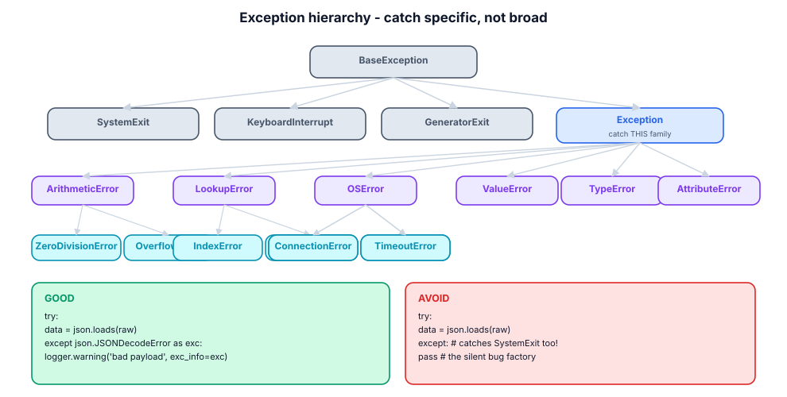
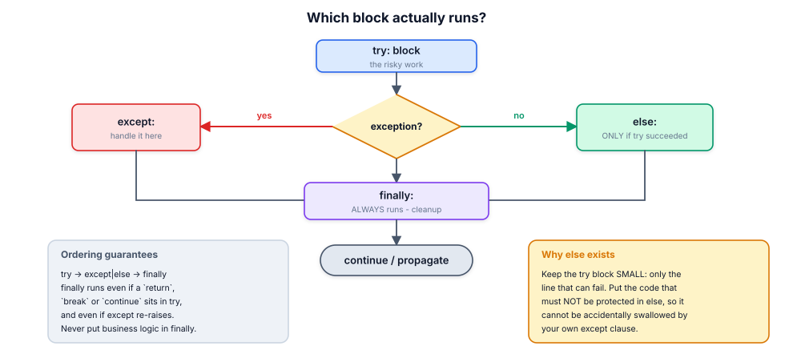

# 11. Exceptions & error handling

> An exception is not a failure of your program; it is your program
> *reporting* a failure. The quality of that report — and of the decision to
> catch or propagate — separates professional code from guesswork.

## 11.1 Definition

**Plain version.** `try` runs risky code; `except` handles specific problems;
`finally` always cleans up.

**Precise version.** An exception is an object (instance of a `BaseException`
subclass) *raised* with `raise`, propagated up the call stack until a matching
`except` clause catches it; if none matches, the interpreter prints a
**traceback** and exits. Matching is by `isinstance`: `except ValueError` also
catches subclasses. While unwinding, `finally` blocks run, context managers
exit, and the exception can be inspected, transformed, chained or suppressed.
Exceptions are for **exceptional** control flow — expected branches belong in
`if`.

## 11.2 Syntax

```python
try:
    value = int(text)                 # the ONE thing that can fail
except ValueError as exc:             # catch specific, bind the instance
    log.warning("bad number %r: %s", text, exc)
    value = 0
except (TypeError, KeyError) as exc:  # tuple = several types
    ...
else:                                 # ONLY if try did not raise
    persist(value)
finally:                              # ALWAYS: cleanup on every path
    fh.close()

raise ValueError("amount must be positive")            # raise
raise ValueError("…") from original_exc                # explicit chaining
raise                                                  # re-raise current

class AppError(Exception):            # custom hierarchy root
    """Base for every error this application raises."""
class NotFound(AppError): ...
```

## 11.3 First examples

**Example 1 — look-before-you-leap vs ask-forgiveness.**

```python
# LBYL: race-prone and noisy
if key in d:
    value = d[key]

# EAFP: idiomatic Python
try:
    value = d[key]
except KeyError:
    value = default
# ...or simply d.get(key, default) when a default is genuinely fine
```

**Example 2 — `else` keeps the try block honest.**

```python
try:
    raw = fh.read()
except OSError:
    ...
else:
    data = json.loads(raw)     # a JSON error must NOT be swallowed above
```

**Example 3 — chaining tells the true story.**

```python
try:
    config = json.loads(raw)
except json.JSONDecodeError as exc:
    raise ConfigError(f"config at {path} is not valid JSON") from exc
# traceback shows BOTH: ConfigError ... __cause__ ... JSONDecodeError
```

## 11.4 The picture





## 11.5 Going deeper

### 11.5.1 The hierarchy, and the two branches you must not catch

`BaseException` splits into the *system* branch (`SystemExit`,
`KeyboardInterrupt`, `GeneratorExit`) and `Exception`. A bare `except:` (or
`except BaseException:`) swallows Ctrl-C and interpreter shutdown — which is
why linters treat it as an error. Catch `Exception` at worst, specific types
by preference.

### 11.5.2 Matching, ordering, and the tuple rule

Clauses are tested **top to bottom**; the first match wins. Therefore put
subclasses before bases (`except FileNotFoundError` before `except OSError`),
otherwise the base hides them. One `except (A, B)` tuple beats two identical
bodies. The bound name (`as exc`) is deleted at the end of the clause — keep a
reference if you need it later.

### 11.5.3 `finally` semantics you can rely on

`finally` runs on every exit path: normal completion, exception, `return`,
`break`, `continue`. A `return` inside `finally` **discards** an in-flight
exception (and linters scream). Use `finally` only for cleanup; prefer `with`
when a context manager exists, because it cannot be forgotten or mis-ordered.

### 11.5.4 Chaining: `from`, `from None`, and implicit context

- `raise X from Y` sets `__cause__` = Y ("direct cause");
- raising inside an `except` without `from` sets `__context__` ("during
  handling of…"), which tracebacks also show;
- `raise X from None` suppresses the original — use when the original is
  noise (e.g. converting `KeyError` to your `NotFound`).

Tracebacks read bottom-up through the chain; good chains make incidents
debuggable in one screen.

### 11.5.5 Custom hierarchies: the one decision that scales

Every project of more than one module deserves a root error:

```python
class ShopError(Exception):
    """Base class for every error the shop application raises."""

class CatalogError(ShopError): ...
class ItemNotFound(CatalogError):
    def __init__(self, sku: str):
        super().__init__(f"no item with sku {sku!r}")
        self.sku = sku          # structured data, not just a message
class PricingError(ShopError): ...
```

Callers can now catch `ShopError` (anything from us) or `ItemNotFound`
(precisely), and HTTP/CLI layers map families to exit codes or status codes in
one place. Carry **attributes**, not only message strings: machines read
fields, humans read messages.

### 11.5.6 Exceptions vs return codes vs assertions

| Situation | Mechanism |
|-----------|-----------|
| expected alternative outcome | return value / `Optional` / sentinel |
| violated program invariant (bug) | `assert` (disabled under `-O`!) or raise |
| violated input contract | raise `ValueError`/`TypeError` |
| external world said no (file, network) | raise domain error, retry or surface |
| "cannot happen" branch | `raise AssertionError`/`TypeError` — never `pass` |

Assertions are development-time documentation; never use them for validation
of external input (they vanish with `python -O`).

### 11.5.7 Logging exceptions properly

```python
try:
    process(order)
except PaymentError:
    logger.exception("payment failed for order %s", order.id)   # includes traceback
    raise
```

`logger.exception` (or `exc_info=True`) captures the traceback at the point of
failure. Logging *and re-raising* is correct when the layer adds context;
logging *and swallowing* is how incidents become invisible.

### 11.5.8 Retries, timeouts and the outside world

Network errors deserve a policy, not a bare except: which exceptions are
retryable (`TimeoutError`, `ConnectionError`), how many attempts, backoff and
jitter (module 07), and an overall deadline. Libraries like `tenacity`
encode this; the principle is: **catch narrow, retry bounded, surface
clearly**.

## 11.6 Industry level

### The error-handling review checklist

1. **Catch narrow.** `except Exception` only at deliberate boundaries (CLI
   main, worker loop, request handler).
2. **Never bare `except:`** and never `except BaseException` outside
   top-level supervisors.
3. **No empty except bodies.** At minimum log with context; a `pass` is a
   bug report waiting to be filed.
4. **Transform at boundaries.** Internal errors become API/CLI errors there,
   with `from` chaining preserved or deliberately cut.
5. **Fail fast and loud in dev, gracefully in prod.** Same code path,
   different handlers at the edge.
6. **Structured fields on exceptions** (ids, paths, codes) so logs are
   queryable.
7. **`finally`/`with` for resources**; transactions rolled back in
   `__exit__`/except.

### The boundary pattern

```python
def main(argv) -> int:
    try:
        return run(argv)
    except ShopError as exc:            # our fault, explained
        logger.error("%s", exc)
        return 2
    except OSError as exc:              # the world's fault
        logger.error("I/O failure: %s", exc)
        return 3
    except Exception:                   # the unknown: full traceback, non-zero
        logger.exception("unhandled error")
        return 1
```

One place maps exceptions to exit codes; everything inside just raises.

### Warnings are not exceptions

`DeprecationWarning`, `UserWarning` etc. travel through the `warnings` module:
visible in tests/CI (`-W error::DeprecationWarning`), silent by default in
production. Emit with `warnings.warn(..., stacklevel=2)` so the report points
at the *caller*.

## 11.7 Comparison tables

**Block semantics:**

| Block | Runs when | Skipped when |
|-------|-----------|--------------|
| `try` | always | — |
| `except T` | a `T` (or subclass) raised in try | no matching raise |
| `else` | try completed without raise | any raise in try |
| `finally` | **every path** (incl. return/break) | never (except process death) |

**Raise styles:**

| Form | Effect |
|------|--------|
| `raise E("msg")` | new exception |
| `raise` | re-raise current |
| `raise E from C` | `__cause__ = C` ("direct cause") |
| `raise E from None` | hide the original |
| (implicit, inside except) | `__context__` set automatically |

**Choosing the built-in:**

| Meaning | Type |
|---------|------|
| wrong type of argument | `TypeError` |
| wrong value of argument | `ValueError` |
| missing key / index | `KeyError` / `IndexError` |
| missing attribute | `AttributeError` |
| I/O problem | `OSError` (+ subclasses: `FileNotFoundError`, `PermissionError`, `TimeoutError`) |
| unsupported operation | `NotImplementedError` / `RuntimeError` |
| broken protocol/state | your domain error |

## 11.8 Mistakes & gotchas

::: gotcha "Bare `except:`"
Catches `KeyboardInterrupt` and `SystemExit` too. Use `except Exception:` at
boundaries, specific types elsewhere.
:::

::: gotcha "`except (A, B):` written as `except A, B:`"
Python 2 syntax; in Py3 `except A, B` is a syntax error — good — but
`except (A, B)` vs two clauses changes ordering semantics.
:::

::: gotcha "Catching the base before the subclass"
`except OSError` above `except FileNotFoundError` makes the second clause dead
code.
:::

::: gotcha "`return` inside `finally`"
Silently discards the active exception. Cleanup only.
:::

::: gotcha "Swallowing and continuing"
`except: pass` turns a crash into corrupted state discovered hours later. Log
or re-raise.
:::

::: warn "`assert` for input validation"
`python -O` removes asserts. Validate with explicit raises.
:::

::: warn "Exception as control flow for expected cases"
Raising for "user not found" in a hot lookup loop costs ~µs per raise and
reads badly; return `None`/`Optional` or use a sentinel (but keep exceptions
for contract violations).
:::

## 11.9 Interview questions

1. **`else` vs `finally`?** — else only on success of try; finally on every
   path.
2. **What does `except ValueError` catch?** — ValueError and all subclasses.
3. **`raise X from Y` vs implicit chaining?** — explicit `__cause__` vs
   automatic `__context__`; `from None` hides the original.
4. **Why not bare `except:`?** — swallows SystemExit/KeyboardInterrupt; hides
   bugs.
5. **How do you design an error hierarchy?** — one app root, families per
   subsystem, structured attributes, mapped to exit/status codes at the edge.
6. **EAFP vs LBYL?** — try/except is idiomatic and race-free; LBYL when the
   check is cheaper or the failure is expected.
7. **Where should `except Exception` appear?** — at deliberate boundaries
   (main, worker, handler), nowhere else.

## 11.10 Practice exercises

[[exercise tier="Beginner" id="ex-11-a" file="exercises/11_exceptions/test_tasks.py"]]
Implement `safe_int(text, default=None)` (ValueError/TypeError → default),
`divide(a, b)` raising `ValueError` for non-numerics and a custom
`DivisionError` for zero divisors, and `first_existing(paths)` returning the
first readable path or raising `FileNotFoundError` listing all tried paths.
[[/exercise]]

[[exercise tier="Intermediate" id="ex-11-b" file="exercises/11_exceptions/test_tasks.py"]]
Implement `parse_config(text)` raising `ConfigError(line_number, reason)`
(subclass of ValueError) for malformed `key=value` lines, with the line number
as an attribute; `retry_on(exc_types, attempts, delay=0)` decorator; and
`guarded_get(mapping, key, transform)` where a transform failure is chained
with `from` into a `TransformError` carrying the original key.
[[/exercise]]

[[exercise tier="Industry" id="ex-11-c" file="exercises/11_exceptions/test_tasks.py"]]
Build a tiny error-handling framework: `ErrorMapper` where
`.map(exc_type, handler)` registers converters and `.run(fn, *a, **kw)`
executes fn, converting raised exceptions through the **MRO** (most specific
registered wins) and re-raising unmapped ones unchanged; plus
`suppressed(*exc_types, on_suppressed=callback)` context manager recording
what it swallowed (the anti-pattern, implemented deliberately so you can see
exactly what information is lost).
[[/exercise]]

[[solution]]
```python
# Reference core (full: exercises/11_exceptions/solution.py)
class ErrorMapper:
    def __init__(self):
        self._handlers = {}
    def map(self, exc_type, handler):
        self._handlers[exc_type] = handler
        return handler
    def run(self, fn, *args, **kwargs):
        try:
            return fn(*args, **kwargs)
        except Exception as exc:
            for cls in type(exc).__mro__:        # most specific first
                handler = self._handlers.get(cls)
                if handler is not None:
                    return handler(exc)
            raise
```
[[/solution]]

## 11.11 Cheatsheet

| Need | Use |
|------|-----|
| Handle one risk | `try:` + narrow `except T as e:` |
| Success-only step | `else:` |
| Cleanup always | `finally:` (or `with`) |
| Re-raise | bare `raise` |
| Convert with context | `raise DomainError(...) from exc` |
| Hide noise | `raise DomainError(...) from None` |
| Custom family | root `class AppError(Exception)` + subclasses with fields |
| Missing-key tolerance | `d.get(k, default)` / `setdefault` |
| Optional success | `next((… ), None)` or return `None` |
| Log with traceback | `logger.exception(...)` / `exc_info=True` |
| Deprecate an API | `warnings.warn(..., DeprecationWarning, stacklevel=2)` |
| Retry policy | bounded attempts + backoff on narrow exception types |
| Exit-code mapping | one `main()` boundary, nowhere else |
