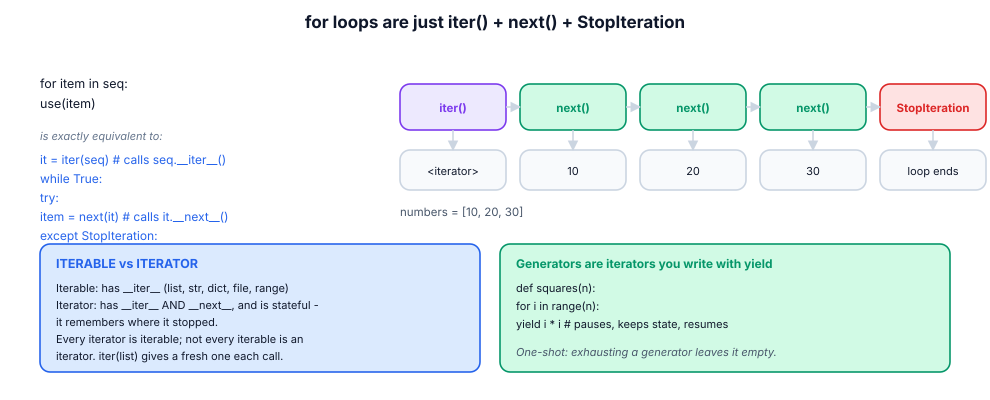
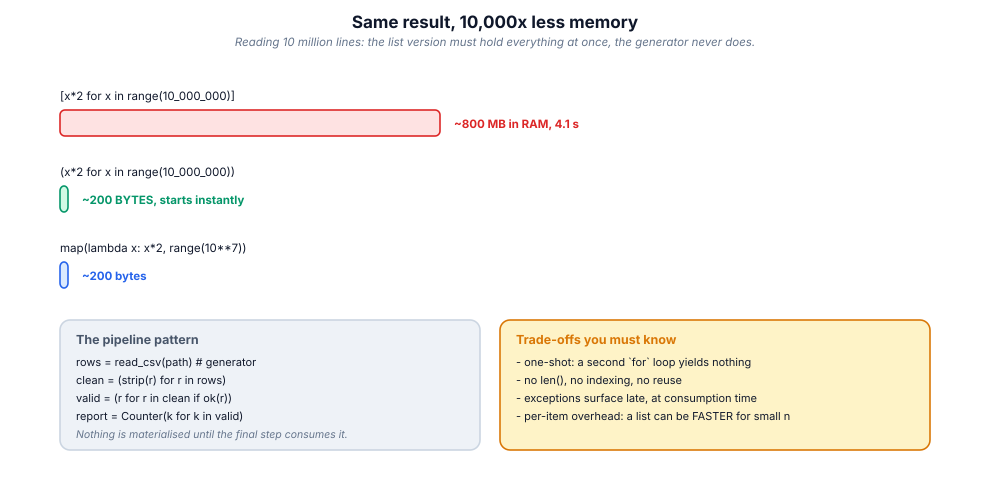

# 12. Iteration, comprehensions & generators

> The single biggest lever in Python performance and memory design is *not
> building the list*. This module teaches you to keep data flowing instead of
> parked.

## 12.1 Definition

**Plain version.** Anything you can loop over is iterable; a generator is a
function that produces values one at a time instead of all at once.

**Precise version.** An **iterable** implements `__iter__` returning an
**iterator**; an **iterator** implements `__next__` returning the next value
and raising `StopIteration` when exhausted (and is its own `__iter__`). A
**generator function** (contains `yield`) returns a **generator object** — an
iterator whose frame is suspended and resumed, keeping local state between
yields. A **generator expression** `(… for … in …)` is the lazy analogue of a
list comprehension. `for`, `sum`, `any`, `join`, `list`, unpacking — all
consume the iterator protocol, which is why your own objects plug into the
whole language by implementing two methods.

## 12.2 Syntax

```python
# comprehensions ----------------------------------------------------------
squares  = [x * x for x in range(10)]              # list
sq_set   = {x * x for x in range(10)}              # set
sq_map   = {x: x * x for x in range(10)}           # dict
sq_lazy  = (x * x for x in range(10))              # generator expression
evens    = [x for x in nums if x % 2 == 0]         # filter
pairs    = [(a, b) for a in xs for b in ys]        # nested loops
label    = [fmt(v) if ok(v) else "n/a" for v in vs]  # inline conditional

# generator functions -------------------------------------------------------
def countdown(n):
    while n:
        yield n                 # suspend here, resume on next()
        n -= 1
    return                      # StopIteration (value ignored by for)

gen = countdown(3)
next(gen)          # 3
list(gen)          # [2, 1]     (already consumed 3!)

# the protocol by hand ----------------------------------------------------------
it = iter([10, 20])
next(it)           # 10
next(it, "done")   # 20
next(it, "done")   # 'done'    (default instead of StopIteration)
```

## 12.3 First examples

**Example 1 — comprehension vs loop, same result.**

```python
names = [" ada ", "GRACE", "  "]
clean = [n.strip().title() for n in names if n.strip()]
# ['Ada', 'Grace']
```

**Example 2 — lazy file pipeline.**

```python
def errors(path):
    with open(path, encoding="utf-8") as fh:
        return sum(1 for line in fh if "ERROR" in line)   # O(1) memory
```

**Example 3 — an infinite sequence, safely.**

```python
def fibs():
    a, b = 0, 1
    while True:
        yield a
        a, b = b, a + b

import itertools
list(itertools.islice(fibs(), 10))     # [0, 1, 1, 2, 3, 5, 8, 13, 21, 34]
```

## 12.4 The picture





## 12.5 Going deeper

### 12.5.1 What `yield` really does

Compiling a function containing `yield` makes it a *generator factory*: calling
it runs **nothing**, it just builds a generator object wrapping the frame. Each
`next()` resumes until the next `yield`, whose expression becomes the returned
value; locals persist between resumes. `yield from sub` delegates: it pipes
every value (and `.send()`/`.throw()`/`.close()`) to a sub-generator — the
basis of coroutine pipelines and of `asyncio`'s ancestry.

### 12.5.2 Generators are one-shot, and that is a feature *and* a trap

```python
g = (x * 2 for x in range(3))
list(g)     # [0, 2, 4]
list(g)     # []          exhausted forever
```

Lists/re-runnable iterables can be looped repeatedly; generators and file
objects cannot. When an API must support multiple passes, return a list or a
callable producing fresh iterators; document one-shot iterators loudly.

### 12.5.3 `send`, `throw`, `close`: generators as coroutines

```python
def accumulator():
    total = 0
    while True:
        value = yield total      # yield AND receive
        total += value

acc = accumulator(); next(acc)   # prime it
acc.send(5); acc.send(7)         # 5, 12
```

This two-way channel is how pre-asyncio frameworks built event loops; today
you will mostly meet it inside libraries, but it explains *why* `async/await`
looks the way it does (module 16).

### 12.5.4 Comprehension semantics worth knowing

- they have their **own scope** (loop variables don't leak — unlike `for`);
- the `if` clause filters, the inline `if/else` **transforms** (different
  positions, different meanings);
- nested comprehensions read loop-order left-to-right: `[ (a,b) for a in A
  for b in B ]` == nested for;
- a comprehension with a single `sum/any/all/max` around it should usually be
  a **generator expression** (no intermediate list): `sum(x*x for x in xs)`;
- dict/set comprehensions deduplicate by key/hash as they build.

### 12.5.5 `itertools`: the standard library of iteration algebra

| Tool | Does | Classic use |
|------|------|-------------|
| `chain(*its)` | concatenate lazily | one loop over many sources |
| `islice(it, a, b)` | slice without materialising | paging a stream |
| `takewhile / dropwhile` | cut by predicate | leading header rows |
| `groupby(it, key)` | consecutive groups | run-length segments |
| `zip_longest` | zip with fill | ragged tables |
| `product / permutations / combinations` | combinatorics | search spaces |
| `accumulate` | running fold | prefix sums |
| `tee(it, n)` | n independent iterators (buffers!) | look-ahead |
| `count / cycle / repeat` | infinite sources | ids, round-robin |
| `starmap / filterfalse` | map/unpack, complement filter | pipelines |

`groupby` surprises everyone: it groups **consecutive** runs only — sort by
the key first, or use a `defaultdict(list)` (module 06).

### 12.5.6 The memory maths

A list of 10⁷ ints: ~80 MB for pointers + 10⁷ int objects (~280 MB) ≈ 360 MB.
A generator: one frame, ~100 bytes. The decision rule:

- need random access / len / reuse → list;
- single pass, transform, aggregate → generator;
- unknown or unbounded size (logs, sockets, sensors) → generator *mandatory*;
- small n (< ~10⁴) → list is fine and often faster (less per-item overhead).

### 12.5.7 Writing your own iterable class

```python
class Range2:
    def __init__(self, n): self.n = n
    def __iter__(self):
        i = 0
        while i < self.n:
            yield i            # generator method = easiest __iter__
            i += 1
```

Using `yield` inside `__iter__` gives re-iterability (each `for` gets a fresh
generator) — strictly better than returning `self` unless you *want* shared
one-shot state.

## 12.6 Industry level

### Pipelines as composition, not as loops

Data-engineering style in pure Python: each stage a generator function, the
pipeline a composition, consumption explicit:

```python
def read(path):          # stage 0: produce
    with open(path, encoding="utf-8") as fh:
        for line in fh:
            yield line

def parse(lines):        # stage 1: transform, drop bad rows
    for line in lines:
        row = line.split(",")
        if len(row) == 3:
            yield row

def enrich(rows):        # stage 2: join with reference data
    for row in rows:
        yield row + [COUNTRY[row[1]]]

report = Counter(r[2] for r in enrich(parse(read("sales.csv"))))
```

Benefits reviewers care about: each stage is unit-testable with a list,
memory is O(1) per stage, and adding a stage is additive. This is the same
architecture as Unix pipes, and the same *idea* as Spark/Dask pipelines.

### Backpressure and batching at boundaries

When producing is fast and consuming is slow (network writes), batch:
`itertools.islice` chunks of 500 records per API call. When consuming is fast
and producing slow, that is a queue/worker problem (module 16), not a
generator problem.

### Generator-based context and resources

A generator that opens a resource must guarantee cleanup: wrap the body in
`try/finally`, or use `contextlib.contextmanager` (the same machinery). Note
that a generator is only closed when GC'd or `.close()`d — `with
contextlib.closing(gen):` makes it deterministic.

### When NOT to be lazy

- you need `len()`, indexing, or two passes → materialise;
- exceptions must surface at validation time, not 40 stages later → validate
  eagerly at the edge;
- the dataset is tiny → clarity beats cleverness.

## 12.7 Comparison tables

**Comprehension flavours:**

| Syntax | Builds | Lazy? |
|--------|--------|-------|
| `[e for x in it]` | list | no |
| `{e for x in it}` | set | no |
| `{k: v for x in it}` | dict | no |
| `(e for x in it)` | generator | **yes** |
| `bytes(e for …)` | bytes | consumes lazily |

**Iterable families:**

| Object | Iterable? | Iterator? | Re-iterable? |
|--------|-----------|-----------|--------------|
| list/tuple/str/dict/set | yes | no | yes |
| `range` | yes | no | yes |
| file object | yes | **yes** | no (position moves) |
| generator / genexp | yes | **yes** | no |
| `map`/`filter`/`zip` | yes | **yes** | no |
| your class with `__iter__` yield | yes | no | yes |

**Loop vs comprehension vs generator:**

| Need | Choose |
|------|--------|
| side effects (write, log, mutate) | `for` loop |
| new collection from old | comprehension |
| single aggregate | builtin + genexp (`sum`, `any`, `max`) |
| streaming / unbounded | generator function |
| combinatorial shapes | `itertools` |

## 12.8 Mistakes & gotchas

::: gotcha "Reusing an exhausted generator"
Second loop yields nothing. If callers iterate twice, return a list or a
factory function.
:::

::: gotcha "`return value` in a generator"
The value lands in `StopIteration.value`, invisible to `for`. Use it only for
`yield from` delegation results.
:::

::: gotcha "Mutable default state across yields"
A generator's locals persist between yields — great for accumulators,
dangerous if you assume a fresh start per `next()` batch.
:::

::: gotcha "`groupby` groups only consecutive runs"
Sort first, or aggregate with a dict.
:::

::: gotcha "List comprehension where genexp belongs"
`sum([x*x for x in huge])` allocates the whole list for nothing. Drop the
brackets.
:::

::: warn "Late binding in comprehension-created closures"
`[lambda: i for i in range(3)]` → all return 2. Bind with `lambda i=i:`.
:::

## 12.9 Interview questions

1. **Iterable vs iterator?** — `__iter__` vs `__iter__`+`__next__`; iterators
   are stateful and one-shot.
2. **What does `yield` do?** — suspends the frame, returns a value, resumes on
   `next()` with locals intact.
3. **List comprehension vs generator expression?** — eager list in memory vs
   lazy O(1)-memory iterator.
4. **How does `for` work internally?** — `iter()` then `next()` until
   `StopIteration`.
5. **Why can't you `len()` a generator?** — no stored size; it hasn't computed
   the future.
6. **`yield from`?** — delegates iteration (and send/throw/close) to a
   sub-generator.
7. **Name five itertools and their uses.** — chain, islice, groupby,
   accumulate, zip_longest, …
8. **How do you make a class iterable?** — `__iter__` (easiest: a generator
   method).

## 12.10 Practice exercises

[[exercise tier="Beginner" id="ex-12-a" file="exercises/12_iteration/test_tasks.py"]]
Implement with comprehensions: `squares_map(n)` ({i: i*i}), `even_squares(nums)`,
`word_lengths(words)` (dict, skipping blanks), and `flatten(matrix)` (one
comprehension with two fors).
[[/exercise]]

[[exercise tier="Intermediate" id="ex-12-b" file="exercises/12_iteration/test_tasks.py"]]
Implement generators `take(n, it)`, `chunked(it, size)` (lists of ≤ size),
`running_average(it)` (yield the mean so far), and `dedupe(it, key=None)`
preserving order. Then `pipeline(*stages)` composing callables that each take
and return iterables.
[[/exercise]]

[[exercise tier="Industry" id="ex-12-c" file="exercises/12_iteration/test_tasks.py"]]
Implement `CsvPipeline`-style stages over an iterable of raw lines:
`parse_rows(lines)` (yield dicts, skip malformed with a recorded `.skipped`
count), `validate(rows, rules)` (rules = {field: predicate}; failures go to
`.rejected`, good rows yielded), `aggregate(rows, field)` (Counter), and a
`Window(it, size)` sliding-window iterator. The whole chain must work on a
generator input without ever materialising it.
[[/exercise]]

[[solution]]
```python
# Reference core (full: exercises/12_iteration/solution.py)
def chunked(it, size):
    it = iter(it)
    while True:
        head = list(itertools.islice(it, size))
        if not head:
            return
        yield head

class Window:
    def __init__(self, it, size):
        self.it, self.size = iter(it), size
    def __iter__(self):
        buf = collections.deque(itertools.islice(self.it, self.size),
                                maxlen=self.size)
        if len(buf) == self.size:
            yield tuple(buf)
        for item in self.it:
            buf.append(item)
            yield tuple(buf)
```
[[/solution]]

## 12.11 Cheatsheet

| Need | Use |
|------|-----|
| Transform to list/set/dict | `[…]` / `{…}` / `{k: v …}` comprehension |
| Lazy transform | `(… for …)` genexp |
| Filter | `if cond` at the end of a comprehension |
| Transform-or-default | `a if cond else b` at the front |
| Aggregate | `sum/any/all/max/min(… for …)` |
| First match lazily | `next((x for x in it if p(x)), default)` |
| Custom lazy sequence | generator function with `yield` |
| Delegate | `yield from sub` |
| Slice a stream | `itertools.islice(it, n)` |
| Concatenate streams | `itertools.chain(a, b)` |
| Consecutive groups | `itertools.groupby(sorted_it, key)` |
| Running totals | `itertools.accumulate` |
| Infinite ids | `itertools.count(start, step)` |
| Batching | `islice` in a while-loop, or `chunked` |
| Make class iterable | `def __iter__(self): yield …` |
