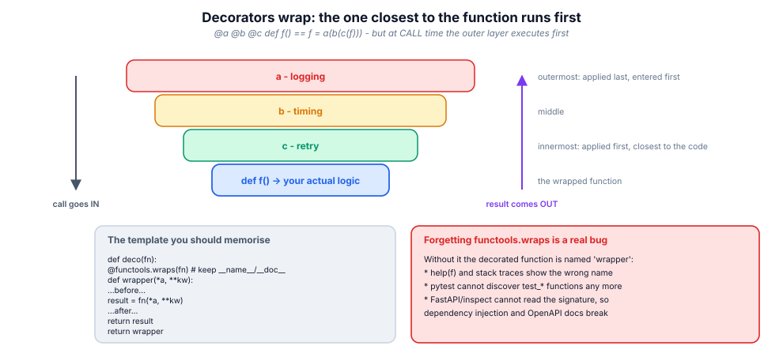
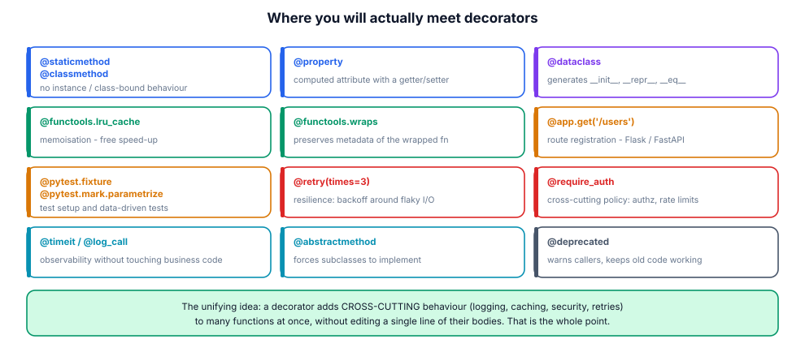

# 13. Closures & decorators

> A decorator is just a function that writes boilerplate for you, once, at
> import time, for every function that opts in with one line. Everything
> "framework-y" in Python — routes, fixtures, ORM columns, CLI commands — is
> this idea.

## 13.1 Definition

**Plain version.** A decorator wraps a function with extra behaviour without
editing its body; you apply it with `@name` above the `def`.

**Precise version.** A decorator is a **callable that takes a callable and
returns a callable**. The statement

```python
@deco
def f(): ...
```

is exactly `f = deco(f)` executed **at definition time** (import time for
module-level code). Because the wrapper closes over the original function (a
*closure*, module 07), it can run code before/after/instead of the call,
inspect arguments, cache results, retry failures or refuse to run at all.
Decorator *factories* (`@deco(arg)`) add one more layer: `deco(arg)` returns
the actual decorator.

## 13.2 Syntax

```python
import functools, time

def logged(fn):                       # plain decorator
    @functools.wraps(fn)              # keep name/doc/signature
    def wrapper(*args, **kwargs):
        print("call", fn.__name__, args, kwargs)
        return fn(*args, **kwargs)
    return wrapper

def retry(times: int, delay: float = 0.0):     # decorator FACTORY
    def decorator(fn):
        @functools.wraps(fn)
        def wrapper(*args, **kwargs):
            for attempt in range(times):
                try:
                    return fn(*args, **kwargs)
                except Exception:
                    if attempt == times - 1:
                        raise
                    time.sleep(delay)
        return wrapper
    return decorator

@logged                               # no parentheses: decorator itself
def add(a, b): return a + b

@retry(times=3, delay=0.1)            # parentheses: factory call first
def fetch(url): ...

@logged
@retry(times=2)                       # stacking: retry applied first,
def load(): ...                       # then logged wraps that
# equivalent to: load = logged(retry(times=2)(load))
```

## 13.3 First examples

**Example 1 — timing.**

```python
def timed(fn):
    @functools.wraps(fn)
    def wrapper(*a, **kw):
        start = time.perf_counter()
        try:
            return fn(*a, **kw)
        finally:
            wrapper.elapsed = time.perf_counter() - start
    wrapper.elapsed = 0.0
    return wrapper

@timed
def work(): sum(range(10**6))
work(); print(f"{work.elapsed:.4f}s")
```

**Example 2 — a registry (the framework pattern).**

```python
ROUTES = {}
def route(method, path):
    def decorator(fn):
        ROUTES[(method, path)] = fn
        return fn
    return decorator

@route("GET", "/users")
def list_users(): return ["ada"]
```

**Example 3 — class-based decorator with state.**

```python
class CountCalls:
    def __init__(self, fn): functools.update_wrapper(self, fn); self.fn = fn; self.calls = 0
    def __call__(self, *a, **kw):
        self.calls += 1
        return self.fn(*a, **kw)

@CountCalls
def ping(): return "pong"
ping(); ping(); print(ping.calls)      # 2
```

## 13.4 The picture





## 13.5 Going deeper

### 13.5.1 When decoration happens — and why it matters

`@deco` runs when the `def` statement executes: at **import** for module-level
functions, at **class creation** for methods, at **call** time for functions
defined inside functions. Consequences: decorator side effects (registration,
validation of configuration) happen once per process; a decorator that
requires runtime state (a DB handle) must capture it lazily inside the
wrapper, not at decoration time.

### 13.5.2 `functools.wraps` and the metadata contract

Without `wraps`, the wrapper's `__name__` is `"wrapper"`, its docstring is
gone, and `inspect.signature` describes `(*args, **kwargs)`. That breaks:
tracebacks, `help()`, Sphinx, pytest discovery (`test_*` renamed!), FastAPI's
signature-based dependency injection, and CLI builders. `wraps` copies
`__module__`, `__name__`, `__qualname__`, `__doc__`, `__dict__` and sets
`__wrapped__` — which also lets anyone unwrap: `original = f.__wrapped__`
(useful in tests).

For class-based decorators use `functools.update_wrapper(self, fn)`.

### 13.5.3 Stacking order, precisely

```python
@a
@b
def f(): ...      # f = a(b(f))
```

Definition time: `b` first, then `a`. Call time: `a`'s wrapper body runs
first, and decides whether/when to call into `b`'s wrapper. So `@cache`
outside `@retry` caches final results including retries; inside, it caches
each attempt. Order is a design decision — draw it when reviewing.

### 13.5.4 Decorators on methods and classes

Decorating a method works identically (the wrapper receives `self` as first
argument). Two classic traps:

- `@lru_cache` on a method caches **forever per instance-argument**, keeping
  `self` (and everything it references) alive — a memory leak; prefer
  caching a pure module-level function or `functools.cache` on a hashable key;
- decorating a **class** (`@dataclass`, `@singleton`) replaces the class
  object itself — subclasses then decorate independently.

### 13.5.5 Stateful decorators: caches, limits, metrics

The closure is the state. Guard it when threads are involved:

```python
def rate_limit(per_second: int):
    def decorator(fn):
        lock = threading.Lock()
        window = collections.deque()
        @functools.wraps(fn)
        def wrapper(*a, **kw):
            with lock:
                now = time.monotonic()
                while window and now - window[0] > 1.0:
                    window.popleft()
                if len(window) >= per_second:
                    raise RuntimeError("rate limited")
                window.append(now)
            return fn(*a, **kw)
        return wrapper
    return decorator
```

Rule: state created in the *factory* is shared by all calls of that decorated
function (usually what you want); state created in the *wrapper* is per-call
(useless for caches).

### 13.5.6 Typing decorators (module 14 preview)

A wrapper typed as `(*args, **kwargs) -> Any` destroys the caller's type
information. `ParamSpec` preserves it:

```python
from typing import Callable, ParamSpec, TypeVar
P, R = ParamSpec("P"), TypeVar("R")

def logged(fn: Callable[P, R]) -> Callable[P, R]: ...
```

Static checkers then keep validating call sites of decorated functions.

### 13.5.7 Decorator vs context manager vs base class

| Need | Tool |
|------|------|
| behaviour for *every* call of a named function | decorator |
| behaviour for *one* dynamic block of code | context manager (`with`) |
| shared behaviour + shared state across a family | base class / mixin |
| one-off wrapping at a call site | plain higher-order function |
| per-instance policy | dependency injection (pass a strategy) |

If you find yourself decorating 20 functions with the same policy, ask whether
the policy belongs at a boundary (middleware, interceptor) instead.

## 13.6 Industry level

### The production decorator catalogue

- **Resilience**: `@retry`, `@circuit_breaker`, `@timeout(seconds)`;
- **Performance**: `@cache/TTL`, `@debounce`, `@rate_limit`;
- **Security**: `@require_auth(roles=…)`, `@audit_logged`;
- **Observability**: `@traced`, `@timed`, `@count_exceptions` (metrics);
- **Registration**: `@app.get(path)`, `@cli.command()`, `@pytest.fixture`,
  `@dataclass`;
- **Lifecycle**: `@deprecated(since=…, remove_in=…)`, `@experimental`.

All of them share the discipline: validate configuration at decoration time
(fail fast at import), keep the wrapper signature-transparent (`wraps` +
`ParamSpec`), keep state thread-safe or document otherwise, and make the
decorator **unit-testable on its own** (decorate a dummy function in tests).

### Registries are contracts

The `@route` pattern scales into plugin systems when the registry is explicit
and validated:

```python
def command(name: str):
    if not name.isidentifier():
        raise ValueError(f"bad command name {name!r}")   # import-time check
    def deco(fn):
        if name in COMMANDS:
            raise ValueError(f"duplicate command {name!r}")
        COMMANDS[name] = fn
        return fn
    return deco
```

Import-time failure for duplicate routes/commands is a *feature*: CI catches
conflicts before deployment instead of at 3 a.m.

### Deprecation, done politely

```python
def deprecated(*, since: str, remove_in: str, use: str):
    def deco(fn):
        msg = f"{fn.__name__} is deprecated since {since}; use {use}; removal in {remove_in}"
        @functools.wraps(fn)
        def wrapper(*a, **kw):
            warnings.warn(msg, DeprecationWarning, stacklevel=2)
            return fn(*a, **kw)
        return wrapper
    return deco
```

`stacklevel=2` points the warning at the *caller*, which is the difference
between a usable and an ignorable warning.

## 13.7 Comparison tables

**Decorator flavours:**

| Flavour | Shape | Use |
|---------|-------|-----|
| plain | `def deco(fn)` | no configuration |
| factory | `def deco(cfg): def deco2(fn)` | configuration |
| class-based | `__init__(fn)` + `__call__` | visible state, methods |
| on classes | returns a new/altered class | `@dataclass`, `@singleton` |
| async | `async def wrapper` | awaiting the wrapped coroutine |

**Built-ins you already use:**

| Decorator | Adds |
|-----------|------|
| `@property` / `.setter` | attribute access with logic |
| `@staticmethod` / `@classmethod` | binding behaviour |
| `@abstractmethod` | contract enforcement via ABC |
| `@dataclass` | generated dunders |
| `@functools.lru_cache/cache` | memoisation |
| `@functools.wraps` | metadata preservation (inside decorators) |
| `@contextlib.contextmanager` | generator → context manager |
| `@pytest.fixture/parametrize` | test wiring |

## 13.8 Mistakes & gotchas

::: gotcha "Forgetting `functools.wraps`"
Wrong names in tracebacks, broken help/docs, pytest can't find the test,
FastAPI can't read the signature. Lint rule: every wrapper gets `wraps`.
:::

::: gotcha "Side effects at decoration time"
The decorator body (not the wrapper) runs at import. Connecting to a DB there
makes importing your module require a live DB.
:::

::: gotcha "Stacking order assumed, not drawn"
`@cache` over `@retry` vs under it behaves differently under failure. Decide
deliberately.
:::

::: gotcha "`lru_cache` on methods"
The cache keys include `self`, so instances (and their graphs) never get
collected. Cache pure functions instead.
:::

::: gotcha "Mutable state shared across threads, unguarded"
Two calls mutate the same closure dict → lost updates. Lock it or make it
per-call.
:::

::: warn "Decorators as a substitute for design"
Ten stacked decorators on one function is a smell: the function is doing too
much, or the cross-cutting concern belongs in middleware.
:::

## 13.9 Interview questions

1. **What does `@deco` above a def do?** — `f = deco(f)` at definition time.
2. **Why `functools.wraps`?** — preserve metadata/signature; sets `__wrapped__`.
3. **Order of stacked decorators?** — applied bottom-up, executed top-down.
4. **Decorator vs decorator factory?** — the factory takes config and returns
   the decorator; needs `@deco(...)` with parentheses.
5. **How do you test a decorator?** — decorate a dummy function and assert
   behaviour; or call `deco(fn)` directly.
6. **Where does decorator state live?** — in the closure created per
   decoration (shared by calls) or per call inside the wrapper.
7. **How would you keep types through a decorator?** — `ParamSpec` +
   `TypeVar` (or `Callable[P, R]`).

## 13.10 Practice exercises

[[exercise tier="Beginner" id="ex-13-a" file="exercises/13_decorators/test_tasks.py"]]
Implement `logged(fn, sink=print)` recording `("call", name, args, kwargs)`
and `("return", name, result)` into `sink`; `double_result(fn)`; and
`count_calls(fn)` exposing `.calls` (class- or closure-based).
[[/exercise]]

[[exercise tier="Intermediate" id="ex-13-b" file="exercises/13_decorators/test_tasks.py"]]
Implement `timed(clock=time.monotonic)` storing `.elapsed` on the wrapper;
`retry_dec(attempts, exceptions=(Exception,), sleep=time.sleep)`; and
`ttl_cache(seconds, clock)` expiring entries (hits after expiry recompute).
[[/exercise]]

[[exercise tier="Industry" id="ex-13-c" file="exercises/13_decorators/test_tasks.py"]]
Implement `route(method, path)` filling a `ROUTES` registry with import-time
duplicate detection and `dispatch(method, path, **params)`; `validate(**specs)`
checking parameter types at call time (`TypeError` naming the parameter); and
a `singleton` class decorator making `Klass() is Klass()` while preserving
`isinstance` and the class name.
[[/exercise]]

[[solution]]
```python
# Reference core (full: exercises/13_decorators/solution.py)
def ttl_cache(seconds, clock=time.monotonic):
    def decorator(fn):
        store = {}
        @functools.wraps(fn)
        def wrapper(*args, **kwargs):
            key = (args, tuple(sorted(kwargs.items())))
            now = clock()
            hit = store.get(key)
            if hit is not None and now - hit[0] < seconds:
                return hit[1]
            value = fn(*args, **kwargs)
            store[key] = (now, value)
            return value
        wrapper.cache_clear = store.clear
        return wrapper
    return decorator

def singleton(cls):
    instance = None
    @functools.wraps(cls)
    def get_instance(*args, **kwargs):
        nonlocal instance
        if instance is None:
            instance = cls(*args, **kwargs)
        return instance
    get_instance.__wrapped_class__ = cls
    return get_instance
```
[[/solution]]

## 13.11 Cheatsheet

| Need | Use |
|------|-----|
| Wrap a function | `def deco(fn): @wraps(fn) def wrapper(*a, **kw): …` |
| Configure the wrap | factory: `def deco(cfg): return real_deco` |
| Keep metadata | `@functools.wraps(fn)` / `update_wrapper(self, fn)` |
| Unwrap for tests | `f.__wrapped__` |
| State per decorated fn | closure in the factory |
| Thread-safe state | `threading.Lock` around the closure |
| Register at import | decorator writing into a module-level dict |
| Memoise pure fn | `@functools.lru_cache(maxsize=…)` |
| One block, not all calls | `@contextlib.contextmanager` + `with` |
| Type-preserving wrapper | `Callable[ParamSpec, TypeVar]` |
| Deprecate | warn `DeprecationWarning, stacklevel=2` |
| Async function | `async def wrapper: return await fn(...)` |
