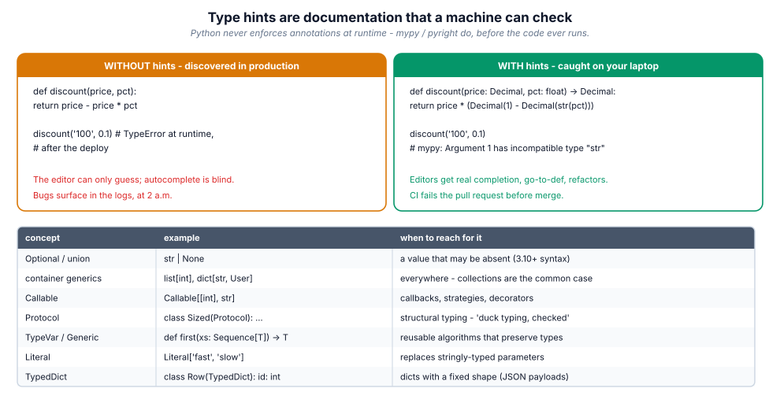

# 14. Type hints & static analysis

> Python stays dynamic at runtime and gains a compile-time safety net on top.
> Teams that type their boundaries ship fewer 2 a.m. incidents; the types are
> also the documentation, the autocomplete and the refactor guard.

## 14.1 Definition

**Plain version.** Type hints annotate what values should be: `def f(x: int)
-> str:`.

**Precise version.** Annotations are **expressions evaluated (or, since PEP
563/649, stored lazily as strings) and attached to `__annotations__`**. The
interpreter ignores them at runtime; **static checkers** (mypy, pyright,
pyre) analyse them without running the code, and libraries (pydantic,
FastAPI, dataclasses) may read them via `typing.get_type_hints`. So hints are
a *contract for tools and humans*, enforced before execution — the mirror
image of tests, which enforce behaviour during execution.

## 14.2 Syntax

```python
from __future__ import annotations          # lazy annotations (older Pythons)
from collections.abc import Sequence, Mapping, Iterable, Callable
from typing import TypeVar, Generic, Protocol, Literal, TypedDict, Any, cast

def total(prices: list[float], tax: float = 0.0) -> float: ...
def find(users: Sequence["User"], name: str | None = None) -> User | None: ...
def handler(event: dict[str, Any]) -> None: ...          # Any = opt out
def mode(m: Literal["fast", "safe"]) -> None: ...        # exact literals
def first(xs: Sequence[T]) -> T | None: ...              # generic (T below)

T = TypeVar("T")
class Stack(Generic[T]):
    def push(self, item: T) -> None: ...
    def pop(self) -> T: ...

class UserPayload(TypedDict):
    id: int
    name: str
    tags: list[str]

class Renderable(Protocol):
    def render(self) -> str: ...

UserId = NewType("UserId", int)         # distinct from plain int to checkers
```

## 14.3 First examples

**Example 1 — the bug a checker catches before runtime.**

```python
def discount(price: float, pct: float) -> float:
    return price * (1 - pct)

discount("100", 0.1)
# mypy: error: Argument 1 to "discount" has incompatible type "str";
#        expected "float"
```

**Example 2 — Optional means "may be None".**

```python
def user_by_id(uid: int) -> User | None:
    return store.get(uid)

u = user_by_id(7)
u.name                     # mypy: error: Item "None" of "User | None" has no attribute "name"
if u is not None:
    u.name                 # narrowed: fine
```

**Example 3 — Protocol: duck typing, checked.**

```python
def export(doc: Renderable) -> str:      # any object with .render()
    return doc.render()
```

No inheritance required; mypy verifies structural compatibility at call sites.

## 14.4 The picture



## 14.5 Going deeper

### 14.5.1 Modern syntax vs legacy `typing` names

| Legacy (3.5–3.8) | Modern (3.9+/3.10+) |
|------------------|---------------------|
| `List[int]`, `Dict[str, int]`, `Set[int]`, `Tuple[int, ...]` | `list[int]`, `dict[str, int]`, `set[int]`, `tuple[int, ...]` |
| `Optional[X]` | `X \| None` |
| `Union[A, B]` | `A \| B` |
| `typing.Callable[[int], str]` | `collections.abc.Callable[[int], str]` |
| `typing.Iterable/Sequence/Mapping` | `collections.abc.*` |
| `Text` | `str` |

Prefer builtins and `collections.abc`; reserve `typing` for the concepts that
live only there (`TypeVar`, `Protocol`, `Literal`, `TypedDict`, `Annotated`,
`cast`, `overload`, `Final`, `ClassVar`, `Self`, `TypeGuard`).

### 14.5.2 When annotations are evaluated

Historically annotations executed at `def` time (cost + forward-reference
pain). PEP 563 made them strings (`from __future__ import annotations`), PEP
649 (3.14) evaluates them **on demand**. Practical rules: use the future
import on <3.14 if you need forward references everywhere; resolve strings
with `typing.get_type_hints(fn)` when a library must read them (pydantic,
ORMs, serializers); keep annotation expressions importable at module level so
`get_type_hints` can resolve them.

### 14.5.3 Generics and variance, pragmatically

`list[int]` is **not** a `list[object]` (invariance: mutating a shared list
could break it), while `Sequence[int]` **is** a `Sequence[object]`
(covariance: read-only). Hence: **accept abstract, return concrete** —
parameters as `Sequence/Mapping/Iterable/Set`, returns as `list/dict` when
callers need mutation. `TypeVar` preserves identity through a function
(`first(xs: Sequence[T]) -> T | None`); bound TypeVars (`TypeVar("N",
bound=Number)`) constrain; `ParamSpec` preserves signatures through decorators
(module 13).

### 14.5.4 Protocols: structural interfaces

```python
class Sized(Protocol):
    def __len__(self) -> int: ...

@runtime_checkable
class Closable(Protocol):
    def close(self) -> None: ...

isinstance(fh, Closable)      # True - checks method presence at runtime
```

`runtime_checkable` protocols support `isinstance` (methods only, not
signatures). Protocols are how libraries accept "anything file-like" without
forcing inheritance — the checked version of duck typing.

### 14.5.5 TypedDict, Literal, NewType, Annotated

- **TypedDict**: JSON-shaped dicts with known keys; checkers validate access
  and construction; at runtime it is just `dict`.
- **Literal**: enumerated values; `match`/`if` narrow them exhaustively.
- **NewType**: zero-cost distinct types — `UserId(int)` catches passing an
  `OrderId` where a `UserId` belongs, at zero runtime cost.
- **Annotated**: attach runtime metadata — `Annotated[int, Field(ge=0)]`
  (pydantic), `Annotated[str, StringConstraints(max_length=8)]`; checkers see
  the base type, frameworks see the metadata.

### 14.5.6 Narrowing: how checkers follow your logic

`isinstance`, `is None`, `match`, `in` on Literals, `TypeGuard` functions and
truthiness all narrow unions:

```python
def describe(x: int | str | None) -> str:
    match x:
        case None:  return "absent"
        case int(): return f"number {x}"
        case str(): return f"text {x!r}"
```

Exhaustive `match` over Literals/unions lets mypy flag unhandled cases with
`assert_never(x)` in the final branch — a compile-time guarantee you handled
every variant.

### 14.5.7 Running the checkers

```bash
mypy --strict src/            # or pyright (VS Code: Pylance)
```

`--strict` = disallow untyped defs/any returns, warn unused ignores, etc.
Adopt gradually: strict on new packages (`[tool.mypy]` per-module overrides),
relaxed on legacy. Editors show errors as you type; CI fails the PR
(module 18). `reveal_type(x)` prints the inferred type during a check — the
debugger of static analysis.

### 14.5.8 Runtime validation is a different job

Hints do not validate. At system boundaries (HTTP bodies, config files, CLI
args) use a library that does: **pydantic** models parse + validate + coerce
using the annotations, and produce structured errors. Pattern: untrusted
bytes → pydantic model at the edge → fully typed, trusted objects inside.

## 14.6 Industry level

### The typing rollout playbook

1. **Boundaries first**: public functions, dataclasses, pydantic models,
   function signatures — bodies can stay gradual.
2. **Ban `Any` at the boundary**; inside, prefer `object` + narrowing over
   `Any` when the type is truly unknown.
3. **`--strict` for new modules**, per-module config for legacy; ruff/mypy
   codes on every `type: ignore` with a justification comment.
4. **Protocols at plugin seams**, ABCs inside your own frameworks.
5. **TypedDict for external JSON**, dataclasses for internal records,
   pydantic at the edge.
6. **CI gate**: `mypy` + `pyright` + tests on every PR; the merge button stays
   red otherwise.

### What good looks like in review

```python
def load_users(path: Path) -> list[User]:        # concrete return: callers can mutate
    ...
def render(docs: Iterable[Renderable]) -> str:  # abstract input: accept anything
    ...
def user_id_from(request: Request) -> UserId:   # NewType: cannot mix up ids
    ...
```

Reviewers check: no bare `dict`/`list` (always parametrised), no `Optional`
without a `None`-handling path, no `cast` without a comment, generics used
where behaviour is type-agnostic.

## 14.7 Comparison tables

**Construct chooser:**

| Situation | Construct |
|-----------|-----------|
| maybe absent | `X \| None` |
| one of several | `A \| B` or `Literal[...]` |
| homogeneous container | `list[int]`, `set[str]` |
| fixed-shape record | `dataclass` / `TypedDict` (JSON) |
| read-only sequence param | `Sequence[T]` / `Iterable[T]` |
| mapping param | `Mapping[K, V]` |
| callback | `Callable[[int], str]` / `ParamSpec` |
| interface by shape | `Protocol` |
| interface by inheritance | `ABC` |
| distinct scalar | `NewType` |
| metadata for frameworks | `Annotated[X, ...]` |
| type-preserving generic fn | `TypeVar` + `Generic` |
| escape hatch | `cast(T, x)` (comment why) |

**Runtime vs static:**

| Question | Answer |
|----------|--------|
| Do hints slow my program? | negligibly (annotation storage only) |
| Do hints raise at runtime on bad data? | **no** — checkers do, before run |
| Can I `isinstance(x, list[int])`? | no (`TypeError`); use protocols or element checks |
| Who reads hints at runtime? | pydantic/FastAPI/dataclasses via `get_type_hints` |
| Where are they stored? | `__annotations__` (strings under PEP 563) |

## 14.8 Mistakes & gotchas

::: gotcha "`Optional[X]` ≠ "optional parameter""
It means "may be None". A parameter with a default is optional; its type may
or may not include None.
:::

::: gotcha "`list[int]` in `isinstance`"
`TypeError: subscripted generics cannot be used with isinstance`. Use
`runtime_checkable` Protocols or manual checks.
:::

::: gotcha "Invariance surprise"
`def f(xs: list[object])` refuses a `list[int]`. Accept `Sequence[object]`
instead.
:::

::: gotcha "`Any` infects everything it touches"
One `Any` return silences checks downstream for the whole call graph. Prefer
`object` + narrowing, or a Protocol.
:::

::: gotcha "Forward references on old Pythons"
`def f() -> MyClass:` before `MyClass` exists needs quotes or
`from __future__ import annotations`.
:::

::: warn "Hints as false comfort"
Annotated but unchecked code is untested documentation. Run the checker in CI
or the hints are decoration.
:::

## 14.9 Interview questions

1. **Are type hints enforced at runtime?** — No; static checkers and
   opt-in libraries use them.
2. **`Optional[X]` vs default argument?** — may-be-None vs callable-without-it.
3. **Why `Sequence` in parameters, `list` in returns?** — covariance/invariance;
   accept wide, return useful.
4. **Protocol vs ABC?** — structural/static vs nominal/runtime.
5. **What is `TypeVar` for?** — relating parameter and return types generically.
6. **How do you type a decorator preserving signatures?** — `ParamSpec` +
   `TypeVar`.
7. **Where would you use TypedDict vs dataclass?** — external JSON shape vs
   internal record with behaviour.
8. **What does `--strict` add?** — disallows untyped defs, silent Any, unused
   ignores, etc.

## 14.10 Practice exercises

[[exercise tier="Beginner" id="ex-14-a" file="exercises/14_typing/test_tasks.py"]]
Add annotations to `normalize(texts)`, `stats(numbers)` and `lookup(mapping,
key)` so that `typing.get_type_hints` reports exactly the expected signatures
(the tests assert the annotations), keeping behaviour correct.
[[/exercise]]

[[exercise tier="Intermediate" id="ex-14-b" file="exercises/14_typing/test_tasks.py"]]
Implement generic `first(seq: Sequence[T]) -> T | None`, `pairwise(it:
Iterable[T]) -> Iterator[tuple[T, T]]`, a `Renderable` runtime-checkable
Protocol plus `render_all(docs: Iterable[Renderable]) -> list[str]`, and a
`UserPayload` TypedDict with `validate_payload(data: object) -> UserPayload`
raising `ValueError` with the offending field name on bad shapes.
[[/exercise]]

[[exercise tier="Industry" id="ex-14-c" file="exercises/14_typing/test_tasks.py"]]
Implement a checked result type: `Ok(Generic[T])` / `Err(Generic[E])` with
`.unwrap()`, `.map(fn)`, `.is_ok()` and a `match`-friendly `.tag` Literal; plus
`Repository(Protocol[T])` and `InMemoryRepository(Generic[T])` implementing
`save/get/list_all` keyed by an `EntityId = NewType(...)`, raising `KeyError`
with the id on miss. Tests exercise behaviour and assert the generic
annotations via `get_type_hints`.
[[/exercise]]

[[solution]]
```python
# Reference core (full: exercises/14_typing/solution.py)
T = TypeVar("T"); E = TypeVar("E")

class Ok(Generic[T]):
    tag: Literal["ok"] = "ok"
    def __init__(self, value: T) -> None: self.value = value
    def is_ok(self) -> bool: return True
    def unwrap(self) -> T: return self.value
    def map(self, fn): return Ok(fn(self.value))

class Err(Generic[E]):
    tag: Literal["err"] = "err"
    def __init__(self, error: E) -> None: self.error = error
    def is_ok(self) -> bool: return False
    def unwrap(self) -> NoReturn: raise ValueError(f"unwrap of Err: {self.error}")
    def map(self, fn): return self
```
[[/solution]]

## 14.11 Cheatsheet

| Need | Write |
|------|-------|
| maybe None | `X \| None` |
| union | `A \| B` |
| list/dict/set of T | `list[T]`, `dict[K, V]`, `set[T]` |
| tuple shape | `tuple[int, str]` / homogeneous `tuple[int, ...]` |
| any iterable param | `Iterable[T]` / `Sequence[T]` |
| mapping param | `Mapping[K, V]` |
| callable | `Callable[[int], str]` |
| exact values | `Literal["a", "b"]` |
| JSON shape | `class X(TypedDict)` |
| record | `@dataclass` (+ `frozen=True`) |
| shape interface | `class P(Protocol)` |
| generic fn/class | `T = TypeVar("T")`, `Generic[T]` |
| decorator typing | `ParamSpec` + `TypeVar` |
| distinct scalars | `NewType("UserId", int)` |
| framework metadata | `Annotated[int, Field(ge=0)]` |
| runtime validation | pydantic model at the boundary |
| check | `mypy --strict src/`, pyright in editor, both in CI |
