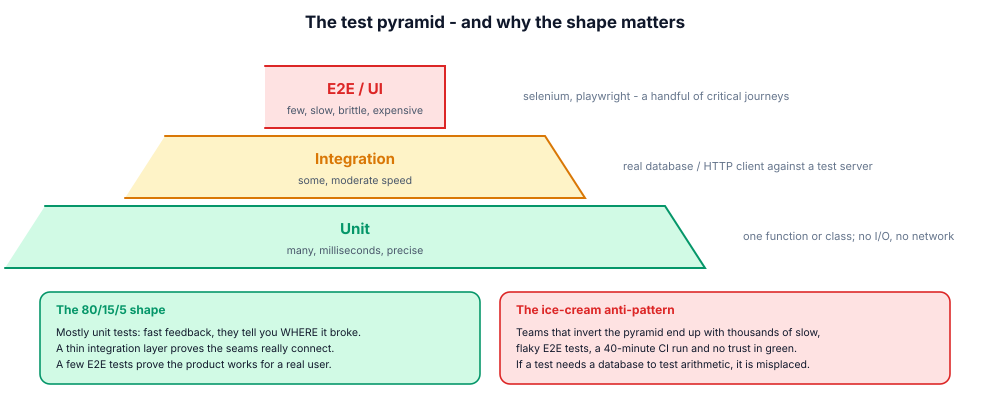
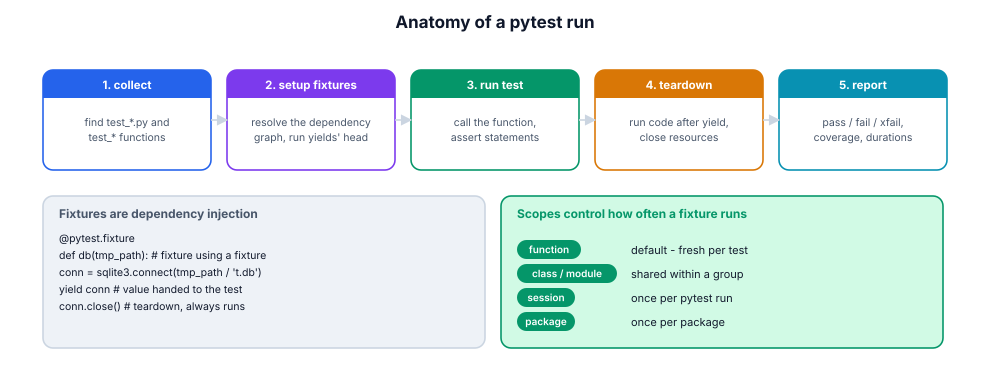

# 15. Testing with pytest

> A test suite is an executable specification and a regression net. Its value
> is proportional to how much developers trust it — which is a property of
> speed, clarity and stability, not of line count.

## 15.1 Definition

**Plain version.** A test is a function that runs code and complains if the
behaviour is wrong; pytest finds and runs them for you.

**Precise version.** pytest **collects** `test_*.py` files and `test_*`
functions (and `Test*` classes), **rewrites `assert` statements** at import so
failures show real values, resolves each test's **fixtures** as a dependency
graph (setup → yield → teardown), applies **marks** (skip/xfail/parametrize)
and reports pass/fail/error with durations and coverage when asked. One
command — `pytest -q` — is the project's definition of "it works".

## 15.2 Syntax

```python
import pytest

def test_total_includes_vat():                 # plain function, plain assert
    assert with_vat(100) == 118.0

def test_missing_sku_raises():
    with pytest.raises(ItemNotFound) as excinfo:
        catalog.get("nope")
    assert "nope" in str(excinfo.value)

@pytest.mark.parametrize("score,grade", [(95, "A"), (85, "B"), (50, "F")])
def test_grading(score, grade):
    assert grade_of(score) == grade

@pytest.fixture
def cart():                                    # setup + teardown
    c = Cart()
    c.add("book", 2)
    yield c                                    # value handed to the test
    c.clear()                                  # teardown, always runs

def test_cart_total(cart):                     # fixture by parameter name
    assert cart.total() == 2 * price_of("book")

@pytest.mark.skipif(sys.platform == "win32", reason="posix paths")
@pytest.mark.slow                              # custom mark, selectable: -m slow
def test_big_import(): ...
```

## 15.3 First examples

**Example 1 — arrange / act / assert.**

```python
def test_withdraw_reduces_balance():
    account = Account("ada", 100)      # arrange
    account.withdraw(30)               # act
    assert account.balance == 70       # assert
```

**Example 2 — tmp_path and monkeypatch (built-in fixtures).**

```python
def test_config_roundtrip(tmp_path, monkeypatch):
    cfg = tmp_path / "app.json"        # isolated directory per test
    monkeypatch.setenv("APP_ENV", "test")
    write_config(cfg)
    assert read_config(cfg)["env"] == "test"
```

**Example 3 — capturing output.**

```python
def test_cli_prints_summary(capsys):
    main(["report"])
    out = capsys.readouterr().out
    assert "rows=42" in out
```

## 15.4 The picture





## 15.5 Going deeper

### 15.5.1 Assert rewriting: why failures are readable

pytest imports test modules through its own loader and rewrites bare
`assert` into introspecting code, so `assert total == expected` prints both
values and their diff on failure — no `self.assertEqual` ceremony. This is why
plain `assert` (and `pytest.raises`, `pytest.approx`) is the house style.

### 15.5.2 Fixtures: dependency injection, not globals

A fixture is requested by **parameter name**; pytest resolves transitive
dependencies, caches per scope, and runs teardown in reverse order:

| Scope | Recreated | Use for |
|-------|-----------|---------|
| `function` (default) | every test | anything mutable |
| `class` / `module` | per class/module | expensive-but-shared setup |
| `package` | per package | db schema per test-package |
| `session` | once per run | server process, docker container |

`conftest.py` makes fixtures visible to a directory subtree without imports.
Rules that keep suites sane: fixtures provide **environment** (db, files,
config), not **behaviour**; prefer small composable fixtures
(`db` → `migrated_db` → `seeded_db`); never mutate a session-scoped object in
a test.

### 15.5.3 Parametrisation and ids

One behaviour, many cases — without copy-paste:

```python
@pytest.mark.parametrize("raw,expected", [
    pytest.param("1,2", (1, 2), id="simple"),
    pytest.param('"a,b",2', ("a,b", 2), id="quoted-comma"),
    pytest.param("", (), id="empty"),
])
def test_parse_row(raw, expected): ...
```

`id=` turns cases into readable names in the report and lets you run one case:
`pytest -k quoted-comma`. Parametrised cases are **separate tests**: one
failure doesn't hide the others.

### 15.5.4 The doubles taxonomy (know the words, use the right one)

| Double | What it is | Use when |
|--------|-----------|----------|
| dummy | passed but never used | satisfying a signature |
| stub | canned answers | controlling inputs |
| spy | records calls | verifying interactions |
| fake | working but simplified impl (in-memory db) | replacing infrastructure |
| mock | expects calls, fails otherwise | verifying protocol with the outside world |

`unittest.mock` provides the machinery:

```python
from unittest import mock

def test_retries_then_succeeds():
    client = mock.Mock()
    client.fetch.side_effect = [TimeoutError, TimeoutError, "payload"]
    assert fetch_with_retry(client, attempts=3) == "payload"
    assert client.fetch.call_count == 3
```

and `mock.patch("module.name")` replaces an attribute **for the duration of
the with-block/decorator**. `monkeypatch` is pytest's safer, auto-undoing
cousin for attributes, env vars and dict entries.

**Mock at boundaries only** (network, clock, RNG, filesystem when unavoidable).
Mocking your own classes couples tests to implementation and breaks on
refactors — the classic "tests green, product broken" cause.

### 15.5.5 Time, randomness, and other hidden inputs

Anything non-deterministic must be injected:

```python
def test_token_expiry(clock):          # clock fixture -> controllable time
    token = issue(now=clock)
    clock.advance(minutes=31)
    assert expired(token, now=clock)
```

Same for `random.Random(seed)` instances and filesystem clocks. A test that
sleeps "to be safe" is a flaky test waiting for a slow CI runner.

### 15.5.6 Coverage, and what it cannot tell you

`pytest --cov=src --cov-report=term-missing` shows executed lines; add
`--cov-branch` for branch coverage. Coverage finds **untested paths**, not
bad tests: 100 % coverage with no assertions is worthless. Teams set a floor
(e.g. 90 %) in CI and review *diff coverage* on PRs — new code must be tested
even when legacy isn't.

### 15.5.7 Beyond example-based tests

- **property-based** (`hypothesis`): generate thousands of inputs and assert
  invariants ("parse then render is identity") — ideal for parsers, codecs,
  serializers;
- **snapshot/golden**: store expected output, review diffs — great for
  rendered text, dangerous for volatile data;
- **contract tests**: provider/consumer agree on a schema (pact, schemathesis
  for OpenAPI);
- **mutation testing** (`mutmut`): flips operators in your code and checks the
  suite notices — measures test *quality*, not coverage.

## 15.6 Industry level

### The habits of a trusted suite

1. **Fast or dead**: unit suite under ~10 s; slow tests marked and run in a
   nightly/parallel job (`pytest -n auto` with xdist).
2. **Deterministic**: no wall clock, no network, no ordering, no shared
   state; `random.seed` via injected `Random`.
3. **One behaviour per test**, named `test_<unit>_<scenario>_<expectation>`:
   `test_withdraw_over_balance_raises_overdrawn`.
4. **Arrange-Act-Assert**, no logic in tests (no loops/ifs building
   expectations — parametrise instead).
5. **Failures point at the cause**: assert on the specific value/exception
   message, not `assert not errored`.
6. **Fixtures for environment, factories for data** (`make_user(**over)`).
7. **Delete obsolete tests**: a test that can't fail is maintenance cost.
8. **TDD where design is unclear**: red → green → refactor keeps tests
   behaviour-focused by construction.

### Structuring a growing suite

```text
tests/
    conftest.py            # shared fixtures: db, client, factories
    unit/                  # no I/O, milliseconds
    integration/           # real db / http against test server
    e2e/                   # a handful of journeys, marked slow
```

CI runs unit on every push, integration on PR, e2e nightly. The pyramid is a
*cost* model: an E2E failure costs 20 minutes of debugging to locate; a unit
failure costs 20 seconds.

### Reviewing a test PR

- does it fail when the behaviour breaks? (mutate the code mentally)
- does it test behaviour, not implementation (private names, call counts of
  internal helpers)?
- are the cases parametrised rather than copy-pasted?
- does the name tell the story without reading the body?
- any sleeps, network, today(), or global mutation?

## 15.7 Comparison tables

**pytest vs unittest:**

| | pytest | unittest |
|---|--------|----------|
| assertions | bare `assert` (rewritten) | `self.assertX` methods |
| fixtures | functions + DI by name | setUp/tearDown methods |
| parametrisation | decorator, first-class | subTest (weaker) |
| plugins | huge ecosystem | stdlib-only |
| running unittest suites | yes (compatible) | — |

**When to reach for which double:**

| Need | Reach for |
|------|-----------|
| in-memory replacement of a DB | fake (dict-backed repo) |
| canned API responses | stub (`Mock(return_value=…)` / `side_effect=[…]`) |
| verify an email was sent | spy/mock with `assert_called_once_with` |
| control "now" | injected clock fixture |
| silence a dependency | `monkeypatch.setattr` |

**Marks cheat-sheet:**

| Mark | Effect |
|------|--------|
| `@pytest.mark.skip(reason=…)` | never run |
| `@pytest.mark.skipif(cond, reason=…)` | conditional |
| `@pytest.mark.xfail(reason=…, strict=True)` | expected failure (strict: passing fails!) |
| `@pytest.mark.parametrize(...)` | case matrix |
| custom `-m name` | selection: `pytest -m "not slow"` |

## 15.8 Mistakes & gotchas

::: gotcha "Asserting on truthiness"
`assert result` passes for `"wrong text"`. Assert the exact value.
:::

::: gotcha "Shared mutable fixture state"
A module-scoped list mutated by tests → order-dependent failures. Scope
fixtures to `function` unless you truly share.
:::

::: gotcha "Mocking what you own"
Tests that mirror implementation break on every refactor. Mock the boundary
(network/clock), fake the interior.
:::

::: gotcha "`Mock` auto-creates attributes"
A typo'd method returns a Mock instead of failing. Use `spec=RealClass` or
`autospec=True` to get attribute checking.
:::

::: gotcha "Floats without approx"
`assert 0.1 + 0.2 == 0.3` fails. `pytest.approx(0.3)`.
:::

::: warn "Sleeping in tests"
`time.sleep(0.5)` "to let it settle" is flakiness by design. Inject clocks or
use condition waits with timeouts.
:::

::: warn "Coverage as the goal"
Chasing 100 % produces assertion-free tests. Chase *behaviours* and use
coverage to find blind spots.
:::

## 15.9 Interview questions

1. **How does pytest find tests?** — collection rules: `test_*.py` files,
   `test_*` functions, `Test*` classes without `__init__`.
2. **Fixture scopes and when to widen them?** — function default; widen only
   for expensive, read-only setup.
3. **stub vs mock vs fake?** — canned answers / call expectations / working
   simplified implementation.
4. **How do you test code that calls `datetime.now()`?** — inject a clock;
   never assert against real time.
5. **What does `xfail(strict=True)` mean?** — the test is expected to fail;
   if it passes, the suite fails (time to remove the mark).
6. **Why parametrise instead of looping inside a test?** — independent cases,
   readable ids, one failure doesn't mask the rest.
7. **How do you keep a suite fast?** — pyramid, marks, xdist, no I/O in unit
   tests, session-scoped expensive fixtures.

## 15.10 Practice exercises

The exercise pack for this module is meta on purpose: you build the *machinery*
pytest gives you, which is the fastest way to understand it.

[[exercise tier="Beginner" id="ex-15-a" file="exercises/15_testing/test_tasks.py"]]
Implement `approx(a, b, rel=1e-9, abs_tol=1e-12)`; `raises(exc_type)` as a
context manager exposing `.value`; and `collect(module)` returning the
`test_*` callables of a module in definition order.
[[/exercise]]

[[exercise tier="Intermediate" id="ex-15-b" file="exercises/15_testing/test_tasks.py"]]
Implement `run(module)` — a mini pytest: executes collected tests, returns
`{"passed": [...], "failed": {name: exception}, "errors": …}` where a test that
raises `SkipTest` (your exception) lands in `"skipped"`. Add a `Spy` double:
records `(args, kwargs)` per call in `.calls`, returns `.result` or replays
`.side_effect` list (raising `StopIteration`-style `ExhaustedSideEffect` when
empty), and supports `.call_count` and `.called_with(*a, **kw)`.
[[/exercise]]

[[exercise tier="Industry" id="ex-15-c" file="exercises/15_testing/test_tasks.py"]]
Extend the mini runner with **fixtures**: a `fixture` decorator registering
functions by name (supporting fixture-of-fixture via parameter names and
generator teardown via `yield`), and a `parametrize(argnames, cases)` decorator
expanding one test into N named cases in the `run` report
(`"test_x[simple]"`). Unknown fixture name → `FixtureError` at run time.
[[/exercise]]

[[solution]]
```python
# Reference core (full: exercises/15_testing/solution.py)
FIXTURES: dict = {}

def fixture(fn):
    FIXTURES[fn.__name__] = fn
    return fn

def _resolve(name, cache, teardowns):
    if name in cache:
        return cache[name]
    fn = FIXTURES.get(name)
    if fn is None:
        raise FixtureError(f"unknown fixture: {name}")
    kwargs = {p: _resolve(p, cache, teardowns)
              for p in inspect.signature(fn).parameters}
    gen = fn(**kwargs)
    if inspect.isgenerator(gen):
        value = next(gen)
        teardowns.append(gen)
    else:
        value = gen
    cache[name] = value
    return value
```
[[/solution]]

## 15.11 Cheatsheet

| Need | Use |
|------|-----|
| Run suite | `pytest -q`, `pytest tests/unit -q` |
| One test / case | `pytest path::test_name`, `-k expr` |
| Stop at first failure | `-x`; verbose failures `-vv` |
| Show prints | `-s` |
| Expected failure | `@pytest.mark.xfail(strict=True)` |
| Skip | `skip` / `skipif(cond, reason=…)` |
| Cases | `@pytest.mark.parametrize(…, ids=[…])` |
| Setup/teardown | `@pytest.fixture` with `yield` |
| Shared fixtures | `tests/conftest.py` |
| Temp files | `tmp_path` fixture |
| Env/attr patching | `monkeypatch.setenv / setattr` |
| Mock boundary | `unittest.mock.Mock(spec=…)`, `patch` |
| Exceptions | `pytest.raises(E) as ei` |
| Floats | `pytest.approx(x)` |
| Output | `capsys.readouterr()` |
| Coverage | `pytest --cov=src --cov-branch --cov-report=term-missing` |
| Parallel | `pytest -n auto` (xdist) |
| Select marks | `pytest -m "not slow"` |
