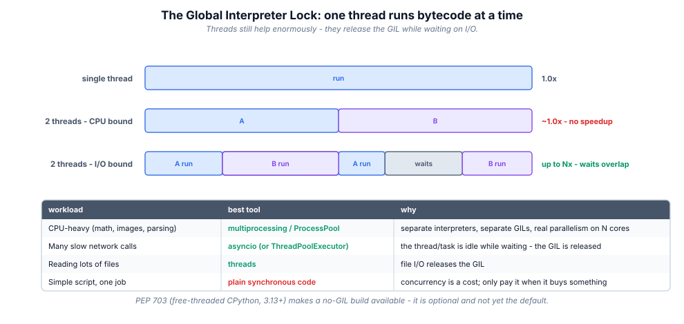
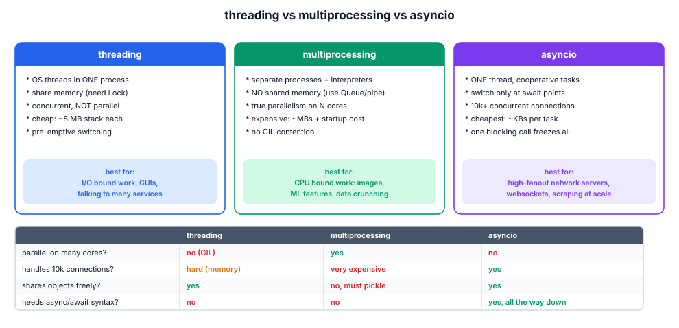
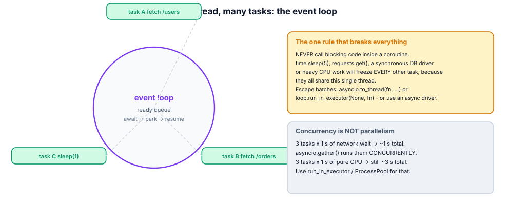

# 16. Concurrency

> Concurrency is *dealing with* many things at once; parallelism is *doing*
> many things at once. Python gives you three models, and choosing between
> them is a two-question decision: is the work CPU-bound or I/O-bound, and how
> much state must be shared?

## 16.1 Definition

**Plain version.** Running several tasks "at the same time": threads for
waiting, processes for computing, asyncio for thousands of network calls.

**Precise version.** CPython executes bytecode under a **Global Interpreter
Lock (GIL)**: one thread runs Python bytecode per interpreter at a time.
Threads therefore give **concurrency without parallelism** — but the GIL is
**released during I/O** and around C extensions that opt out, so threads shine
for I/O-bound work. **Processes** sidestep the GIL entirely (separate
interpreters, memory shared only by explicit IPC) and give true parallelism
for CPU-bound work. **asyncio** runs one thread with many *tasks* that
cooperatively yield at `await` points — the cheapest way to hold tens of
thousands of in-flight I/O operations.

## 16.2 Syntax

```python
# threads ---------------------------------------------------------------
import threading, queue
lock = threading.Lock()
with lock:                      # mutual exclusion
    shared.append(item)
q: queue.Queue = queue.Queue()  # thread-safe handoff
t = threading.Thread(target=worker, args=(q,), daemon=True)
t.start(); t.join()

# executors (preferred over raw threads) ----------------------------------
from concurrent.futures import ThreadPoolExecutor, ProcessPoolExecutor
with ThreadPoolExecutor(max_workers=8) as ex:
    results = list(ex.map(download, urls))        # order preserved
    fut = ex.submit(download, urls[0])            # or fire-and-track
    fut.result(timeout=10)

# processes ---------------------------------------------------------------
with ProcessPoolExecutor() as ex:
    squares = list(ex.map(crunch, chunks))        # real parallelism

# asyncio -------------------------------------------------------------------
import asyncio
async def fetch(session, url):
    async with session.get(url) as resp:          # awaits I/O, yields control
        return await resp.text()

async def main():
    async with aiohttp.ClientSession() as session:
        pages = await asyncio.gather(*(fetch(session, u) for u in urls))
asyncio.run(main())
```

## 16.3 First examples

**Example 1 — threads speed up waiting, not computing.**

```python
import time, urllib.request
urls = [...] * 20
t0 = time.perf_counter()
with ThreadPoolExecutor(10) as ex:
    list(ex.map(urllib.request.urlopen, urls))
print(time.perf_counter() - t0)      # ~slowest single request, not the sum
```

**Example 2 — a race condition, and the lock that fixes it.**

```python
total = 0
def bump():
    global total
    for _ in range(100_000):
        total += 1            # NOT atomic: read-modify-write

threads = [threading.Thread(target=bump) for _ in range(4)]
# without a lock: total ends up < 400000, nondeterministically
```

**Example 3 — asyncio: 100 "slow" calls in ~1 unit of time.**

```python
async def slow(i):
    await asyncio.sleep(1)          # yields; others run meanwhile
    return i

async def main():
    return await asyncio.gather(*(slow(i) for i in range(100)))
# asyncio.run(main())  ->  ~1 s total, not 100 s
```

## 16.4 The picture







## 16.5 Going deeper

### 16.5.1 The GIL, precisely

The GIL protects CPython's memory management (above all, reference counts)
from races. It is held while executing bytecode, released during blocking I/O
and by C extensions that declare it (NumPy releases it for heavy ops). A
thread is also pre-empted every `sys.getswitchinterval()` seconds (5 ms
default) so nobody starves. Consequences:

- two threads running pure Python on two cores do **not** finish sooner;
- threads waiting on sockets/files/locks cost almost nothing CPU-wise;
- C-extension numerics can parallelise *inside* one thread's call;
- free-threaded builds (PEP 703, Python 3.13+) exist as an *opt-in* no-GIL
  build — real parallelism for Python code, with a performance cost on
  single-threaded code and an ecosystem that is still migrating.

### 16.5.2 Sharing state between threads: the primitives

| Primitive | Purpose |
|-----------|---------|
| `Lock` | mutual exclusion (acquire once) |
| `RLock` | re-entrant (same thread may nest) |
| `Semaphore(n)` | limit concurrent access to n |
| `Event` | one broadcast flag (wait/set) |
| `Condition` | wait until a predicate, with notification |
| `queue.Queue` | **the** safe producer/consumer channel |
| `threading.local` | per-thread storage (request contexts) |
| `atomic-ish` types | `queue`, `deque.append` are thread-safe by implementation; `x += 1` is not |

Rules: keep the critical section tiny; always `with lock:`; establish a global
lock **ordering** to avoid deadlocks; prefer passing messages (`Queue`) over
sharing memory — "don't communicate by sharing memory; share memory by
communicating".

### 16.5.3 Processes: what crosses the boundary

Arguments and results are **pickled** across the process boundary, so lambdas
and local functions cannot be shipped (top-level functions only), and big
payloads cost serialization time. Start methods differ: `fork` (Unix default,
inherits memory, unsafe with threads), `spawn` (macOS/Windows default, clean,
slower), `forkserver`. For shared mutable state across processes use
`multiprocessing.Manager` (proxy objects, slower) or shared memory
(`Value`, `Array`, `shared_memory`) with explicit locks — or restructure so
each worker owns a shard and returns a reduction.

### 16.5.4 asyncio without mysticism

- a **coroutine** is a generator-like object created by calling an `async def`;
  nothing runs until it is *scheduled*;
- `await x` suspends the current task until `x` is ready and **returns control
  to the loop**; the loop then runs another ready task;
- `asyncio.gather(*cs)` runs concurrently and returns results in order;
  `as_completed` yields as they finish;
- `create_task(c)` schedules immediately (fire-and-track); keep a reference or
  it may be garbage-collected mid-flight;
- `TaskGroup` (3.11+) is structured concurrency: all-or-nothing with
  `ExceptionGroup` semantics and automatic cancellation of siblings;
- cancellation is cooperative: `await` points raise `CancelledError`; never
  swallow it — clean up and re-raise (or use `asyncio.shield` deliberately);
- timeouts: `asyncio.timeout(...)` / `wait_for(c, seconds)`;
- limiting fan-out: `asyncio.Semaphore(n)` around the await;
- **one blocking call freezes everything**: `time.sleep`, `requests.get`,
  synchronous DB drivers, CPU loops. Escape with
  `await asyncio.to_thread(blocking_fn, …)` or an executor, or use async
  drivers (httpx, aiohttp, asyncpg).

### 16.5.5 Scaling numbers worth remembering

| Model | Cost per unit of concurrency | Practical ceiling |
|-------|------------------------------|-------------------|
| thread | ~8 MB stack (tunable), context switch | ~10³–10⁴ |
| process | MBs + startup, pickling IPC | ~cores × few |
| asyncio task | ~KBs, no switch overhead | ~10⁵–10⁶ |

Hence: web servers with many idle connections → asyncio; CPU crunching →
processes; glue code calling blocking libs concurrently → thread pool.

### 16.5.6 Mixing models, correctly

Common production shapes: asyncio event loop + `to_thread` for the one legacy
blocking driver; a `ProcessPoolExecutor` *behind* `loop.run_in_executor` for
CPU-heavy steps inside an async service; worker queues (Celery, arq, Dramatiq)
when jobs outlive the request and need retries/durability. Keep one model per
layer; crossing models is where bugs breed.

## 16.6 Industry level

### The decision procedure teams actually use

1. **Is there parallelisable CPU work?** → processes / vectorised NumPy /
   move it to C / cache it. Threads will not help.
2. **Is it many independent blocking calls to existing sync libs?** →
   `ThreadPoolExecutor` (or `asyncio.to_thread` inside an async app).
3. **Is it a high-fanout network service you control end-to-end?** → asyncio
   with async drivers, semaphore-limited fan-out, timeouts on every await.
4. **Is it long-running, retryable background work?** → a task queue with
   workers (durability, visibility, retries), not threads in the web process.
5. **Otherwise** → stay synchronous. Concurrency is a cost; pay it only when
   latency or throughput demands it.

### Hygiene that prevents incidents

- **timeouts everywhere**: every network await/call gets one; unbounded waits
  are how thread pools exhaust and requests pile up;
- **bounded queues**: an unbounded `Queue` under load is an OOM; use
  `maxsize` and let producers feel backpressure;
- **graceful shutdown**: `executor.shutdown(wait=True)`, drain queues, cancel
  tasks in `finally`, handle SIGTERM in services;
- **idempotency keys** on retried side effects;
- **name your threads/tasks** (`Thread(name=…)`, `Task(..., name=…)`) so
  dumps and logs are readable;
- **no shared mutable state by default**; message-passing first;
- **test with injected executors/clocks**, and use
  `threading.Barrier`/`asyncio.Event` to force interleavings deterministically.

### Observing concurrency

`faulthandler.dump_traceback_later(30, exit=True)` catches deadlocks in CI;
`py-spy dump --pid …` shows every thread's stack of a live process; asyncio
debug mode (`PYTHONASYNCCIODEBUG=1`, `loop.set_debug(True)`) reports slow
callbacks and un-awaited coroutines. Know these before you need them at 3 a.m.

## 16.7 Comparison tables

**Model chooser (see also figure):**

| Workload | Model | Why |
|----------|-------|-----|
| call 50 HTTP APIs with `requests` | ThreadPoolExecutor | blocking lib, I/O-bound |
| same, with httpx.AsyncClient | asyncio | one thread, 50 in-flight |
| resize 10 000 images | ProcessPoolExecutor / NumPy | CPU-bound, parallel cores |
| websocket server, 20k clients | asyncio | cheap tasks, mostly idle |
| nightly batch ETL | processes or a queue | throughput + isolation |
| GUI staying responsive | threads or async main loop | I/O off the UI thread |

**Synchronisation chooser:**

| Need | Use |
|------|-----|
| protect a critical section | `with lock:` |
| producer → consumer | `queue.Queue` / `asyncio.Queue` |
| limit concurrency to n | `Semaphore(n)` / executor max_workers |
| signal "ready" across threads | `Event` |
| wait for a condition | `Condition` |
| per-thread context | `threading.local()` / `contextvars` (async-safe) |
| run-once initialisation | `Lock` + flag, or module import |

## 16.8 Mistakes & gotchas

::: gotcha "`total += 1` in threads"
Read-modify-write is not atomic; you will lose updates nondeterministically.
Lock it, or use a Queue/Counter per thread and merge.
:::

::: gotcha "Daemon threads and abrupt exit"
`daemon=True` threads are killed without cleanup when main exits — fine for
logging, fatal for flushes. Join or use executor shutdown.
:::

::: gotcha "Deadlock by lock ordering"
Thread 1 holds A waits B; thread 2 holds B waits A. Acquire in one global
order, or use one coarse lock, or message-pass.
:::

::: gotcha "`time.sleep` inside a coroutine"
Blocks the whole loop. `await asyncio.sleep(...)`. Same for any blocking call.
:::

::: gotcha "Calling a coroutine without awaiting"
`fetch(url)` alone creates a coroutine and warns "never awaited". You need
`await`, `create_task`, or `gather`.
:::

::: gotcha "Pickling failures with ProcessPool"
Lambdas, local functions and open files cannot cross the boundary. Define
workers at module top level.
:::

::: warn "Threads for CPU-bound hope"
Adding threads to a pure-Python computation adds overhead, not speed. Measure
first (module 17), then parallelise with processes.
:::

## 16.9 Interview questions

1. **What is the GIL and what does it imply?** — one bytecode-executing thread
   per interpreter; CPU-bound threads don't parallelise; I/O-bound do.
2. **Threads vs processes vs asyncio?** — shared-memory waiting / isolated
   computing / single-thread cooperative tasks.
3. **How do you protect shared state?** — locks around minimal critical
   sections, or message passing via queues.
4. **What freezes an event loop?** — any blocking call; fix with async drivers
   or `to_thread`.
5. **`gather` vs `as_completed`?** — all results in order vs results as they
   arrive.
6. **How does cancellation work in asyncio?** — `CancelledError` at await
   points; cooperative, must be propagated or handled deliberately.
7. **When is a thread pool the right answer?** — wrapping blocking,
   non-async-aware libraries with moderate concurrency.
8. **Why can't you pickle a lambda for ProcessPool?** — pickling is by
   reference (module + qualname); locals/lambdas have none.

## 16.10 Practice exercises

All exercises take injectable clocks/fetchers so the tests never sleep in real
time.

[[exercise tier="Beginner" id="ex-16-a" file="exercises/16_concurrency/test_tasks.py"]]
Implement `parallel_map(fn, items, workers=4)` with a ThreadPoolExecutor
preserving input order; `safe_counter(n_threads, per_thread)` returning the
final count using a Lock (must equal n*per exactly); and
`chunk_sums(numbers, procs=2)` using ProcessPoolExecutor over a top-level
worker.
[[/exercise]]

[[exercise tier="Intermediate" id="ex-16-b" file="exercises/16_concurrency/test_tasks.py"]]
Implement a thread-safe `TokenBucket(rate, capacity, clock=time.monotonic)`
with `acquire(n=1) -> bool` (non-blocking); a producer/consumer
`run_pipeline(items, worker, n_workers)` using `queue.Queue` returning results
in input order; and `async fetch_all(fetcher, urls, limit)` limiting
concurrency with `asyncio.Semaphore` (fetcher is an async callable injected by
the test).
[[/exercise]]

[[exercise tier="Industry" id="ex-16-c" file="exercises/16_concurrency/test_tasks.py"]]
Implement `async run_jobs(jobs, *, timeout, max_concurrent)` using a
TaskGroup-free structured approach: each job (zero-arg coroutine factory) gets
a timeout; results and exceptions are collected per index (cancelled/failed →
`JobError` in the report, never crashing siblings); plus a `WorkerPool`
context manager over threads with `submit(fn, *a)` and `shutdown(drain=True)`
guaranteeing submitted work finishes (or is reported) and no thread leaks.
[[/exercise]]

[[solution]]
```python
# Reference core (full: exercises/16_concurrency/solution.py)
async def run_jobs(jobs, *, timeout, max_concurrent):
    sem = asyncio.Semaphore(max_concurrent)
    results = [None] * len(jobs)

    async def one(i, factory):
        async with sem:
            try:
                async with asyncio.timeout(timeout):
                    results[i] = ("ok", await factory())
            except asyncio.TimeoutError as exc:
                results[i] = ("error", JobError(f"job {i} timed out"))
            except Exception as exc:
                results[i] = ("error", JobError(f"job {i} failed: {exc}"))

    await asyncio.gather(*(one(i, f) for i, f in enumerate(jobs)))
    return results
```
[[/solution]]

## 16.11 Cheatsheet

| Need | Use |
|------|-----|
| Wrap blocking lib concurrently | `ThreadPoolExecutor(max_workers=n)` |
| CPU-bound parallelism | `ProcessPoolExecutor` / NumPy / shard & reduce |
| Many network calls, async drivers | `asyncio.gather` + `Semaphore` |
| Run sync code inside async | `await asyncio.to_thread(fn, …)` |
| Safe handoff between threads | `queue.Queue(maxsize=…)` |
| Critical section | `with lock:` (tiny!) |
| Limit concurrency | `Semaphore(n)` / pool size |
| Timeouts | `fut.result(timeout=…)`, `asyncio.timeout(…)` |
| Structured async | `async with asyncio.TaskGroup() as tg: tg.create_task(…)` |
| Background durable jobs | task queue (Celery/arq) + workers |
| Debug a hung process | `py-spy dump`, `faulthandler` |
| Async debug | `PYTHONASYNCCIODEBUG=1` |
| Decide the model | CPU-bound? share state? fan-out size? (figure §16.4) |
