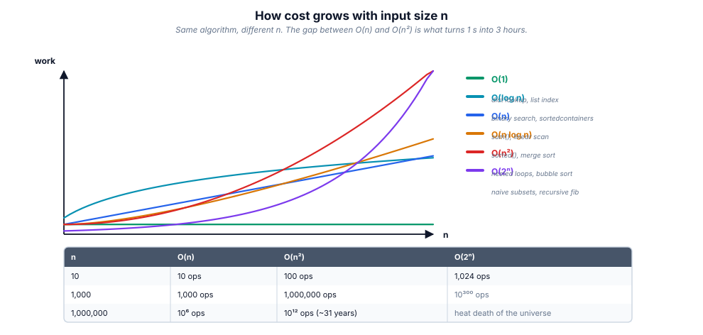
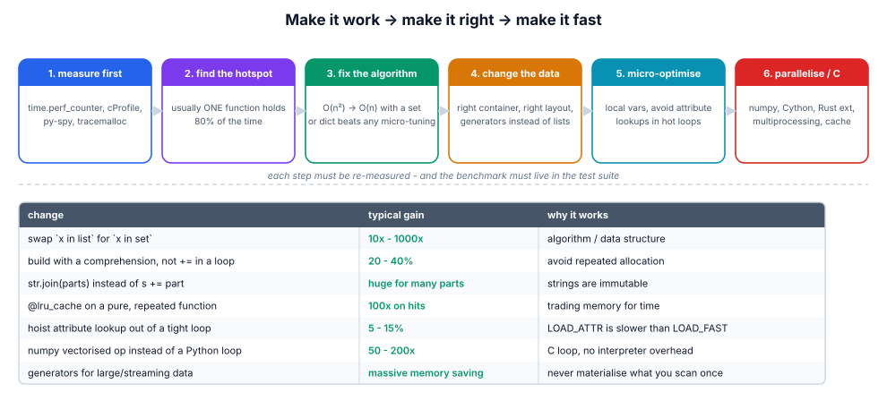
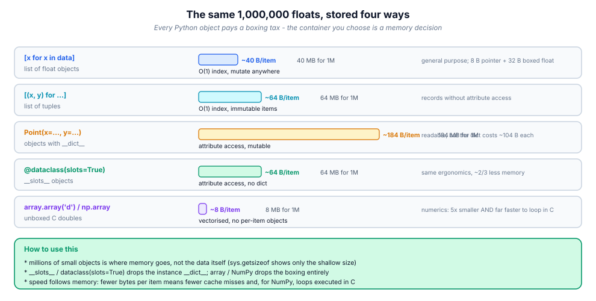

# 17. Performance & profiling

> Rule zero: **measure**. Rule one: fix the algorithm before the constant
> factor. Rule two: an optimisation you cannot show a before/after number for
> is a rumour.

## 17.1 Definition

**Plain version.** Making code fast and light — but only the parts that are
actually slow, and only after proving it.

**Precise version.** Performance work has three layers:
1. **complexity** — how cost grows with input size (big-O): the only layer
   that changes the *shape* of the problem;
2. **constant factors** — CPython-level costs (lookups, allocation, bytecode)
   that give 1.5–10× on the same complexity;
3. **architecture** — caching, batching, indexing, parallelism: removing work
   entirely.

Profiling is the measurement discipline: `time.perf_counter` / `timeit` for
micro-benchmarks, `cProfile`/`py-spy` for "where does the time go",
`tracemalloc` for "where does the memory go".

## 17.2 Syntax

```python
import time, timeit, cProfile, pstats, tracemalloc, functools, sys

t0 = time.perf_counter(); work(); dt = time.perf_counter() - t0   # wall clock

timeit.timeit("f(x)", setup="from mod import f; x = data",
              number=1000, globals=globals())                      # micro-bench
timeit.repeat(..., repeat=5, number=100)                           # take min

cProfile.run("main()", "out.prof")                                 # whole run
python -m cProfile -s cumtime script.py                            # CLI, sorted
python -m pstats out.prof                                          # browse

tracemalloc.start()
work()
snapshot = tracemalloc.take_snapshot()
for stat in snapshot.statistics("lineno")[:10]:
    print(stat)                                                    # top allocators

sys.getsizeof(obj)                                                 # bytes (shallow)

@functools.lru_cache(maxsize=1024)          # or @functools.cache (unbounded)
def expensive(arg): ...
expensive.cache_info()                      # hits/misses/size
expensive.cache_clear()
```

## 17.3 First examples

**Example 1 — the O(n²) → O(n) win (1000× on 100k items).**

```python
def has_duplicates_slow(items):            # O(n²): `in` scans the list
    return any(x in items[:i] for i, x in enumerate(items))

def has_duplicates_fast(items):            # O(n): set membership is O(1)
    seen = set()
    for x in items:
        if x in seen:
            return True
        seen.add(x)
    return False
```

**Example 2 — strings: join beats `+=`.**

```python
slow = ""
for part in parts: slow += part            # O(n²): new string each time
fast = "".join(parts)                       # O(n): one allocation
```

**Example 3 — caching a pure function.**

```python
@functools.lru_cache(maxsize=None)
def fib(n: int) -> int:
    return n if n < 2 else fib(n - 1) + fib(n - 2)
# fib(35): 2.6 s -> 0.00002 s
```

## 17.4 The picture







## 17.5 Going deeper

### 17.5.1 Complexity decides everything else

| Growth | Name | 10⁶ items ≈ | Typical source |
|--------|------|-------------|----------------|
| O(1) | constant | instant | dict/set lookup, index |
| O(log n) | logarithmic | ~20 steps | bisect, balanced tree |
| O(n) | linear | ~0.05 s | one pass, Counter |
| O(n log n) | linearithmic | ~1 s | `sorted`, merge sort |
| O(n²) | quadratic | **11 days** | nested loops, `x in list` in a loop |
| O(2ⁿ) | exponential | forever | naive recursion without memo |

Read the table bottom-up when debugging: the jump from quadratic to linear is
worth more than any micro-trick. Standard fixes: `list` membership → `set`;
repeated lookups in a nested loop → precompute a `dict` index; repeated
recomputation → memoise; repeated scans for min/max/top-k → `heapq`
(O(n log k)); repeated re-sorting → sort once, `bisect` after.

### 17.5.2 Reading a profile without fooling yourself

`cProfile` reports two columns that answer different questions:

- **tottime**: time *in* the function, excluding callees → who burns CPU;
- **cumtime**: including callees → which call path is expensive end-to-end.

Sort by `tottime` to find the hot function, by `cumtime` to find the hot path.
Remember the profiler's bias: it adds per-call overhead, so it exaggerates
tiny frequently-called functions — and it does **not** show wall-clock waiting
(I/O) clearly. For production-shaped truth use a **sampling profiler**:

```bash
py-spy top --pid 1234          # live, no code changes, no restart
py-spy record -o flame.svg --pid 1234      # flamegraph for the PR
```

Sampling is safe on a live process; `cProfile` is for your laptop.

### 17.5.3 CPython constant factors worth knowing

| Cost | Relative note |
|------|---------------|
| local variable lookup | fastest (array index) |
| global / builtin lookup | dict lookup each access — hoist into locals |
| attribute lookup (`obj.attr`) | dict lookup + descriptor; bind once outside loops |
| function call | ~50–100 ns; a tight loop of tiny calls is slower than inlined code |
| `list.append` in loop | amortised O(1); prefer comprehension (no per-iteration lookup) |
| `str +=` in loop | O(n²); use `"".join` or `io.StringIO` |
| `x in list` | O(n); `x in set/dict` O(1) |
| tuple vs list | tuple smaller/faster to build; list needed for mutation |
| `sorted(key=f)` | calls `f` once per item (Schwartzian transform) — good |
| generator expression | saves memory, not CPU; `sum(x*x for x in …)` avoids the list |

Hoisting pattern in a hot loop:

```python
append = result.append          # bind the method ONCE
upper = str.upper
for item in items:
    append(upper(item))
```

### 17.5.4 Memory: where the bytes go

Every Python object carries overhead (~56 bytes for an empty object, ~184 for
an empty dict in CPython 3.11). Millions of small objects is where memory goes
— not the data itself. Levers:

- `__slots__` on hot classes: instance `__dict__` (≈104 bytes) → fixed slots
  (≈48 bytes total for a small object); also faster attribute access;
- tuples/`namedtuple`/`dataclass(slots=True)` instead of dicts per record;
- `array.array` / NumPy for numeric columns: 8 bytes per float vs ~32 for a
  boxed float in a list;
- generators/`itertools.islice` to stream instead of materialising;
- intern short strings implicitly (CPython does for identifiers) and reuse
  constants;
- watch for accidental retention: module-level caches, closures over big
  objects, tracebacks holding frames (a classic leak), `lru_cache` on methods
  keeping `self` alive forever.

Diagnose with `tracemalloc` snapshots diffed between two points, or
`objgraph`/`gc.get_referrers` for "who still holds this".

### 17.5.5 Caching: the three levels

| Level | Scope | Tool | Failure mode |
|-------|-------|------|--------------|
| in-process | one worker | `functools.cache`, dict, `cachetools.TTLCache` | stale across restarts, memory growth |
| shared | all workers | Redis/Memcached | network hop, serialization, stampede |
| edge/client | browser/CDN | HTTP `ETag`, `Cache-Control` | invalidation complexity |

`lru_cache` rules: arguments must be **hashable**; `maxsize=None` = unbounded
(use `cache` deliberately, with a bound on the key space); on **methods** it
caches `self` → leaks and couples instances (use `cached_property` for
per-instance values, or cache a module-level function); check `cache_info()`
hit rate before trusting it; invalidate explicitly when inputs change.

### 17.5.6 The real-world hot spots (in order of typical payoff)

1. **database**: missing index, `SELECT *`, N+1 queries (one query per row →
   batch/`JOIN`/`select_related`), unbounded result sets → paginate/stream;
2. **network fan-out**: serial calls → concurrent (module 16), plus
   connection pooling and keep-alive;
3. **serialization**: JSON of huge payloads → field selection, compression,
   binary formats;
4. **algorithms**: quadratic membership, repeated re-computation;
5. **CPython micro-costs**: only after 1–4, and only in genuinely hot loops.

### 17.5.7 Benchmarking discipline

`timeit` handles the traps for you: it disables GC, repeats, and reports the
best of N (min, not mean — noise only ever adds time). Always put imports and
data construction in `setup`, and pass the namespace via `globals=`:

```python
timeit.repeat("has_duplicates_fast(data)",
              setup="data = list(range(100_000))",
              globals=globals(), number=10, repeat=5)
```

For anything beyond one-liners use **pytest-benchmark** (statistics,
comparison, CI history) or **hyperfine** for CLI timings, and keep a small
`benchmarks/` suite so regressions show up in review, not in production.

## 17.6 Industry level

### Latency is a distribution, not a number

Report **p50/p95/p99** (and max): an "average 40 ms" endpoint with a p99 of
4 s is broken for one user in a hundred. Track percentiles per endpoint, per
dependency, and in your load tests. Tail latency usually comes from GC pauses,
cache misses, cold connections, lock contention and noisy neighbours — each
with a different fix.

### Performance budgets in CI

```toml
# pyproject.toml
[tool.pytest.ini_options]
markers = ["bench: performance benchmarks"]
```

Run a benchmark job on PRs that compares against the baseline branch and fails
on a regression beyond, say, 10 %. Combine with: a smoke-profile of the hot
path (`py-spy record` on a staging run), memory ceiling assertions for the
batch jobs, and a load test (locust/k6) before releases. A budget you do not
enforce is a wish.

### The optimisation review checklist

- Is the algorithm the right complexity for the *expected* input size?
- Are there repeated computations that could be hoisted or cached?
- Any N+1 or serial I/O that could be batched/concurrent?
- Does it allocate per iteration what could be allocated once?
- Is memory bounded (streaming/generators, `maxsize` on caches)?
- Is there a benchmark proving the win, and a comment stating the intent?

### When Python itself is the bottleneck

Order of escalation: better algorithm → cache/batch → NumPy/vectorised C
extensions → move the hot function to a compiled extension (Cython, mypyc,
Rust via PyO3) → different runtime (PyPy) → different service (Go/Rust for
that component) → more machines. Most teams never need step 4; almost all need
steps 1–3.

## 17.7 Comparison tables

**Technique payoff:**

| Technique | Typical gain | Risk |
|-----------|--------------|------|
| fix quadratic algorithm | 10–10 000× | none |
| batch DB/network calls | 5–100× | more code, partial-failure handling |
| cache pure results | 10–1000× | staleness, memory |
| `set`/`dict` for lookups | 10–1000× | hashing cost for big keys |
| comprehension + hoisting | 1.2–3× | readability if overdone |
| `__slots__` | memory −50 %, access +20 % | no dynamic attrs |
| NumPy vectorisation | 10–100× | dependency, dtype care |
| multiprocessing (CPU) | ≈ #cores | pickling, complexity |
| asyncio (I/O fan-out) | ≈ fan-out | async discipline everywhere |

**Tool chooser:**

| Question | Tool |
|----------|------|
| how long does this snippet take? | `timeit.repeat` / pytest-benchmark |
| which function burns CPU? | `cProfile` (tottime) |
| which path is slow end-to-end? | `cProfile` (cumtime) / tracing |
| what is the live process doing? | `py-spy top` / `py-spy record` (flamegraph) |
| where does memory go? | `tracemalloc` snapshot diff |
| how big is this object? | `sys.getsizeof`, `pympler.asizeof` (deep) |
| is it a DB problem? | query logs / `EXPLAIN ANALYZE` |

## 17.8 Mistakes & gotchas

::: gotcha "Optimising the wrong thing"
Profile first. The function that *looks* slow is rarely the one that is.
:::

::: gotcha "Wall-clock timing of tiny code"
`time.time()` around one call measures noise (and GC). Use `timeit` with
`repeat` and take the min.
:::

::: gotcha "`lru_cache` on a method"
`self` becomes part of the key: instances are retained forever and per-instance
state is shared through the cache. Use `cached_property` or a module function.
:::

::: gotcha "Unbounded caches"
`functools.cache` on user-supplied keys is a memory leak and a DoS vector.
Bound `maxsize`, or use a TTL/LRU cache with a ceiling.
:::

::: gotcha "Generators are not automatically faster"
They save memory and startup latency; per-item CPU cost is similar or higher.
:::

::: gotcha "`in` on the wrong container"
`x in big_list` inside a loop is the most common accidental quadratic in
Python code review.
:::

::: warn "Averages hide tails"
Never ship on mean latency. p95/p99 is what users feel.
:::

## 17.9 Interview questions

1. **How do you find why something is slow?** — profile (`cProfile`/py-spy),
   look at tottime vs cumtime, confirm the input size, then fix complexity.
2. **`list` vs `set` membership?** — O(n) vs O(1) average (hashing).
3. **Why is `"".join` faster than `+=`?** — strings are immutable; `+=`
   reallocates per step → quadratic.
4. **tottime vs cumtime?** — excluding vs including callees.
5. **When do you use `__slots__`?** — many small long-lived instances; saves
   the instance dict, blocks dynamic attributes.
6. **Risks of `lru_cache`?** — hashability, unbounded growth, method/`self`
   retention, staleness for impure functions.
7. **How would you make an API 10× faster?** — measure, then: index/batch the
   DB, cache, concurrency for fan-out, only then micro-optimise.
8. **What is a performance budget?** — an enforced ceiling (latency percentile,
   memory, benchmark delta) checked in CI.

## 17.10 Practice exercises

[[exercise tier="Beginner" id="ex-17-a" file="exercises/17_performance/test_tasks.py"]]
Implement `find_duplicates(items)` (one pass, order of first repeat),
`frequent(words, k)` with `collections.Counter`, `join_lines(lines)` using
`"".join`, and `flatten(pairs)` with a comprehension. The grader asserts
correct results **and** that the implementations scale linearly by timing them
against a 200 000-item input.
[[/exercise]]

[[exercise tier="Intermediate" id="ex-17-b" file="exercises/17_performance/test_tasks.py"]]
Implement `moving_average(values, window)` in O(n) using a `deque` running sum;
`top_k(numbers, k)` with `heapq.nlargest`; a manual `LRUCache(capacity)` with
`get/put/__len__` and correct eviction order (touch on hit); and `chunked(it,
n)` as a lazy generator that never materialises the input.
[[/exercise]]

[[exercise tier="Industry" id="ex-17-c" file="exercises/17_performance/test_tasks.py"]]
Implement `memoized(fn)` (your own LRU-with-stats wrapper: `.cache_info()`
reporting hits/misses/size, `.cache_clear()`, thread-safe with a `Lock`), and
`enrich_orders(orders, fetch_customers)` where `fetch_customers(ids: list) ->
dict` is an injected **batch** API — your code must call it at most once per
unique id group and produce enriched rows, proving the N+1 problem is gone (the
test counts calls).
[[/exercise]]

[[solution]]
```python
# Reference core (full: exercises/17_performance/solution.py)
def enrich_orders(orders, fetch_customers):
    ids = sorted({o["customer_id"] for o in orders})     # unique, one batch
    customers = fetch_customers(ids) if ids else {}
    return [{**o, "customer": customers.get(o["customer_id"])} for o in orders]
```
[[/solution]]

## 17.11 Cheatsheet

| Symptom | First move |
|---------|-----------|
| slow with big inputs, fine with small | complexity: find the nested scan / repeated work |
| slow everywhere, CPU pinned | `cProfile` tottime → hot function |
| slow in production only | `py-spy record` → flamegraph |
| memory grows over time | `tracemalloc` snapshot diff; check caches/closures/tracebacks |
| many small objects | `__slots__`, tuples, arrays/NumPy |
| repeated identical calls | `lru_cache` (bounded) |
| `str` building in a loop | `"".join` |
| membership tests | `set`/`dict` |
| top-k / streaming min-max | `heapq.nlargest` / `nlargest(k)` |
| N+1 queries | batch, join, prefetch |
| serial network calls | thread pool / asyncio (module 16) |
| need proof | `timeit.repeat`, pytest-benchmark, before/after in the PR |
