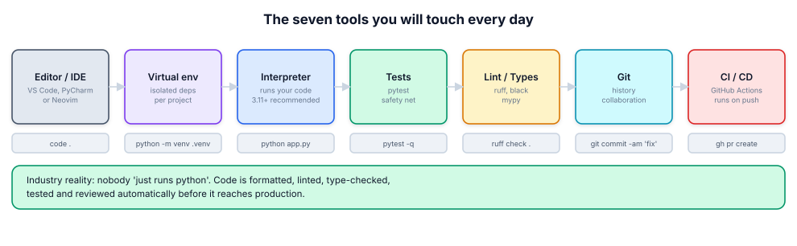
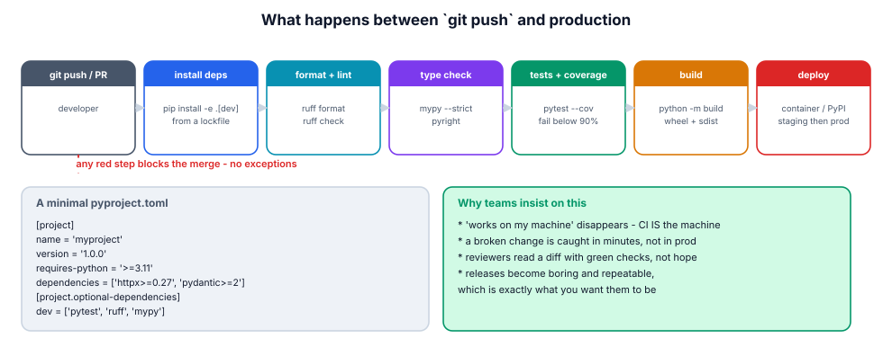
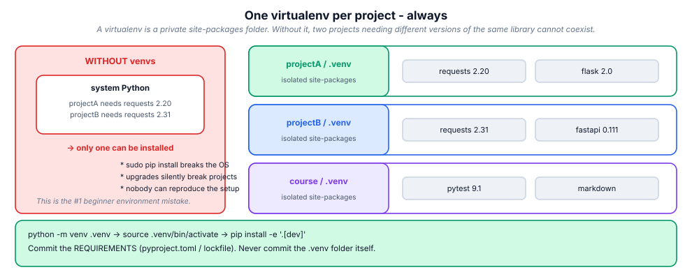
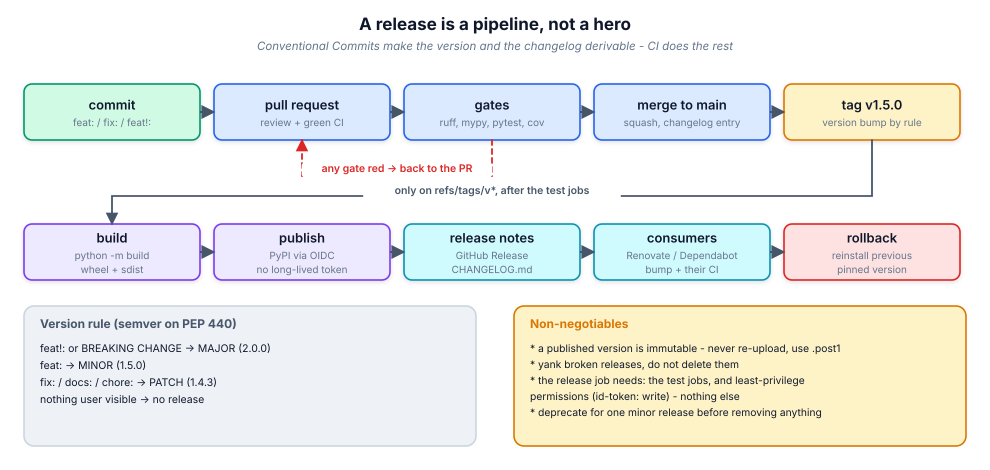

# 18. Packaging, environments & CI/CD

> Packaging is how your code becomes something other people (and future you)
> can install; CI is how you stop shipping broken things. Both are
> configuration you write once and profit from on every commit.

## 18.1 Definition

**Plain version.** `pyproject.toml` describes the project; a build backend
turns it into an installable file; CI runs your checks on every push.

**Precise version.** A **distribution** is an artifact: a *wheel* (`.whl`,
pre-built, "installed" by unpacking) or an *sdist* (`.tar.gz`, source, built on
the target). Metadata follows **PEP 621** (`[project]` table), the build
system is declared in `[build-system]`, and tools (pip, uv, poetry, hatch)
consume the same file. **Environments** (venv/conda) isolate dependencies per
project; **lockfiles** pin the full resolved graph for reproducibility; **CI**
(GitHub Actions et al.) executes lint → typecheck → test matrix → build →
publish, failing the pull request when any gate fails.

## 18.2 Syntax

```toml
# pyproject.toml -------------------------------------------------------
[build-system]
requires = ["hatchling"]
build-backend = "hatchling.build"

[project]
name = "acme-reports"
version = "1.4.2"                     # single source of truth
description = "Report generation for the ACME platform"
readme = "README.md"
requires-python = ">=3.11"
license = { text = "MIT" }
authors = [{ name = "ACME Eng", email = "eng@acme.dev" }]
keywords = ["reports", "etl"]
classifiers = ["Programming Language :: Python :: 3.11",
               "Typing :: Typed"]
dependencies = ["httpx>=0.27", "pydantic>=2.7", "rich>=13"]

[project.optional-dependencies]        # extras: pip install '.[dev]'
dev = ["pytest>=8", "pytest-cov", "ruff", "mypy"]
postgres = ["asyncpg>=0.29"]

[project.scripts]                      # console entry points
acme-report = "acme_reports.cli:main"

[project.urls]
Homepage = "https://github.com/acme/reports"
Changelog = "https://github.com/acme/reports/releases"

[tool.ruff]
line-length = 100
target-version = "py311"
[tool.ruff.lint]
select = ["E", "F", "I", "UP", "B", "SIM", "RUF"]

[tool.mypy]
strict = true
python_version = "3.11"

[tool.pytest.ini_options]
addopts = "-q --strict-markers"
testpaths = ["tests"]
```

```yaml
# .github/workflows/ci.yml ------------------------------------------------
name: CI
on: [push, pull_request]
jobs:
  quality:
    runs-on: ubuntu-latest
    steps:
      - uses: actions/checkout@v4
      - uses: actions/setup-python@v5
        with: { python-version: "3.12", cache: pip }
      - run: pip install -e '.[dev]'
      - run: ruff check . && ruff format --check .
      - run: mypy src/
      - run: pytest --cov=src --cov-fail-under=90
  matrix:
    runs-on: ubuntu-latest
    strategy:
      matrix: { python-version: ["3.11", "3.12", "3.13"] }
    steps:
      - uses: actions/checkout@v4
      - uses: actions/setup-python@v5
        with: { python-version: "${{ matrix.python-version }}" }
      - run: pip install -e '.[dev]' && pytest
```

```bash
python -m venv .venv && source .venv/bin/activate
pip install -e '.[dev]'          # editable install of your own project
python -m build                  # -> dist/*.whl and dist/*.tar.gz
twine check dist/* && twine upload dist/*
uv sync                          # or: pip install -r requirements.lock
```

## 18.3 First examples

**Example 1 — the smallest package that installs.**

```text
reports/
    pyproject.toml
    src/
        acme_reports/
            __init__.py          # __version__ optional
            cli.py               # def main() -> None
```

`pip install -e .` → `import acme_reports` works *and* the `acme-report`
command is on your PATH.

**Example 2 — read your own metadata at runtime (no duplication).**

```python
from importlib.metadata import version
__version__ = version("acme-reports")     # comes from pyproject/installed dist
```

**Example 3 — what a wheel filename tells you.**

```text
acme_reports-1.4.2-py3-none-any.whl
   name     ver   py  abi platform      -> pure Python, any OS
numpy-2.1.0-cp312-cp312-manylinux_2_17_x86_64.whl
                      -> compiled for CPython 3.12 on Linux x86-64
```

## 18.4 The picture



![Anatomy of pyproject.toml: build-system, project, optional-dependencies, scripts and the [tool.*] sections.](figures/pyproject-anatomy.svg)





## 18.5 Going deeper

### 18.5.1 Build backends: who actually makes the wheel

`[build-system].build-backend` is a pluggable API (PEP 517/518): **hatchling**
(modern default, simple), **setuptools** (legacy, most flexible for exotic
layouts/C extensions), **poetry-core**, **flit-core** (minimal), **pdm-backend**,
**maturin** (Rust extensions), **scikit-build-core** (CMake/C++). `python -m
build` creates an isolated env, installs `requires`, calls the backend and
writes `dist/`. You almost never need to know more than: keep the backend
boring, keep the layout standard.

### 18.5.2 Layouts: `src/` vs flat

| | `src/` layout | flat layout |
|---|---------------|-------------|
| Import without installing | impossible (good!) | works from repo root (masks packaging bugs) |
| Tests exercise | the *installed* package | possibly the local dir |
| Tooling friction | slightly more setup | none |
| Recommended | **yes**, for anything published | fine for scripts/apps |

The `src/` layout's whole point: it forces `pip install -e .` so your tests
prove the package metadata (package discovery, entry points, data files) is
correct — the classic "works on my machine, `ModuleNotFoundError` on PyPI" bug
disappears.

### 18.5.3 Versions: PEP 440 and semver

`MAJOR.MINOR.PATCH` (semver) mapped onto PEP 440 grammar:

| Form | Meaning |
|------|---------|
| `1.4.2` | release |
| `1.5.0rc1`, `1.5.0b2`, `1.5.0a1` | release candidate / beta / alpha |
| `1.5.0.post1` | post-release (metadata/packaging fix) |
| `1.5.0.dev3` | development snapshot |
| `2024.9.1` | CalVer (allowed; used by e.g. certifi, black) |

Rules teams adopt: breaking API change → MAJOR; backwards-compatible feature →
MINOR; fix → PATCH; never reuse a version on PyPI (immutable); **yank** (not
delete) broken releases. Single source of truth: the `[project].version` field
(or `dynamic = ["version"]` + backend hook reading VCS tags), read at runtime
with `importlib.metadata.version(...)`.

### 18.5.4 Dependencies: ranges, extras, locks

- **Libraries** declare *ranges* (`httpx>=0.27,<1`) — you must not pin the
  world for your consumers;
- **Applications** pin *exactly* with a lockfile (`requirements.lock`,
  `uv.lock`, `poetry.lock`) including hashes — reproducibility is the point;
- **extras** (`[project.optional-dependencies]`) group optional deps:
  `pip install 'acme-reports[postgres,dev]'`;
- **dependency groups** (PEP 735, `[dependency-groups]`) are for dev-only
  tooling that should not be publishable metadata;
- generate locks with `pip-compile` (pip-tools) or `uv lock`; regenerate on
  dependency bumps, review the diff like code.

### 18.5.5 Publishing without leaking tokens

Modern PyPI supports **trusted publishing** (OIDC): you configure the PyPI
project to trust your GitHub repo/workflow, and CI gets a short-lived token —
no long-lived secret to rotate or leak.

```yaml
  publish:
    if: startsWith(github.ref, 'refs/tags/v')
    needs: [quality, matrix]
    permissions: { id-token: write }        # OIDC
    steps:
      - uses: actions/checkout@v4
      - run: pipx run build
      - uses: pypa/gh-action-pypi-publish@release/v1
```

For private packages: an internal index (Artifactory, devpi, CodeArtifact) plus
`--index-url`, or a git+ssh dependency for internal-only libs.

### 18.5.6 CI pipeline anatomy (and keeping it fast)

Stages: **checkout → setup (cached) → install → lint/format → types → tests →
coverage gate → build → (on tag) publish → deploy**. Speed levers: cache pip/uv
and the pre-commit environment; run lint/types in a job parallel to tests;
shard the test suite (`pytest -n auto`, or split by directory); run the
cross-version matrix only on `main`/PRs, not every push; reuse a built wheel as
the deploy artifact instead of rebuilding.

### 18.5.7 The gates worth enforcing

| Gate | Tool | Fails when |
|------|------|-----------|
| format | `ruff format --check` | files not formatted |
| lint | `ruff check` | style/bug patterns, unsorted imports |
| types | `mypy --strict src/` | annotation errors |
| tests | `pytest` | behaviour regressions |
| coverage floor | `--cov-fail-under=90` | untested new code |
| security | `pip-audit`, `bandit`, Dependabot/Renovate | vulnerable deps |
| license | `pip-licenses --fail-on="GPL-3.0"` | license incompatibility |
| packaging | `twine check dist/*`, `python -m build` | broken metadata/README |
| perf budget | pytest-benchmark vs baseline | >10 % regression |

`pre-commit` runs a subset locally (format, lint, quick checks) so CI failures
become rare rather than routine.

### 18.5.8 Shipping applications (not libraries)

Applications need a runtime environment, not a PyPI page: pin a lockfile, build
a **multi-stage Docker image** (builder stage installs deps into a venv; final
stage copies the venv + code onto a slim base), run as a non-root user, set
`PYTHONUNBUFFERED=1`, pin the base image digest, scan the image (Trivy), and
deploy the *same artifact* through dev → staging → prod with a rollback that is
just "deploy the previous tag".

```dockerfile
FROM python:3.12-slim AS build
RUN python -m venv /opt/venv
COPY pyproject.toml uv.lock ./
RUN /opt/venv/bin/pip install --no-cache-dir -r <(uv export --no-dev)
FROM python:3.12-slim
COPY --from=build /opt/venv /opt/venv
COPY src/ /app/src/
ENV PATH="/opt/venv/bin:$PATH" PYTHONUNBUFFERED=1
USER 10001
CMD ["acme-report", "serve"]
```

## 18.6 Industry level



### Release flow that scales past one developer

1. PR → CI gates (lint/types/tests/coverage) green → review → squash-merge to
   `main`;
2. commits follow **Conventional Commits** (`feat:`, `fix:`, `feat!:`/
   `BREAKING CHANGE:`) so the changelog and next version are derivable;
3. release job (manual or automated: semantic-release/Release Drafter) bumps
   the version, writes `CHANGELOG.md`, tags `v1.5.0`, builds and publishes the
   wheel, creates the GitHub Release with notes;
4. tag → publish job with OIDC; artifacts are retained and checksummed;
5. downstream apps bump the dependency via Renovate/Dependabot PR → their CI
   proves compatibility;
6. rollback = reinstall the previous pinned version. No heroics.

### Things seniors check in a packaging PR

- is `requires-python` honest, and does the CI matrix cover it?
- are dependency ranges neither pinned-to-death nor open-ended (`>=` without
  an upper bound invites breakage; too tight breaks consumers)?
- does the package include the data files it needs (`[tool.hatch.build]` /
  `package-data`), and is nothing unintended included (`.env`, tests, caches)?
- is the version single-sourced (no three places to edit)?
- does the README render on PyPI (`twine check`)?
- is the release job protected by `if: startsWith(github.ref,'refs/tags/v')`
  and `needs:` the test jobs?
- are secrets OIDC/short-lived, with least-privilege `permissions:`?

### Deprecation policy (libraries people depend on)

Announce in the changelog → warn with `DeprecationWarning` for at least one
minor release → remove in the next major. Keep type hints and tests for the
deprecated path until it is gone; never remove silently.

## 18.7 Comparison tables

**Tool chooser:**

| Task | Modern pick | Legacy equivalent |
|------|-------------|-------------------|
| metadata/build config | `pyproject.toml` | `setup.py` + `setup.cfg` |
| build backend | hatchling / setuptools | distutils (removed) |
| env creation | `uv venv`, `python -m venv` | virtualenv |
| install/resolve | `uv`, `pip` | easy_install |
| lockfile | `uv.lock`, `pip-compile` | hand-maintained requirements.txt |
| lint + format | `ruff` | flake8 + isort + black |
| types | `mypy` / `pyright` | — |
| test runner | `pytest` | unittest |
| publish | `python -m build` + OIDC action | `python setup.py sdist upload` |
| task runner | `nox` / `tox` / `Makefile` | shell scripts |

**Wheel vs sdist:**

| | wheel `.whl` | sdist `.tar.gz` |
|---|--------------|-----------------|
| contents | built, ready to unpack | source tree |
| install speed | fast, no build step | may compile |
| code execution on install | none | `setup.py` runs |
| platform-specific | yes (tags in filename) | usually no |
| publish both? | **yes** | yes (fallback) |

## 18.8 Mistakes & gotchas

::: gotcha "setup.py-only projects"
Still works, but `pyproject.toml` is the standard and the only thing new
tooling reads first. Migrate; keep a `setup.py` shim only if a legacy build
needs it.
:::

::: gotcha "Version defined in three places"
`__init__.py`, `setup.py`, docs — they drift. Single-source it and read with
`importlib.metadata.version`.
:::

::: gotcha "Flat layout hiding a packaging bug"
Tests pass because the repo root is importable; the published package misses a
submodule. `src/` layout + `pip install -e .` prevents this.
:::

::: gotcha "Pinning everything in a library"
`dependencies = ["httpx==0.27.0"]` makes your library uninstallable next to
anything else. Ranges for libraries, locks for applications.
:::

::: gotcha "Committing `.venv/` or `dist/`"
Noise and stale artifacts. `.gitignore` them; let CI build.
:::

::: warn "Long-lived upload tokens"
A PyPI token in repo secrets is a supply-chain risk. Use trusted publishing
(OIDC) or scoped, rotating tokens.
:::

::: warn "Reusing a version number"
PyPI is immutable per filename; a re-upload silently fails or is rejected.
Bump, or `.post1` for metadata-only fixes.
:::

## 18.9 Interview questions

1. **What does `[build-system]` do?** — declares the backend and its build
   requirements (PEP 517/518) used by `python -m build`/pip.
2. **Wheel vs sdist?** — pre-built vs source; wheels install faster and don't
   execute code.
3. **Why `src/` layout?** — forces installation, so tests validate real
   packaging.
4. **Extras vs dependency groups?** — publishable optional features vs
   dev-only tooling.
5. **How do you make installs reproducible?** — lockfile with hashes;
   regenerate deliberately.
6. **How do you publish securely from CI?** — build on tag, OIDC trusted
   publishing, least-privilege permissions, `twine check`.
7. **Semver bump for a backwards-incompatible rename?** — MAJOR (plus a
   deprecation cycle first).
8. **What gates belong in CI?** — format, lint, types, tests, coverage floor,
   dependency audit, packaging check, perf budget.

## 18.10 Practice exercises

This pack makes you write the *tooling* around packaging: read a real
`pyproject.toml`, compute semver bumps from Conventional Commits, render a CI
workflow, build an sdist-style manifest, and resolve a dependency graph.

[[exercise tier="Beginner" id="ex-18-a" file="exercises/18_packaging/test_tasks.py"]]
Implement `parse_pyproject(text)` (with `tomllib`) returning
`{"name", "version", "requires_python", "dependencies", "extras", "scripts"}`
with `None`/`{}`/`[]` defaults; `bump(version, part)` for semver
(major/minor/patch, `ValueError` on junk); `is_newer(a, b)` comparing dotted
numeric versions.
[[/exercise]]

[[exercise tier="Intermediate" id="ex-18-b" file="exercises/18_packaging/test_tasks.py"]]
Implement `classify_commits(messages)` grouping Conventional Commits into
`feat/fix/docs/refactor/chore/other/breaking`; `next_version(current,
messages)` applying the semver rules (breaking → major, feat → minor, fix →
patch, nothing → `None`); and `render_workflow(name, py_versions, steps)`
emitting valid GitHub Actions YAML text with a matrix over `py_versions`.
[[/exercise]]

[[exercise tier="Industry" id="ex-18-c" file="exercises/18_packaging/test_tasks.py"]]
Implement `make_manifest(files, include, exclude)` (glob rules, deterministic
sorted output, exclusions win); `resolve_install_order(packages)` — Kahn
topological sort with alphabetical tie-break, raising `CyclicDependency`
(cycle members in the message) or `UnknownDependency`; `check_pins(
requirements, lock)` returning `{"ok", "mismatched", "missing", "unpinned"}`
for lockfile drift; and `release_plan(current, messages)` combining
classification, bump and changelog into one dict.
[[/exercise]]

[[solution]]
```python
# Reference core (full: exercises/18_packaging/solution.py)
def resolve_install_order(packages):
    indeg = {name: 0 for name in packages}
    for name, meta in packages.items():
        for dep in meta.get("requires", []):
            if dep not in indeg:
                raise UnknownDependency(dep)
            indeg[name] += 1
    ready = sorted(n for n, d in indeg.items() if d == 0)
    order = []
    while ready:
        node = ready.pop(0)
        order.append(node)
        for name, meta in packages.items():
            if node in meta.get("requires", []):
                indeg[name] -= 1
                if indeg[name] == 0:
                    ready.append(name)
        ready.sort()
    if len(order) != len(packages):
        raise CyclicDependency(sorted(n for n, d in indeg.items() if d))
    return order
```
[[/solution]]

## 18.11 Cheatsheet

| Task | Command / snippet |
|------|-------------------|
| create env | `python -m venv .venv` / `uv venv` |
| activate | `source .venv/bin/activate` (Win: `.venv\Scripts\activate`) |
| install project editable | `pip install -e '.[dev]'` |
| build artifacts | `python -m build` |
| check artifacts | `twine check dist/*` |
| publish | `twine upload dist/*` (or OIDC action) |
| lock deps | `uv lock` / `pip-compile pyproject.toml -o requirements.lock` |
| install from lock | `uv sync` / `pip install -r requirements.lock` |
| audit deps | `pip-audit`, `uv pip audit` |
| lint+format | `ruff check . && ruff format .` |
| types | `mypy src/` |
| tests + coverage | `pytest --cov=src --cov-fail-under=90` |
| parallel tests | `pytest -n auto` |
| local gates | `pre-commit install` / `pre-commit run -a` |
| read own version | `importlib.metadata.version("pkg")` |
| add console script | `[project.scripts] name = "pkg.mod:fn"` |
| optional deps | `pip install 'pkg[postgres]'` |
| run on many Pythons | `tox` / `nox` / CI matrix |
