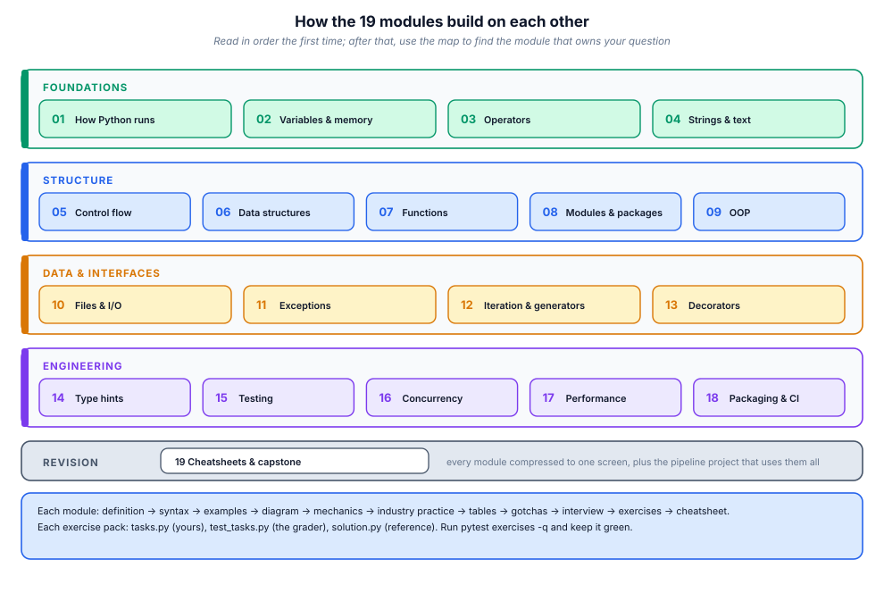

# 19. Cheatsheets & revision

> Everything earlier in the course, compressed. These tables are for the night
> before an exam or an interview, and for the moment you know *what* you want
> but not the exact spelling of it.

## 19.1 The course on one picture



## 19.2 Types & literals

| Type | Literal | Mutable? | Ordered? | Notes |
|------|---------|----------|----------|-------|
| `int` | `42`, `0x2A`, `1_000` | no | yes | arbitrary precision |
| `float` | `3.14`, `1e-9` | no | yes | IEEE-754, never for money |
| `complex` | `2+3j` | no | no | `abs()` = magnitude |
| `bool` | `True`/`False` | no | yes | subclass of `int` |
| `str` | `"a"`, `'a'`, `"""a"""` | no | yes | Unicode code points |
| `bytes` | `b"ab"` | no | yes | raw 8-bit data |
| `list` | `[1, 2]` | **yes** | yes | heterogeneous, amortised O(1) append |
| `tuple` | `(1, 2)`, `1,` | no | yes | record/keys, unpacking |
| `dict` | `{"k": 1}` | **yes** | insertion | O(1) lookup, keys hashable |
| `set` | `{1, 2}` | **yes** | no | unique, O(1) membership |
| `frozenset` | `frozenset({1})` | no | no | hashable set |
| `NoneType` | `None` | no | — | singleton |
| `Decimal` | `Decimal("0.1")` | yes-ish | yes | money, exact decimal |

**Truthiness:** everything is true except `False`, `None`, `0`, `0.0`, `""`,
`()`, `[]`, `{}`, `set()`, and objects defining `__bool__`/`__len__` → 0.

## 19.3 Operators you must know cold

| Group | Operators | Gotcha |
|-------|-----------|--------|
| arithmetic | `+ - * / // % **` | `/` always float; `//` floors toward −∞ |
| comparison | `== != < <= > >=` | chained: `a < b < c` |
| identity | `is`, `is not` | object identity, not equality; only for `None`/singletons |
| membership | `in`, `not in` | O(1) on set/dict, O(n) on list |
| boolean | `and or not` | short-circuit; `and`/`or` **return operands** |
| walrus | `:=` | assign inside an expression |
| bitwise | `& \| ^ ~ << >>` | also set operations on `set` |
| ternary | `a if cond else b` | reads left-to-right |
| unpacking | `a, *rest = seq` | `*` collects the remainder |

Precedence (tightest first): `**` → unary `+ - ~` → `* / // %` → `+ -` →
`<< >>` → `&` → `^` → `|` → comparisons → `not` → `and` → `or` → ternary →
walrus → lambda. **When in doubt, add parentheses.**

## 19.4 Strings

```python
s = "Hello, World"
s[1:5]              # 'ello'      s[::-1] -> reversed
s.split(", ")       # ['Hello', 'World']      ", ".join(parts)
s.strip()           # trim whitespace (lstrip/rstrip)
s.replace("l", "L") # new string (immutable)
s.startswith("He")  # endswith / in / index / find(-1) / count
s.upper().lower()   # casefold() for case-insensitive COMPARISON
f"{value:>10,.2f}"  # width 10, right-aligned, thousands, 2 decimals
f"{now:%Y-%m-%d}"   # datetime formatting
" ".join(words)     # NEVER += in a loop
b = s.encode("utf-8"); text = b.decode("utf-8", errors="replace")
```

| f-spec | Example | Result |
|--------|---------|--------|
| `<` `>` `^` | `f"{'x':^5}"` | `'  x  '` |
| `=` | `f"{x=}"` | `'x=3'` (debugging) |
| `,` / `_` | `f"{1234567:,}"` | `'1,234,567'` |
| `.2f` / `.2%` / `.3g` | `f"{0.1234:.2%}"` | `'12.34%'` |
| `#x` `#o` `#b` | `f"{255:#x}"` | `'0xff'` |
| `!r` `!s` | `f"{obj!r}"` | repr — for logs/errors |

## 19.5 Control flow

```python
if x > 0: ... elif x == 0: ... else: ...
while cond: ... else: <no break>       # else runs if not broken
for item in seq:
    if bad: break
else:
    print("completed without break")    # search pattern
for i, v in enumerate(seq): ...
for a, b in zip(xs, ys, strict=True): ...
match command.split():                  # structural pattern matching
    case ["go", direction]: walk(direction)
    case ["quit" | "exit"]: sys.exit()
    case [cmd, *args] if cmd in KNOWN: run(cmd, args)
    case _: error()
```

| Construct | Use for |
|-----------|---------|
| `if/elif/else` | 2–4 conditions |
| `match` | shape/destructure dispatch, command parsers |
| `dict` dispatch | name → handler tables |
| `for/else` | "searched and did not find" |
| `while/else` | same for condition loops |
| early `return` | flatten nesting (guard clauses) |

## 19.6 Containers: operations & complexity

| Operation | list | dict | set | deque |
|-----------|------|------|-----|-------|
| index `x[i]` | O(1) | — | — | O(1) ends, O(n) middle |
| lookup `k in x` | **O(n)** | O(1) | O(1) | O(n) |
| append right | O(1)* | O(1)* | O(1)* | O(1) |
| append left | **O(n)** | — | — | O(1) |
| pop right | O(1) | O(1) | O(1) | O(1) |
| pop left / del [0] | **O(n)** | O(1) | O(1) | O(1) |
| insert middle | O(n) | — | — | O(n) |
| sort | O(n log n) | — | — | — |
| slice | O(k) | — | — | O(k) |

\* amortised. **Choosing:** unique + membership → `set`; key→value → `dict`;
ordered + mutable sequence → `list`; fixed record → `tuple`/`dataclass`;
queue at both ends → `collections.deque`; counting → `Counter`; defaults →
`defaultdict`; insertion-ordered eviction → `OrderedDict`; big binary numbers →
`array`/NumPy.

```python
from collections import Counter, defaultdict, deque, namedtuple
Counter("aab").most_common(1)          # [('a', 2)]
d = defaultdict(list); d["k"].append(1)
q = deque(maxlen=3)                    # bounded, drops oldest
```

## 19.7 Comprehensions & generators

```python
[x * 2 for x in nums if x > 0]                       # list
{x: len(x) for x in words}                           # dict
{x for x in items}                                   # set
((x, y) for x in xs for y in ys)                     # generator: lazy
sum(x * x for x in nums)                             # no list built
next(it, default)                                    # safe first item
itertools.chain(a, b); islice(it, 10); groupby(sorted_data, key)
itertools.product(xs, ys); permutations(xs); combinations(xs, 2)
zip(a, b, strict=True); enumerate(x, start=1); reversed(seq)
```

| Need | Use |
|------|-----|
| transform + filter, all in memory | list comprehension |
| huge/infinite stream | generator expression |
| nested loops → flat | `[x for row in m for x in row]` |
| key→group | `defaultdict(list)` or `groupby` (needs sorted input) |
| pairwise | `zip(seq, seq[1:])` or `itertools.pairwise` |
| chunk | `itertools.islice` in a loop (module 17) |

## 19.8 Functions

```python
def f(pos, /, either, *, kw_only, default=1, **rest) -> str: ...
def g(*args, **kwargs): ...                # transparent wrapper
f.__defaults__, f.__kwdefaults__, inspect.signature(f)
lambda x: x + 1                            # expression only, no statements
```

| Kind | Syntax at call | Rule |
|------|----------------|------|
| positional-only | before `/` | cannot be passed by name |
| positional-or-keyword | middle | either |
| var-positional | `*args` | tuple of extras |
| keyword-only | after `*` | must be named |
| var-keyword | `**kwargs` | dict of extras |

**Defaults:** never mutable (`def f(x=[])` is shared forever) → use `None`
sentinel. **Return** early, return one shape, avoid `None`-or-value ambiguity.
**Scope:** LEGB (Local → Enclosing → Global → Builtins); `nonlocal` rebinds an
enclosing variable, `global` a module one — prefer returning values.

## 19.9 OOP

```python
class Account:
    kind = "current"                       # class attribute (shared)
    def __init__(self, owner, balance=0):
        self.owner = owner                 # instance attributes
        self._balance = balance            # convention: internal
    @property
    def balance(self): return self._balance
    @balance.setter
    def balance(self, v):
        if v < 0: raise ValueError("negative balance")
        self._balance = v
    @classmethod
    def from_string(cls, s): ...           # alternative constructor
    @staticmethod
    def is_valid(s): ...                   # no self/cls
    def __repr__(self): return f"Account({self.owner!r}, {self._balance})"
    def __eq__(self, other): ...           # + __hash__ if used in sets/dicts
```

| Dunder | Triggered by |
|--------|--------------|
| `__init__` / `__new__` | construction |
| `__repr__` / `__str__` | repr() / print, str(), f-string |
| `__eq__` / `__hash__` | `==`, dict/set membership |
| `__len__` / `__getitem__` / `__contains__` | len(), x[i], `in` |
| `__iter__` / `__next__` | for-loops, iter()/next() |
| `__enter__` / `__exit__` | `with` |
| `__call__` | `obj()` |
| `__add__` / `__radd__` | `+` (and friends) |
| `__set_name__` / `__get__` / `__set__` | descriptors |
| `__post_init__` | after `@dataclass` init |
| `__slots__` | no instance dict (memory) |

**Prefer:** composition over inheritance; `dataclass(frozen=True, slots=True)`
for records; `Enum` for closed sets; ABC for a real contract, `Protocol` for
structural typing; `super()` respects the MRO (C3 linearisation).

## 19.10 Files, exceptions, iteration

```python
with open(path, encoding="utf-8") as fh:            # text
    for line in fh: ...                              # lazy, line by line
pathlib.Path("d").mkdir(exist_ok=True)
p.read_text(encoding="utf-8"); p.write_text(s, encoding="utf-8")
csv.DictReader(fh); json.dump(obj, fh, indent=2, default=str)

try: risky()
except (ValueError, KeyError) as e: handle(e)        # specific first
except Exception: log.exception("..."); raise        # never bare except
else: success_path()                                 # only if no exception
finally: cleanup()                                   # always
raise ValueError("why") from exc                     # chain the cause
```

| Iterator need | Tool |
|---------------|------|
| iterate | `for x in it` (calls `__iter__`/`__next__`) |
| produce lazily | `yield` in a function → generator |
| delegate | `yield from other_iterable` |
| stop | `return` inside a generator → `StopIteration` |
| cleanup | `try/finally` around the `yield`, or `contextlib.closing` |
| close early | `gen.close()` throws `GeneratorExit` at the yield |

## 19.11 Decorators & closures

```python
import functools
def deco(fn):
    @functools.wraps(fn)                 # ALWAYS
    def wrapper(*args, **kwargs):
        ...before...
        try: return fn(*args, **kwargs)
        finally: ...after...
    return wrapper

@deco
@other                    # applied bottom-up: other first, then deco
def f(): ...

f = deco(arg)(f)          # decorator factory: deco(arg) returns the decorator
```

| Use | Recipe |
|-----|--------|
| timing | `perf_counter` around the call |
| retry | loop with `attempt`, sleep backoff, re-raise last |
| cache | `functools.lru_cache(maxsize=…)` |
| logging | `functools.wraps` + logger call |
| auth/validation | check args, raise `PermissionError` |
| registration | append `fn` to a module-level registry dict |
| preserve signature | `ParamSpec` + `TypeVar` (module 14) |

## 19.12 Typing quick reference

| Want | Write |
|------|-------|
| optional | `X \| None` |
| union | `A \| B` |
| containers | `list[int]`, `dict[str, int]`, `tuple[int, ...]` |
| params | `Sequence[T]`, `Mapping[K, V]`, `Iterable[T]` |
| callbacks | `Callable[[int], str]` |
| literals | `Literal["a", "b"]` |
| JSON shape | `TypedDict` |
| record | `@dataclass` |
| shape interface | `Protocol` (+`runtime_checkable`) |
| generics | `T = TypeVar("T")`, `Generic[T]` |
| decorators | `ParamSpec` |
| distinct scalars | `NewType("UserId", int)` |
| metadata | `Annotated[int, Field(ge=0)]` |
| check | `mypy --strict src/` |

## 19.13 Testing quick reference

| Want | Write |
|------|-------|
| assert | bare `assert x == y` |
| exception | `with pytest.raises(E) as ei:` |
| floats | `pytest.approx(v)` |
| cases | `@pytest.mark.parametrize("a,b", [(1,2)], ids=[…])` |
| setup/teardown | `@pytest.fixture` + `yield` |
| shared fixtures | `tests/conftest.py` |
| temp dir | `tmp_path` |
| env/attrs | `monkeypatch.setenv/setattr` |
| doubles | `unittest.mock.Mock(spec=…)` / `patch` |
| skip/expected-fail | `skipif(cond)`, `xfail(strict=True)` |
| output | `capsys.readouterr()` |
| coverage | `pytest --cov=src --cov-fail-under=90` |
| speed | `pytest -n auto`, `-m "not slow"` |

## 19.14 Concurrency quick reference

| Situation | Tool |
|-----------|------|
| blocking lib, many calls | `ThreadPoolExecutor(n).map(f, items)` |
| CPU-bound | `ProcessPoolExecutor` / NumPy |
| async network fan-out | `asyncio.gather` + `Semaphore` |
| sync call inside async | `await asyncio.to_thread(fn)` |
| structured async | `async with asyncio.TaskGroup() as tg` |
| thread handoff | `queue.Queue(maxsize=…)` |
| mutual exclusion | `with lock:` |
| timeouts | `fut.result(timeout=…)`, `asyncio.timeout(…)` |
| durable background jobs | Celery / arq + workers |

**Remember:** GIL → threads for waiting, processes for computing, asyncio for
many idle connections.

## 19.15 Performance quick reference

| Symptom | Fix |
|---------|-----|
| quadratic blow-up | `set`/`dict` lookups, precompute index, memoise |
| hot function | `cProfile` tottime → algorithm change |
| string building | `"".join` |
| repeated pure calls | `functools.lru_cache(maxsize=…)` |
| many small objects | `__slots__`, tuples, `array`/NumPy |
| memory growth | `tracemalloc` snapshot diff; bound caches |
| N+1 queries | batch/join |
| serial I/O | concurrency (module 16) |
| need proof | `timeit.repeat`, pytest-benchmark |

## 19.16 Packaging & CI quick reference

| Task | Command |
|------|---------|
| env | `python -m venv .venv` / `uv venv` |
| install editable | `pip install -e '.[dev]'` |
| build | `python -m build` |
| publish | `twine upload dist/*` (or OIDC action on tag) |
| lock | `uv lock` / `pip-compile` |
| lint/format | `ruff check . && ruff format .` |
| types | `mypy src/` |
| tests | `pytest --cov=src --cov-fail-under=90` |
| version at runtime | `importlib.metadata.version("pkg")` |
| semver | breaking → MAJOR, feature → MINOR, fix → PATCH |

## 19.17 The debugging ladder

```text
1  read the traceback BOTTOM-UP: last line = the error, frames above = the path
2  reproduce it minimally: smallest input, one command
3  print/log the values you assume (or use pdb: b file:line, c, p var, w)
4  bisect the change: git bisect, or comment out halves
5  check the boundary: types, None, empty, encoding, off-by-one
6  write a failing test, then fix it - the test stays as proof
```

| Tool | Use |
|------|-----|
| `pdb` / `breakpoint()` | interactive step-through |
| `repr(obj)`, `type(obj)` | what is this, really |
| `logging` (not print) | levels, structured fields |
| `git bisect` | find the commit that broke it |
| `py-spy dump/top` | live process, no restart |
| `dis.dis(fn)` | what bytecode actually runs |
| `sys.getsizeof`, `tracemalloc` | memory |

## 19.18 Capstone project

[[exercise tier="Industry" id="ex-19-a" file="exercises/19_capstone/test_tasks.py"]]
Build `report.py`: a small sales-report pipeline that uses almost everything in
this course — a custom exception hierarchy (`ReportError` → `ParseError`,
`ValidationError`), frozen `slots=True` dataclasses (`Order`, `Summary`), a
**lazy** CSV loader (`load_orders(text, strict=False)` generator that skips or
raises on bad rows), money parsed to `Decimal`, a `retry(times, delay)`
decorator with injectable sleep, `summarise(orders)` (totals, per-region
aggregates, top customer), and `render_markdown(summary)` producing a stable
table. The grader checks the pipeline end-to-end, including laziness, error
handling and the retry decorator.
[[/exercise]]

[[solution]]
Reference implementation: `exercises/19_capstone/solution.py`.
[[/solution]]

## 19.19 Where to go next

| Direction | Start with |
|-----------|-----------|
| web APIs | FastAPI + pydantic + httpx + uvicorn |
| data work | pandas / polars, NumPy, Jupyter, DuckDB |
| CLI tools | typer / argparse, rich, `pyproject.toml` scripts |
| automation | pathlib, subprocess, requests, schedule/cron |
| ML | scikit-learn → PyTorch, plus module 17 discipline |
| systems | asyncio services, Docker, queues, observability |

Whatever you pick, the loop stays the same: **read the mechanism, type the
example, write the test, measure the result.**
